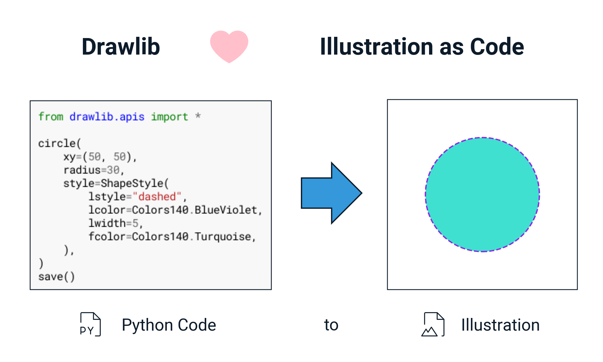
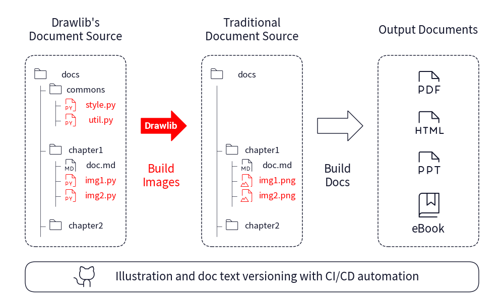

.. drawlib documentation master file, created by
   sphinx-quickstart on Sun Mar 31 22:39:53 2024.
   You can adapt this file completely to your liking, but it should at least
   contain the root `toctree` directive.

=======================================
Welcome to the drawlib Documentation!
=======================================

drawlib is a pure Python drawing library crafted to facilitate **Illustration as Code** rather than focusing solely on creating polished illustrations. 
Witness Python code in action generating a circular image:

    image1.png

In contemporary software development, version control extends beyond code to encompass documentation, all managed seamlessly through Git. 
While I compose technical documents and literature using VSCode and Markdown, hitherto, I relied on PowerPoint for illustration. 
However, this approach lacks compatibility with versioning documentation images.

Enter drawlib, a solution meticulously developed to address this quandary. 
Not only can textual documentation be version-controlled, but illustration code can also be managed through Git, facilitating automation of build tasks via CI/CD pipelines.

    image2.png

Beyond mere illustration, drawlib empowers users to define and apply custom themes to illustration codes. 
Refer to the Quickstart guide for a comprehensive understanding of drawlib's underlying concepts. All images within this documentation are generated using drawlib.

Other version docs
=====================

- `Latest </>`_
- `Version list </versions/>`_

.. toctree::
   :maxdepth: 2
   :caption: Introductions:

   manual/introductions/about/doc
   manual/introductions/install/doc
   manual/introductions/lib_design/doc
   manual/introductions/quick_start/doc

.. toctree::
   :maxdepth: 2
   :caption: Foundations:

   manual/foundations/canvas/doc
   manual/foundations/coordinate_align/doc
   manual/foundations/icon/doc
   manual/foundations/image/doc
   manual/foundations/line/doc
   manual/foundations/line_style/doc
   manual/foundations/shape/doc
   manual/foundations/shape_style/doc
   manual/foundations/text/doc
   manual/foundations/theme/doc
   manual/foundations/build_many/doc
   manual/foundations/programming/doc

.. toctree::
   :maxdepth: 2
   :caption: Advanced Topics:

   manual/advanced_topics/color/doc
   manual/advanced_topics/font/doc
   manual/advanced_topics/dimage/doc
   manual/advanced_topics/smartarts/doc
   manual/advanced_topics/smartarts_sourcecode/doc
   manual/advanced_topics/theme_custom/doc
   manual/advanced_topics/debug/doc
   manual/advanced_topics/settings/doc
   manual/advanced_topics/api_version/doc
   manual/advanced_topics/example_flow/doc

.. toctree::
   :maxdepth: 2
   :caption: API Docs:

   api/modules
   api/drawlib
   api/drawlib.v0_1
   api/drawlib.v0_1.private
   api/drawlib.v0_1.private.core

Indices and tables
==================

* :ref:`genindex`
* :ref:`modindex`
* :ref:`search`
