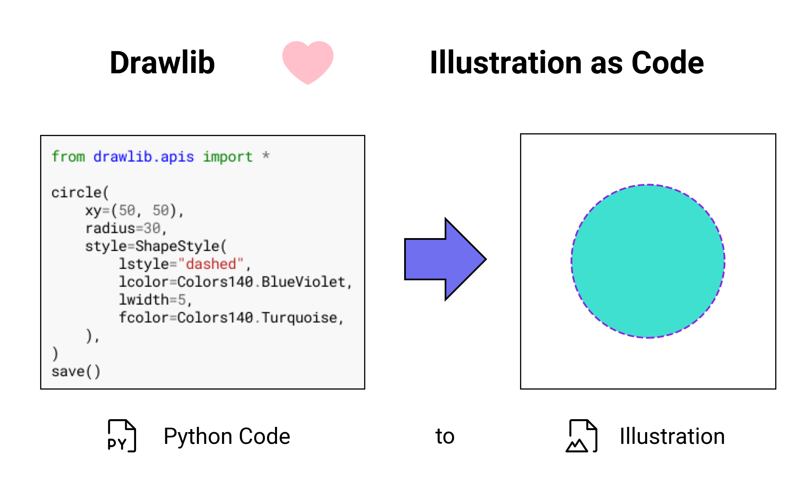
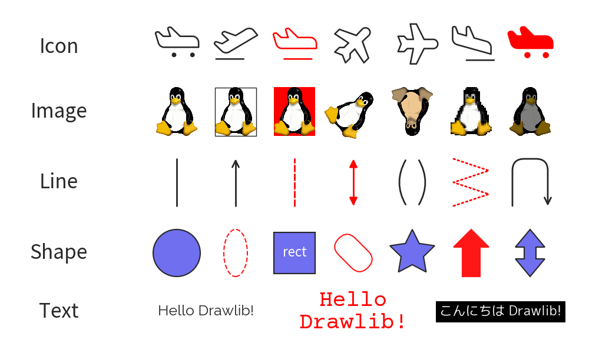
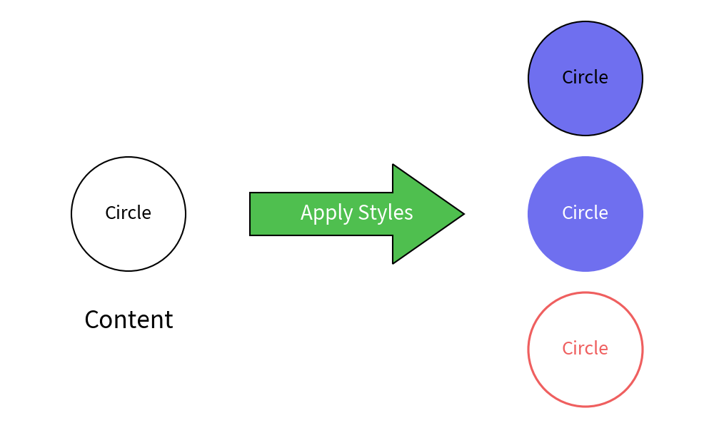
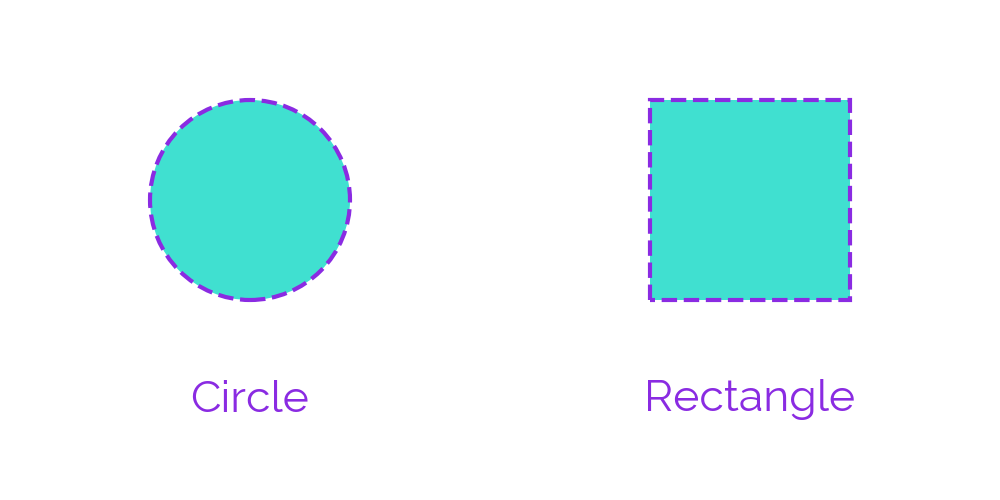

=======================================
Welcome to the Drawlib Documentation!
=======================================

Drawlib is a pure Python drawing library crafted to facilitate **Illustration as Code** rather than focusing solely on creating polished illustrations. 
Witness Python code in action generating a circular image:

   Code makes Illustration

As you can see, we define circle location, size and styles at left side code.
Executing it generate right side circle image.
You will get illustration as you code.

Various Drawing Items
=========================

Drawlib offers a variety of drawing items with different styles. 
Below is a sample image showcasing the major drawing items with varying styles.

   Various drawing methods

- Icon: Over 1500 patterns available in 5 styles (thin, light, regular, bold, fill)
- Image: Easily apply effects
- Line: Supports many styles
- Shape: Around 20 patterns
- Text: Various sizes, fonts, and weights (thin, regular, bold), supporting major local languages

Drawlib is inspired by the features of Microsoft PowerPoint. 
We aim to implement as many popular features as possible. 
In addition to basic drawing features, Drawlib includes advanced features such as a code highlighter, implemented as smart art.

Concept: Apply Style to Content
=================================

The parameters of a circle include coordinates, size, color, etc. 
Many drawing tools treat these parameters uniformly. 
However, we divide them into two parts:

- Content: The type of drawing items, such as coordinates, size, angle, etc.
- Style: Elements like color, line width, and font.

If you are familiar with HTML/CSS, content is analogous to HTML, and style is analogous to CSS. 
Just as it's recommended to define styles in CSS and reference them in HTML, 
Drawlib encourages defining styles separately and referencing them in the illustration code.

   Apply style to content

From an artistic perspective, the mix of content and style is essential. 
However, for illustrations that do not require an artistic look, the content is more critical than the styles. 
The color or width of a line is less important than where the line is drawn.

Separating content and style allows you to focus on the essential content first. 
Once the content is created, you can modify its appearance by changing styles outside of the content. 
Additionally, you can apply one style to many content items if they are separated. 
Using the same style for many items is crucial for achieving consistency in illustrations.

How Style Works
=================

In the first example code, we define the style ``ShapeStyle`` for the drawing item ``circle()``. 
This approach is straightforward, but repeating styling for each item can be burdensome and may lead to inconsistencies. 
Instead, we typically use themes and their styles to change the drawing item styles consistently.

Drawlib's style system is similar to CSS. 
You define the style in one location and reference it everywhere. 
The style is then automatically applied to the items. 
This means you don't need to provide detailed styles for each drawing item.

Here is a style code similar to CSS. 
This code itself doesn't generate any illustration but contains the style definitions.

.. literalinclude:: ../../samples/index/docs/style.py
   :language: python
   :linenos:
   :caption: docs/style.py

And here is an illustration code similar to HTML. 
It imports the style you defined earlier. 
When importing it, the style definitions are automatically loaded.

.. literalinclude:: ../../samples/index/docs/image.py
   :language: python
   :linenos:
   :caption: docs/image.py

Executing the illustration code generates this image. 
As you can see, the pre-defined styles are applied correctly.

   Illustration code references style code

You can define your own styles like this. 
However, we recommend using themes rather than creating your own styles. 
Themes come with many colors and predefined popular styles. 
If you don't require very fancy styles, the theme styles might be sufficient. 
Please take a look at the quick-start documentation first.

Good to build lots of images
===============================

In contemporary software development, version control extends beyond code to encompass documentation, all managed seamlessly through Git. 
While I compose technical documents and literature using VSCode and Markdown, I previously relied on PowerPoint for illustrations. 
However, this approach lacks compatibility with versioning documentation images.

Enter Drawlib, a solution meticulously developed to address this issue. 
With Drawlib, not only can textual documentation be version-controlled, but illustration code can also be managed through Git. 
This facilitates the automation of build tasks via scripting or CI/CD pipelines.

.. figure:: manual/index/image_buildmany.png
   :width: 800
   :class: with-border
   :align: center

    Doc image/text build flow.

Integrating Drawlib into your workflow is straightforward and doesn't significantly differ from managing markdown documents. 
If you create your documentation using markdown or a similar format, you can easily adopt drawlib.

Incidentally, the image above is created using Drawlib, serving as a practical example of Drawlib's capabilities. 
We generate hundreds of such images from image codes with consistent styles for writing books.

Refer to the Quickstart guide for a comprehensive understanding of Drawlib's underlying concepts. 
Almost all images within this documentation are generated using Drawlib. 
Exceptions include only screenshots and original image files such as the Python logo. 
Even the source code image in the first example is generated by Drawlib using its smart art feature.

.. toctree::
   :maxdepth: 2
   :caption: Introductions:

   manual/introductions/about/doc
   manual/introductions/install/doc
   manual/introductions/lib_design/doc
   manual/introductions/quick_start/doc
   manual/introductions/other_version_docs/doc

.. toctree::
   :maxdepth: 2
   :caption: Foundations:

   manual/foundations/canvas/doc
   manual/foundations/coordinate_align/doc
   manual/foundations/icon/doc
   manual/foundations/image/doc
   manual/foundations/line/doc
   manual/foundations/line_style/doc
   manual/foundations/shape/doc
   manual/foundations/shape_style/doc
   manual/foundations/text/doc
   manual/foundations/theme/doc
   manual/foundations/build_many/doc
   manual/foundations/programming/doc

.. toctree::
   :maxdepth: 2
   :caption: Advanced Topics:

   manual/advanced_topics/color/doc
   manual/advanced_topics/font/doc
   manual/advanced_topics/dimage/doc
   manual/advanced_topics/smartarts/doc
   manual/advanced_topics/smartarts_bubblespeech/doc
   manual/advanced_topics/smartarts_sourcecode/doc
   manual/advanced_topics/debug/doc
   manual/advanced_topics/settings/doc
   manual/advanced_topics/cli_options/doc
   manual/advanced_topics/example_flow/doc

.. toctree::
   :maxdepth: 2
   :caption: Themes:

   manual/themes/advanced_topics/doc
   manual/themes/official_default/doc
   manual/themes/official_essentials/doc
   manual/themes/official_monochrome/doc
   manual/themes/create/doc

.. toctree::
   :maxdepth: 2
   :caption: API Docs:

   api/modules
   api/drawlib
   api/drawlib.v0_1
   api/drawlib.v0_1.private
   api/drawlib.v0_1.private.core

Indices and tables
==================

* :ref:`genindex`
* :ref:`modindex`
* :ref:`search`
