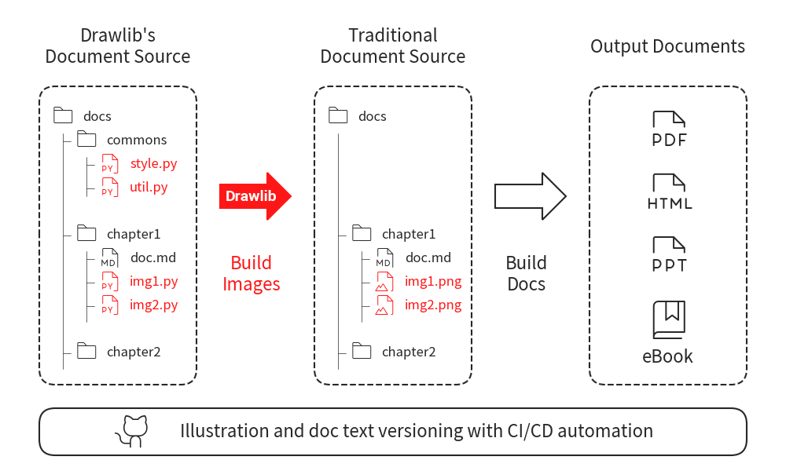

=======================================
Welcome to the Drawlib Documentation!
=======================================

Drawlib is a pure Python drawing library crafted to facilitate **Illustration as Code** rather than focusing solely on creating polished illustrations. 
Witness Python code in action generating a circular image:

.. figure:: manual/introductions/index/image1.png
   :width: 800
   :class: with-border
   :align: center

   Code makes Illustration

As you can see, we define circle location, size and styles at left side code.
Executing it generate right side circle image.
You will get illustration as you code.

Concept: Apply Style to Content
=================================

Parameter of circle are coordinate, size, color etc.
Many drawing tools define them equally.
However, we separate them to 2 part.

- Content: Type of drawing items. Coordinate, Size, Angle etc.
- Style: Color, Line Width, Font

If you are familiar to HTML/CSS, the content is equivalent to HTML and style is equivalent to CSS.
Styling to HTML is not recommended, but define style at CSS and reference it at HTML is recommended.
Drawlib do same.
Styling to content is not recommended, but define style at style code and reference it at illustration code is recommended.

From point of art view, mix of content and style are important.
However, illustrations which doesn't require artistic looking, contents are much important rather than styles.
Color/Width of line is not important rather than where the line is drawn.

Separating them makes you focusing on important content first.
After content is created, you can modify its looking by changing styles which is outside of content.
And also, you can apply 1 style to many content if content and styles are separated.
Same style for many items are important if you want to achieve consitency of illustrations.

Various Drawing Items
=========================

Drawlib posses various drawing items with various styles.
Here is a sample image of major drawing items with changing styles.

.. figure:: manual/introductions/index/image_items.png
   :width: 800
   :class: with-border
   :align: center

   Various drawing methods

- icon: posses 1500+ patterns with 5 styles (thin/light/regular/bold/fill)
- image: able to apply effects easily
- line: supports many styles
- shape: around 20 patterns
- text: various size/fonts/weights(thin/regular/bold) etc. Supports major local languages

Drawlib references Microsoft powerpoint's feature.
We are trying to implement all popular features as possible as we can.
Not only these basic drawing feature, drawlib posses fine grained feature such as Code Highligter etc.
Those are implemented as smart art.

CSS like Styling. Define Once Use Anywhere
=============================================

At first example code, we define style ``ShapeStyle`` at the derawing item ``circle()``.
It is easy to understand, but repeating styling at each items are burden and tending to loose consistency.
We normaly use theme and its styling for changing drawing items style.

Drawlib's style is similar to CSS.
You define style at 1 location and reference it every where.
Then, the style is applied to them automatically.
You don't need to provide detail style for each drawing items.

Here is a style code which is similar to CSS.
This code itself doesn't generate any illustraion.
But having definition of stylings.

.. literalinclude:: ../../samples/index/docs/style.py
   :language: python
   :linenos:
   :caption: docs/style.py

And here is a illustration code which is similar to HTML.
It imports the style you defined earlier.
When importing it, style definition is automatically loaded.

.. literalinclude:: ../../samples/index/docs/image.py
   :language: python
   :linenos:
   :caption: docs/image.py

Executing last illustration code generates this image.
As you can see, pre-defined styles are applied correctly.

   Illustration code references style code

You can define your style by yourself like this.
However we recommend using ``theme`` rather than creating your own styles.
Theme posses many colors with pre-defined popular styles.
If you don't require very fancy style, theme's styles might be OK.
Please take a look at quick-start doc first.

Good to build lots of images
===============================

In contemporary software development, version control extends beyond code to encompass documentation, all managed seamlessly through Git. 
While I compose technical documents and literature using VSCode and Markdown, hitherto, I relied on PowerPoint for illustration. 
However, this approach lacks compatibility with versioning documentation images.

Enter drawlib, a solution meticulously developed to address this quandary. 
Not only can textual documentation be version-controlled, but illustration code can also be managed through Git, facilitating automation of build tasks via CI/CD pipelines.

    Doc image/text build flow.

There are no big difference from markdown document management even if drawlib is added.
If you create your doc from markdown or related one, you can adopt drawlib easily.

By the way, this image itself is created by drawlib.
It might be good real world example of drawlib's illustration.
We build hundreads of these kind of images from image codes with same style for writing books.

Refer to the Quickstart guide for a comprehensive understanding of drawlib's underlying concepts. 
Almost all images within this documentation are generated using drawlib.
Excepts are only screenshots and original image files such as python logo.
Even source code image at first example is generated by drawlib via smart art feature.

.. toctree::
   :maxdepth: 2
   :caption: Introductions:

   manual/introductions/about/doc
   manual/introductions/install/doc
   manual/introductions/lib_design/doc
   manual/introductions/quick_start/doc
   manual/introductions/other_version_docs/doc

.. toctree::
   :maxdepth: 2
   :caption: Foundations:

   manual/foundations/canvas/doc
   manual/foundations/coordinate_align/doc
   manual/foundations/icon/doc
   manual/foundations/image/doc
   manual/foundations/line/doc
   manual/foundations/line_style/doc
   manual/foundations/shape/doc
   manual/foundations/shape_style/doc
   manual/foundations/text/doc
   manual/foundations/theme/doc
   manual/foundations/build_many/doc
   manual/foundations/programming/doc

.. toctree::
   :maxdepth: 2
   :caption: Advanced Topics:

   manual/advanced_topics/color/doc
   manual/advanced_topics/font/doc
   manual/advanced_topics/dimage/doc
   manual/advanced_topics/smartarts/doc
   manual/advanced_topics/smartarts_bubblespeech/doc
   manual/advanced_topics/smartarts_sourcecode/doc
   manual/advanced_topics/debug/doc
   manual/advanced_topics/settings/doc
   manual/advanced_topics/cli_options/doc
   manual/advanced_topics/example_flow/doc

.. toctree::
   :maxdepth: 2
   :caption: Themes:

   manual/themes/advanced_topics/doc
   manual/themes/official_default/doc
   manual/themes/official_default2/doc
   manual/themes/official_essentials/doc
   manual/themes/official_monochrome/doc
   manual/themes/customize/doc
   manual/themes/create/doc

.. toctree::
   :maxdepth: 2
   :caption: API Docs:

   api/modules
   api/drawlib
   api/drawlib.v0_1
   api/drawlib.v0_1.private
   api/drawlib.v0_1.private.core

Indices and tables
==================

* :ref:`genindex`
* :ref:`modindex`
* :ref:`search`
