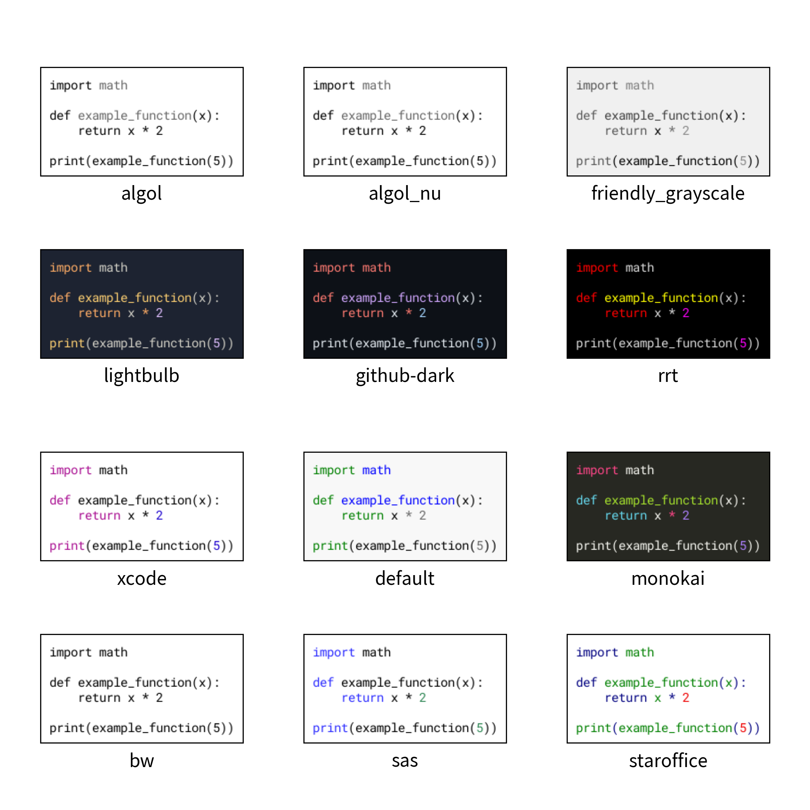

========================
Smart Arts: SourceCode
========================

You can draw source code with ``text()`` with ``halign="left"`` and using mono space fonts.
If you want to draw fancy source code such as having syntax highlight etc, you can use Smart Art feature.
It provides drawing source code image which is generated by ``pygments``.

We have this code.

.. literalinclude:: sample_code.py
   :language: python
   :linenos:
   :caption: sample_code.py

We can draw source code like this.

.. literalinclude:: image1.py
   :language: python
   :linenos:
   :caption: image1.py

First, you need to create ``dsart.SourceCode`` instance.
You can specify these styles as option.

- language: if not provided, auto detect
- style: syntax highlight, back ground color etc.
- font: font
- show_linenum: whether shoing line number or not
- linenum_textcolor: text color of line number
- linenum_bgcolor: background color of line number

After that, you will draw code with ``draw()`` method.
This method's arg is same to ``image()``.
Let's check output.

.. figure:: image1.png
    :width: 600
    :class: with-border
    :align: center

    image1.png

We can see 2 style of fancy soucecodes.

Styles
========

We supports pygment's recommended styles.
And also, additional black and white styles.
Here is a list of styles.

- bw
- sas
- staroffice
- xcode
- default
- monokai
- lightbulb
- github-dark
- rrt
- algol
- algol_nu
- friendly_grayscale

    image2.png

get_text()
============

At last example, we define soucecode in drawing code.
We provides function ``dsart.SourceCode.get_text()`` for getting text code from code file.
As usual in drawlib, file path is relative to the code file.