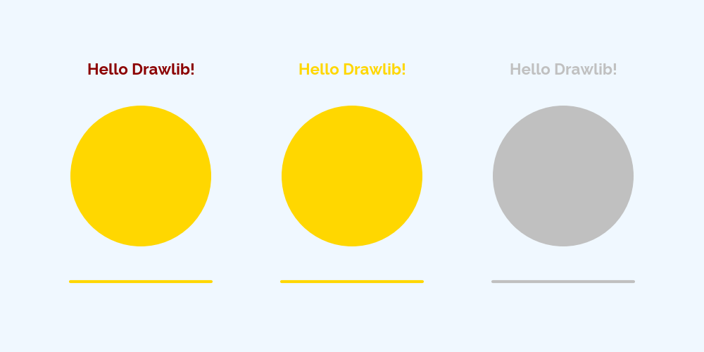

==========================
Define your own theme
==========================

We provides official themes.
But some users may want to create your own theme.
You can achieve it with these 2 ways.

- Register your style objects manually
- Syntax sugar of above

We recommend using syntax sugar way at styling code which is explained at "building many images" doc.

dtheme.apply_custom_theme
===========================

``dtheme.apply_custom_theme()`` provides setting custom theme feature.
It takes these arguments.

- default_style:``dtheme.ThemeStyle``
- named_styles:``List[Tuple[str, dtheme.ThemeStyle]]``
- theme_colors:``List[Tuple[str, Tuple[int, int, int]]]``

The type ``dtheme.ThemeStyle`` is data class which holds all drawlib styles.
All member of the class is optional (default is None).
But data which is passed to arg ``default_style`` requires them.

- backgroundcolor
- sourcecodefont
- iconstyle
- imagestyle
- linestyle
- linearrowstyle
- shapestyle
- shapetextstyle
- textstyle

You can get these styles with ``dtheme.<styles>.get()``.
Those value becomes default.

On the other hand, ``named_styles`` is a list of tuple. The tuple posses name and ``dtheme.ThemeStyle`` object.
You can get those styles via ``dtheme.<styles>.get(name)``.

OK, let's check example custom theme which uses gold and silver colors.

.. literalinclude:: image1.py
   :language: python
   :linenos:
   :caption: image1.py

We define theme styles first.
After that, calling ``dtheme.apply_custom_theme()``.

    image1.png

You can see your theme is applied.