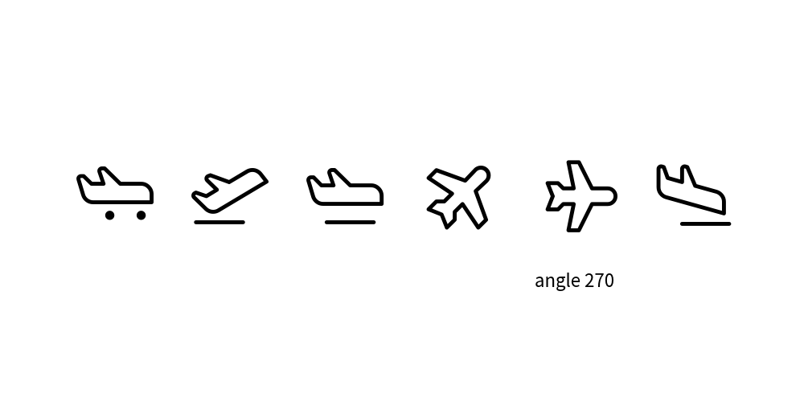
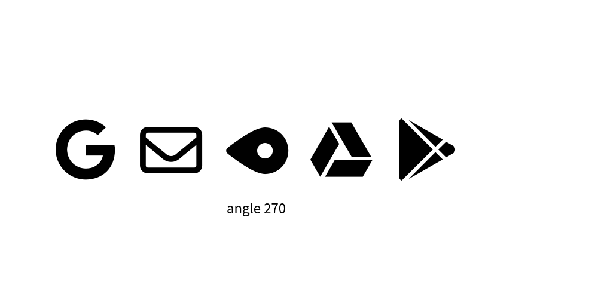
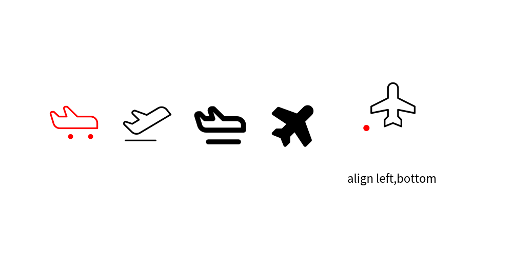

===============
Drawing Icons
===============

If you're looking to enhance your illustrations with icons, drawlib offers several methods to achieve this. 
You can utilize the ``image()`` function by providing an icon image file of your choice. 
Alternatively, you can use ``icon()`` along with dedicated ``Icon Modules`` for drawing icons directly.

Icon Modules
==============

We've curated a selection of icons for your convenience, available in drawlib now.

* ``icon_phosphor``: Derived from Phosphor Icons (https://phosphoricons.com)

Each icon within these modules is defined as a function, allowing you to draw specific icons by simply calling their respective function. 
Let's explore with examples:

.. literalinclude:: image_iconmod1.py
   :language: python
   :linenos:
   :caption: image_iconmod1.py

All functions have these args.

- ``xy`` : coordinate
- ``width`` : icon width
- ``angle`` : angle 0.0~360.0
- ``style`` : Accepts string style name or ``IconStyle`` object.

Executing this code yields the following image:

    icon_phosphor's icons

You see lots of variation of only airplane.
``icon_phosphor`` has around 1500 icons.

icon()
=========

``icon()`` is a versatile function for displaying font icons. 
Internally, icon modules utilize icon().

The function arguments are:

* ``xy``: Coordinates for positioning the icon.
* ``width``: Width of the icon.
* ``code``: Font code representing the icon.
* ``file``: Font file used for rendering the icon.
* ``angle``: Angle for rotating the icon (optional).
* ``style``: Additional style configurations (optional).

Let's explore its usage with FontAwesome Free:

.. literalinclude:: image_icon1.py
   :language: python
   :linenos:
   :caption: image_icon1.py

Executing this code generates the following image:

    FontAwesome-Free icons

While FontAwesome is widely recognized, its full usage requires a commercial license. 
The free version may lack variation and style consistency. 
Therefore, drawlib does not currently provide an icon module for it.

IconStyle
===========

Similar to other drawing elements, the appearance of icons can be customized using the ``IconStyle`` class, which allows you to control:

``IconStyle`` encompasses these attributes

* ``halign``: Horizontal alignment
* ``valign``: Vertical alignment
* ``style``: Icon style, Supports ``"thin"``, ``"light"``, ``"regular"``, ``"bold"``, or ``"fill"``. The availability of styles depends on the icon modules.
* ``color``: Icon color, specified in RGB (0255, 0255, 0255) or RGBA (0255, 0255, 0255, 0.0~1.0). You can utilize helpers like ``Colors`` and ``Colors140``.
* ``alpha``: Icon transparency, ranging from 0.0 to 1.0, where 0.0 represents total transparency.

Let's illustrate this with an example:

.. literalinclude:: image_iconstyle1.py
   :language: python
   :linenos:
   :caption: image_iconstyle1.py

Executing this code generates the following image:

    icons with IconStyle.

Pre-defined icon styles
=========================

Drawlib's theme provides pre-defined icon styles.
You can specify them by names.

Here is an examples.

.. literalinclude:: image_iconstyle2.py
   :language: python
   :linenos:
   :caption: image_iconstyle2.py

Icon supports the following styles exclusively:

- weight of icon: ``light`` and ``bold``
- fill color: ``flat``
- color of icon

Line style solid and dashed are not supported.

    icon with theme's style

