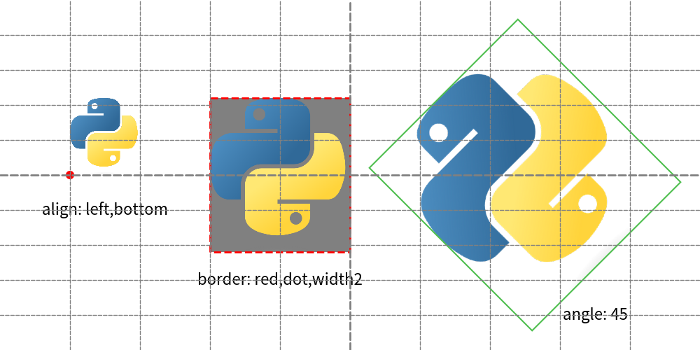

===============
Drawing Image
===============

We use function ``image()`` for drawing images.
It takes these arguments.

* xy
* width
* image: File path string, Dimage, PIL.Image.Image
* angle
* style: ImageStyle

Coordinate and alignment is same to other drawing items.
Let's start from example.

.. literalinclude:: image1.py
   :language: python
   :linenos:
   :caption: image1.py

We draw 3 images which has different xy and width.
Execute the code.

    image1.png

As you can see, xy becomes center of image by default.
It can be changed by specifing style with ``ImageStyle``.
ImageStyle has these attributes.

* halign: Horizontal Align
* valign: Verteical Align
* lwidth: Line width
* lcolor: Line color
* lstyle: Line style

.. literalinclude:: image2.py
   :language: python
   :linenos:
   :caption: image2.py

We draw 3 images which has different xy and width.
Execute the code.

    image2.png

Passing image objects
=========================

Function ``image()`` takes mandatory option image.
We use file path at last example, but also able to use image objects.

* Dimage
* PIL.Image.Image

Former is our image utility class and latter is famous Image library.

