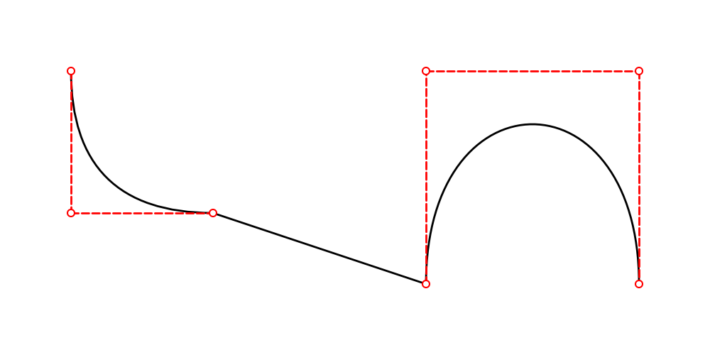

==================
Drawing line
==================

Drawlib has 5 line functions.

* ``line()``
* ``line_curve()``
* ``line_bezier1()``
* ``line_bezier2()``
* ``lines()``
* ``lines_bezier()``

We will explain them one by one.
All of them takes these style classes optionally.

* ``LineStyle``
* ``LineArrowStyle``

As these name explains, LineStyle is for line and LineArrowStyle is for arrow line.
If style is not provided, default line style is applied.
We explain these styles on other page.

line()
=======

Function ``line()`` is a most basic function which draw line.
It takes 3 arguments.

* xy1: start point
* xy2: end point
* style

Lets's check by example.

.. literalinclude:: image1.py
   :language: python
   :linenos:
   :caption: image1.py

We draw line from (10, 10) to (90, 40) without specifying style.
It generate this output.

.. figure:: image1.png
    :width: 500
    :class: with-border
    :align: center

    image1.png

line_curve()
==============

Function ``line_curve()`` is easy to draw curved line.
Functions ``line_bezier1()`` and ``line_bezier2()`` are also able draw curved lines.
However they requires complex curve controlling rather than this function.

This function takes 4 arguments.

* xy1
* xy2
* bend: additional length rather than direct connection
* style

For example, suppose xy1 is (10, 10) and xy2 is (10, 20).
The distance of them is 10.
When we set bend 0.2, draw line from (10, 10) to (10, 20) with length 12(10 x 1.2).
When we set bend 0.4, length is 14(10 x 1.4).

We can also set minus value to bend.
The length is same to plus value, but bending side becomes reverse.
Let's check examples.

.. literalinclude:: image2.py
   :language: python
   :linenos:
   :caption: image2.py

We set 

.. figure:: image2.png
    :width: 500
    :class: with-border
    :align: center

    image2.png

line_bezier1()
===============

Function ``line_bezier1()`` draws bezier line with 1 control point.
It takes these arguments.

* xy1
* cp: bezier control point
* xy2
* style

.. literalinclude:: image3.py
   :language: python
   :linenos:
   :caption: image3.py

We set 

.. figure:: image3.png
    :width: 500
    :class: with-border
    :align: center

    image3.png

line_bezier2()
===============

Function ``line_bezier2()`` draws bezier line with 2 control point.
It takes these arguments.

* xy1
* cp1: bezier control point 1
* cp2: bezier control point 2
* xy2
* style

.. literalinclude:: image4.py
   :language: python
   :linenos:
   :caption: image4.py

We set 

.. figure:: image4.png
    :width: 500
    :class: with-border
    :align: center

    image4.png

lines()
==========

Function ``lines()`` draw line which pass provided points.
It takes these arguments.

* xys
* style

.. literalinclude:: image5.py
   :language: python
   :linenos:
   :caption: image5.py

We set 

.. figure:: image5.png
    :width: 500
    :class: with-border
    :align: center

    image5.png

lines_bezier()
===============

Function ``lines_bezier()`` is similar to ``lines()``.
But it can draw bezier lines from points to points.
It takes these arguments.

* xy: start point
* path_points: list of "tuple of bezier line"
* style

Difficult part is path_points.
It takes 3 type of tuple.

* (x, y): draw last point to (x, y)
* (cp_x, cp_y, x, y): draw bezier1 line from last point to (x, y) with 1 control point
* (cp1_x, cp1_y, cp2_x, cp2_y, x, y): draw bezier2 line from last point to (x, y) with 2 control points

Let's check the how it works with example.

.. literalinclude:: image6.py
   :language: python
   :linenos:
   :caption: image6.py

We use 3 type of tuple as element of ``path_points``.
They becomes line, bezier1 line, bezier2 line.
Executing this code generate this output.

    image6.png

This function might be useful when you want to draw curved line from shape to shape.

.. literalinclude:: image7.py
   :language: python
   :linenos:
   :caption: image7.py

We use 3 type of tuple as element of ``path_points``.
They becomes line, bezier1 line, bezier2 line.
Executing this code generate this output.

.. figure:: image7.png
    :width: 500
    :class: with-border
    :align: center

    image7.png

If you requires precise control, please use this function.
However, if you want to draw simple curve line, we recommend using ``lines_curved()`` instead.

lines_curved()
===============

Function ``lines_curve()`` is syntax sugar of ``lines_bezier()``.
It will automatically add bezier1 curve effect to lines with length ``r``.

.. literalinclude:: image8.py
   :language: python
   :linenos:
   :caption: image8.py

The function is almost same to ``lines()`` but having arg ``r`` which means length of curve.
If you want to add related curves for all vertex, this function is very useful.
Executing this code generate this output.

    lines_curve()

The red dashed line length is value of r. If you set large value, the curve becomes big.