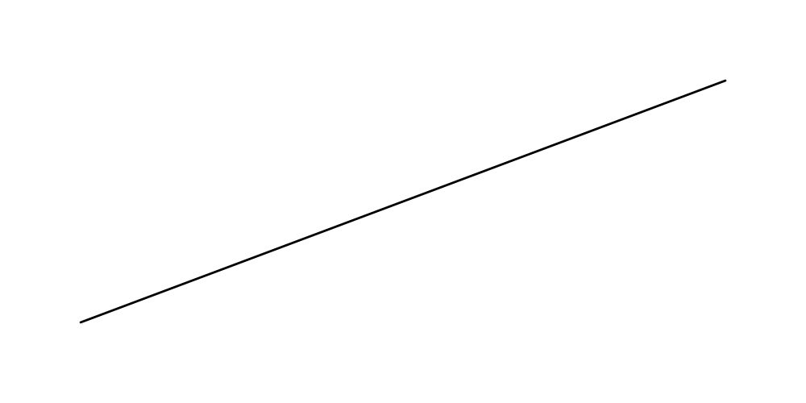
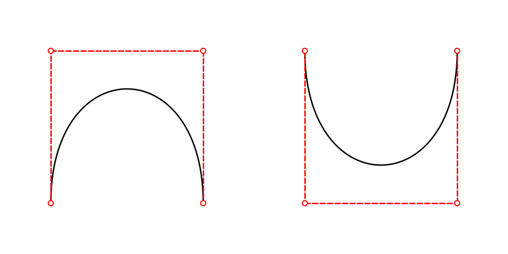

==================
Drawing line
==================

Drawlib provides six functions for drawing lines:

* ``line()``
* ``line_curve()``
* ``line_bezier1()``
* ``line_bezier2()``
* ``lines()``
* ``lines_bezier()``

We will explain each of these functions in detail. 
They all share the following optional arguments:

- ``arrowhead``: Specifies the type of arrowhead. Options are ``["", "->", "<-", "<->"]``.
- ``width``: Specifies the line width. This should typically be configured within the style, but it is also available as an optional argument.
- ``style``: Defines the line style. Accepts a LineStyle object or a string (style name).

Details on these options will be covered in the next section on line styles (see the following page).

line()
=======

The ``line()`` function is the most basic function for drawing lines. 
It requires two mandatory arguments and accepts three optional arguments.

* xy1: The start point of the line
* xy2: The end point of the line
* (optional) arrowhead: Specifies the type of arrow head
* (optional) width: The width of the line
* (optional) style: The style of the line

Let's look at an example:

.. literalinclude:: image1.py
   :language: python
   :linenos:
   :caption: image1.py

In this example, we draw a line from (10, 10) to (90, 40) without specifying a style. 
This generates the following output:

    straight line from xy1 to xy2

line_curved()
==============

The ``line_curved()`` function makes it easy to draw curved lines. 
While ``line_bezier1()`` and ``line_bezier2()`` can also draw curved lines, they require more complex curve control compared to ``line_curved()``.

It requires three mandatory arguments and accepts three optional arguments.

* xy1: The start point of the line
* xy2: The end point of the line
* bend: The additional length beyond a direct connection, controlling the curvature.
* (optional) arrowhead: Specifies the type of arrow head
* (optional) width: The width of the line
* (optional) style: The style of the line

For example, suppose xy1 is (10, 10) and xy2 is (10, 20). 
The distance between these points is 10 units.

- When ``bend`` is set to 0.2, the line is drawn from (10, 10) to (10, 20) with a length of 12 units (10 x 1.2).
- When ``bend`` is set to 0.4, the length is 14 units (10 x 1.4).

Negative values can also be used for bend, which maintains the length but reverses the bending direction. 
Let's check some examples:

.. literalinclude:: image2.py
   :language: python
   :linenos:
   :caption: image2.py

This code generates the following output:

    curved line from xy1 to xy2

line_bezier1()
===============

The ``line_bezier1()`` function draws a Bézier curve with one control point. 
It requires three mandatory arguments and accepts three optional arguments.

* xy1: The start point of the line
* cp: The Bézier control point.
* xy2: The end point of the line
* bend: The additional length beyond a direct connection, controlling the curvature.
* (optional) arrowhead: Specifies the type of arrow head
* (optional) width: The width of the line
* (optional) style: The style of the line

Bézier curves are a popular method for drawing smooth, curved lines. 
If you are not familiar with Bézier curves, it is recommended to research and understand the concept first. 

This code generates the following output:

.. literalinclude:: image3.py
   :language: python
   :linenos:
   :caption: image3.py

It generate this output.

.. figure:: image3.png
    :width: 600
    :class: with-border
    :align: center

    Bézier curves from xy1 to xy2

line_bezier2()
===============

The ``line_bezier2()`` function draws a Bézier curve with two control points. 
It requires four mandatory arguments and accepts three optional arguments.

* xy1: The start point of the line
* cp1: The first Bézier control point.
* cp2: The seconde Bézier control point.
* xy2: The end point of the line
* bend: The additional length beyond a direct connection, controlling the curvature.
* (optional) arrowhead: Specifies the type of arrow head
* (optional) width: The width of the line
* (optional) style: The style of the line

Drawing a Bézier curve with two control points is a popular method for creating smooth, curved lines. 
If you are not familiar with Bézier curves, it is recommended to research and understand the concept first.

Here is an example code:

.. literalinclude:: image4.py
   :language: python
   :linenos:
   :caption: image4.py

Executing this code generates the following output:

    Bézier curves from xy1 to xy2

lines()
==========

The ``lines()`` function draws a line that passes through a series of provided points
It requires one mandatory arguments and accepts three optional arguments.

* xys: A list of (x, y) tuples representing the points the line should pass through.
* (optional) arrowhead: Specifies the type of arrow head
* (optional) width: The width of the line
* (optional) style: The style of the line

The ``xys`` argument differs from the previous functions, but it is simply a list of (x, y) coordinates, such as ``[(10, 10), (20, 40), (30, 10), (40, 40)]``.

Here is an example code:

.. literalinclude:: image5.py
   :language: python
   :linenos:
   :caption: image5.py

It generate this output.

.. figure:: image5.png
    :width: 600
    :class: with-border
    :align: center

    lines which passes list of xy

lines_bezier()
===============

The ``lines_bezier()`` function is similar to ``lines()``, but it can draw multiple straight lines, 
Bézier curves with one control point (bezier1), or Bézier curves with two control points (bezier2) from point to point. 

It takes two mandatory arguments and three optional arguments.

* xy: The starting point.
* path_points: A list of tuples defining the path.
* (optional) arrowhead: Specifies the type of arrow head
* (optional) width: The width of the line
* (optional) style: The style of the line

The ``path_points`` argument can be complex, as it accepts three types of tuples:

* (x, y): Draws a straight line from the last point to (x, y).
* ((cp_x, cp_y), (x, y)): Draws a bezier1 line from the last point to (x, y) with one control point (cp_x, cp_y).
* ((cp1_x, cp1_y), (cp2_x, cp2_y), (x, y)): Draws a bezier2 line from the last point to (x, y) with two control points (cp1_x, cp1_y) and (cp2_x, cp2_y).

Element of ``path_points`` are very similar to the previous functions line(), line_bezier1(), and line_bezier2(). 
We set almost the same arguments for elements of the path_points.

Let's see how it works with an example:

.. literalinclude:: image6.py
   :language: python
   :linenos:
   :caption: image6.py

In this example, we use all three types of tuples as elements of path_points. 
They will create a straight line, a bezier1 line, and a bezier2 line. 

Executing this code generates the following output:

.. figure:: image6.png
    :width: 600
    :class: with-border
    :align: center

    image6.png

This function can be used to draw curved lines from shape to shape like this:

.. figure:: image7.png
    :width: 600
    :class: with-border
    :align: center

    image7.png

For precise control, use this function. 
However, if you want to draw a simple curved line, we recommend using ``lines_curved()`` instead.

lines_curved()
===============

The ``lines_curved()`` function is a simplified syntax for ``lines_bezier()``.

From an argument perspective, this function is almost the same as ``lines()``, but it includes an additional argument ``r`` which specifies the length of the curve.
This automatically applies a bezier1 curve effect to lines with the specified length ``r``. 
If you want to add related curves to all vertices, this function is very useful.

It takes two mandatory arguments and three optional arguments.

* xys: A list of (x, y) tuples representing the points the line should pass through.
* r: The length of the curve.
* (optional) arrowhead: Specifies the type of arrow head
* (optional) width: The width of the line
* (optional) style: The style of the line

Here is an example code:

.. literalinclude:: image8.py
   :language: python
   :linenos:
   :caption: image8.py

Executing this code generates the following output:

.. figure:: image8.png
    :width: 600
    :class: with-border
    :align: center

    lines_curve()

The red dashed support line length is the value of ``r``. 
If you set a large value, the curve becomes bigger. 
However, be careful: ``r`` should be smaller than the distance between points.