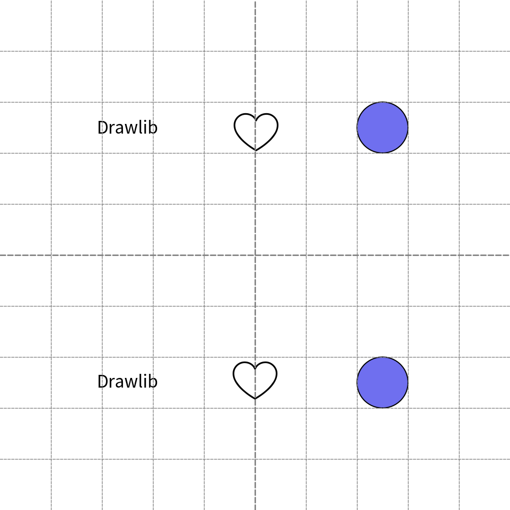

=======================
Coding Best Practices
=======================

If your illustration is comple, drawlib's code will be also complex.
On that situation, coding practice is important.

First of all, you need to notice that arranging coordinate and size will happen many times.
Actions for easing changing them are drawlib's coding best practices!!

Consider Which Alignment is the best
======================================

Many drawing items are aligned vertically and horizontally.
Using horizontal vertical center is best for aligning different type and size objects.

Let's compare codes.
They are almost same but difference in alignment.

.. literalinclude:: image1.py
   :language: python
   :linenos:
   :caption: image1.py

Upperside drawing uses ``Style(halign="left", valign="bottom")``.
The ``(x,y)`` value is not a simple values since I calculate/test positions.

However, bottomside ``(x,y)`` values are very easy to understand.
They are just pointing center of each items.
No calculation and test are required.

    theme "default"

Align "center, center" is nice work when you change item size.
You don't need to change coordinate if center of the new size item doesn't change.
You need to change (x,y) position if you use left, bottom alignment.

Use Variable When Having Same Values
=======================================

At last example, we need to change all y values when we want to change y position of all items.
With align center, typically having same y when aligning items horizontally.
And also, same x when aligning items vertically.
Let's use variable for coordinations.

In this example, we use coordination variable for holrizontally aligning items.

.. literalinclude:: image2_1.py
   :language: python
   :linenos:
   :caption: image2_1.py

Var y is simple. It is a half of height.
Var x is little bit complex, but it provides same x margin for items.

.. figure:: image2_1.png
    :width: 500
    :class: with-border
    :align: center

    theme "default"

You can easily change canvas height and add new items in this code.
We will change height 50 and add rectangle.

.. literalinclude:: image2_2.py
   :language: python
   :linenos:
   :caption: image2_2.py

As you can see, there are only few point of change.
In my opinion, you should follow example of y.
But exmaple of x makes code complex.
If you are not planning to add items, **Not using variable and calculation** is one choice.
We will hard code 25, 50, 75 to x coodinate at first example normally.

    theme "default"

New image align the items correctly.

Grouping by Function
=======================

Function is useful for calling same operation repeatedly.
You can get same benefit at drawlib of course.
However, using function for just grouping items is also recommended coding style.

When you group items via function, you will get these benefits.

- Able to understand abstract image design
- Able to localize variable such as x,y which doesn't affects outside of function.
- Draw same group of items at many places

Normally, we tend to create these functions

- ``left()``, ``center()``, ``right()``
- ``bottom()``, ``center()``, ``top()``

At each functions define x and y at first.
All items are relative position from the base x, y position.
When you want to move group, changing the x, y vars moves all items position.