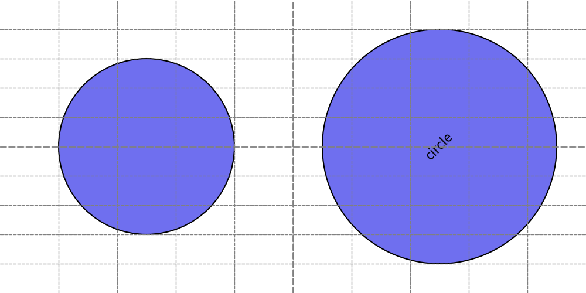
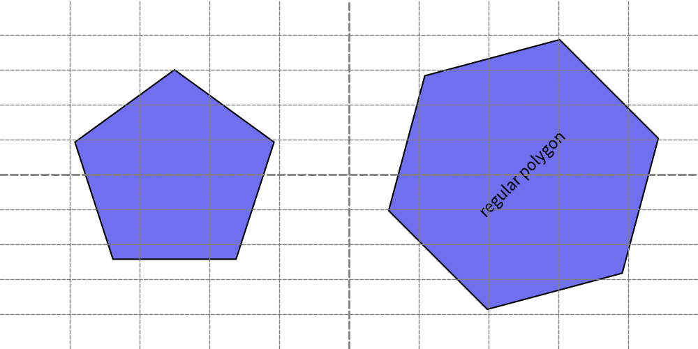
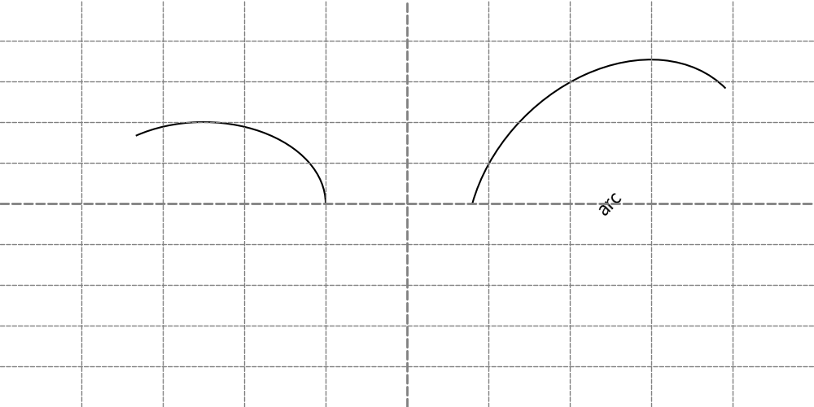
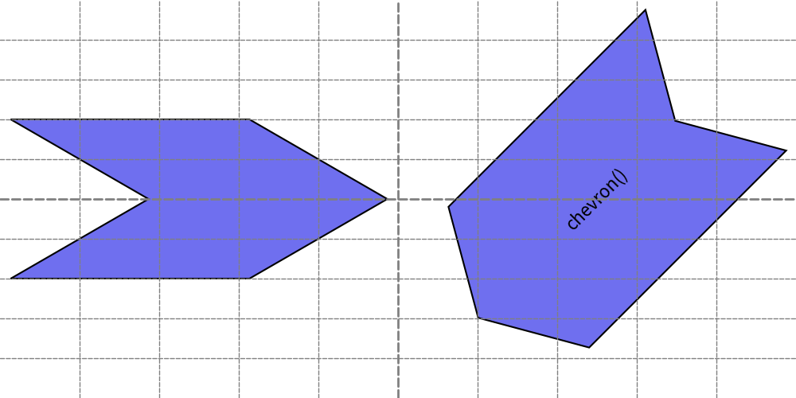
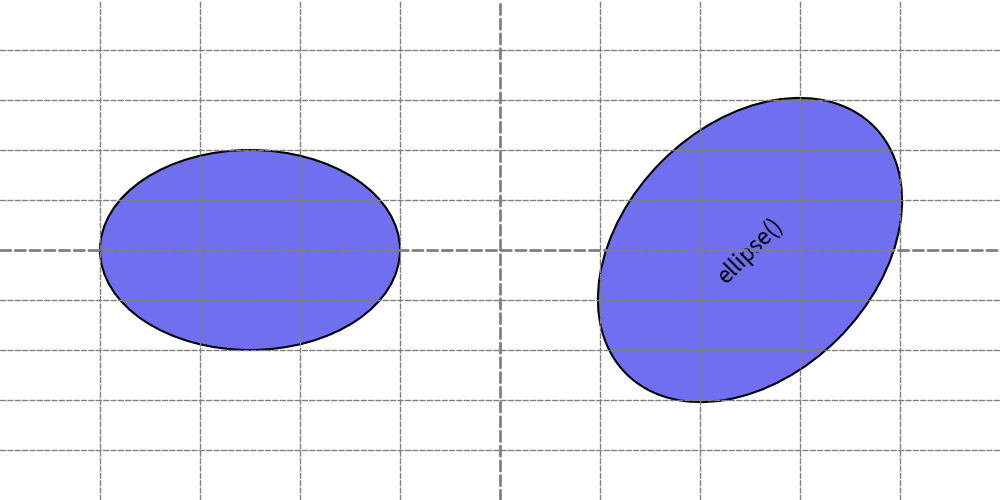
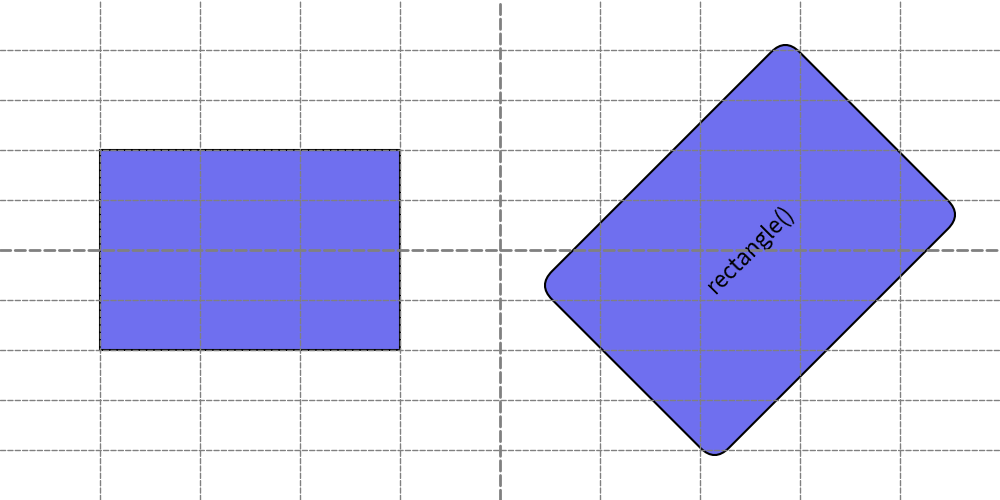
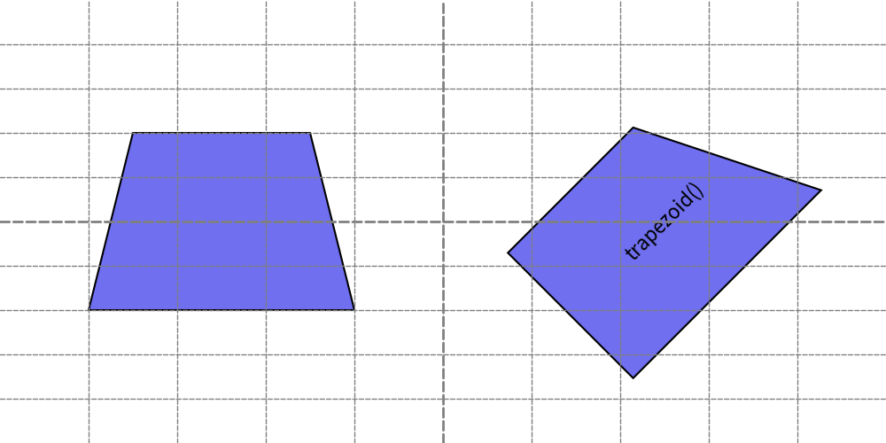
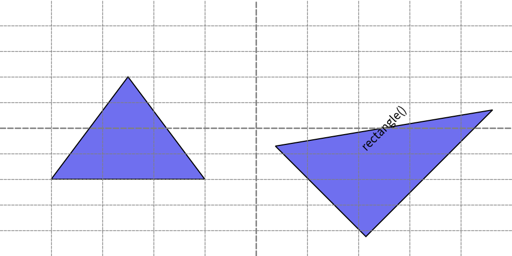
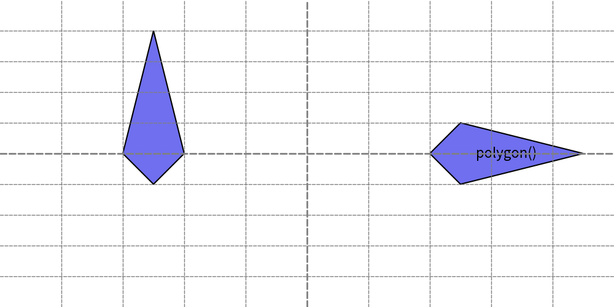

===============
Drawing Shape
===============

Drawlib posses lots of drawing shape functions.
The most basic ones are drawing circle, rectangles etc.
The most minor shapes are bubblespeech, chevron etc.

All of functions are categorized to these 3 types.

* Circle like shape: Specify xy and radius
* Rectangle like shape: Specify xy and width/height
* Other shapes: Arrow(from xy1 to xy2), Polygon(connects xys and fill) etc.

Functions which draw circle like shapes are

* ``circle()``
* ``donuts()``
* ``fan()``
* ``regularpolygon()``
* ``star()``
* ``wedge()``

Functions which draw rectangle like shapes are

* ``arc()``
* ``bubblespeech()``
* ``chevron()``
* ``ellipse()``
* ``parallelogram()``
* ``rectangle()``
* ``rhombus()``
* ``trapezoid()``
* ``triangle``

And last functions which draw other type shapes are

* ``arrow()``
* ``polygon()``
* ``shape()``

Let's take a look all of them except ``shape()`` which we mention at another page by categories.
``shape()`` is useful for drawing shape which is your original.

All of their alignment is horizontally center and vertically center by default.
Which can be changed via style ``ShapeStyle()``.
However ``arrow()`` and ``polygon()`` don't have alignment.
They will ignore alignment attributes.
We will mention styling ``ShapeStyle`` and ``ShapeTextStyle`` in another page.

Draw Circle Like Shapes
=========================

Circle like object specifies xy and radius and other shape specific args.

circle()
---------

Function ``circle()`` draws circle.
Which takes these arguments.

* xy (tuple[float, float]): X, Y coordinate
* radius (float): radius
* angle (float): angle which effects to text
* style (ShapeStyle)
* text (str): center text
* textstyle (ShapeTextStyle)

Let's explore two examples.

.. literalinclude:: image_circle1.py
   :language: python
   :linenos:
   :caption: image_circle1.py

Circle shape doesn't have effect of angle.
However, text has effect.

    image_circle1.png

donuts()
---------

Function ``donuts()`` draws donuts like shape.
We specify external radius and width of fill area from external radius.
In another word, internal radius becomes "external radius - width".

This function takes these arguments.

* xy (tuple[float, float]): X, Y coordinate
* radius (float): external radius
* width (float): width of donuts fill area
* angle (float): angle which effects to text
* style (ShapeStyle)
* text (str): center text
* textstyle (ShapeTextStyle)

Let's explore two examples.

.. literalinclude:: image_donuts1.py
   :language: python
   :linenos:
   :caption: image_donuts1.py

Donuts shape doesn't have effect of angle.
However, text has effect.

.. figure:: image_donuts1.png
    :width: 500
    :class: with-border
    :align: center

    image_donuts1.png

Technically, ``donuts()`` is a syntax sugar function of ``wedge()``.

fan()
-------

Function fan() draws fan which is part of circle.
In other words, drawing circle from angle-A to angle-B is a fan.

This function takes these arguments.

* xy (tuple[float, float]): X, Y coordinate
* radius (float): radius
* from_angle (float): shape starts
* to_angle (float): shape ends
* angle (float): rotate shape
* style (ShapeStyle)
* text (str): center text
* textstyle (ShapeTextStyle)

As you can see we have 3 angles in arguments.
Please remember, use create shape via ``from_angle`` and ``to_angle``.
After creation, rotate it via ``angle``.

Let's explore two examples.

.. literalinclude:: image_fan1.py
   :language: python
   :linenos:
   :caption: image_fan1.py

First example draws fan from angle(``from_angle``) 0 to angle(``to_angle``) 135.
Second example is same, but it rotate fan via specifying ``angle``. 

.. figure:: image_fan1.png
    :width: 500
    :class: with-border
    :align: center

    image_fan1.png

Technically, ``fan()`` is a syntax sugar function of ``wedge()``.

regularpolygon()
------------------

Function ``regularpolygon()`` draws regular polygon.
You can specify number of vertex from 3 to many.

This function takes these arguments.

* xy (tuple[float, float]): X, Y coordinate
* radius (float): radius of vertices
* num_vertices (int): number of vertices
* angle (float): rotate shape
* style (ShapeStyle)
* text (str): center text
* textstyle (ShapeTextStyle)

Let's explore two examples.

.. literalinclude:: image_regularpolygon1.py
   :language: python
   :linenos:
   :caption: image_regularpolygon1.py

We draw pentagon(5 vertices) and hexagon(6 vertices).

    image_regularpolygon1.png

Providing vertices 2 draws line and huge number such as ``1000,000,000`` draws circle.
But there are no reason to use them.

star()
--------

Function ``regularpolygon()`` draws star.
You need to specify how many external vertices it has.
And also, radius for external vertices and internal vertices.

* xy (tuple[float, float]): X, Y coordinate
* radius_ext (float): external radius
* radius_int (float): internal radius
* num_vertices (int): number of vertices
* angle (float): rotate shape
* style (ShapeStyle)
* text (str): center text
* textstyle (ShapeTextStyle)

Let's explore two examples.

.. literalinclude:: image_star1.py
   :language: python
   :linenos:
   :caption: image_star1.py

Via changing ``num_vertices``, you can draw many type of stars.

.. figure:: image_star1.png
    :width: 500
    :class: with-border
    :align: center

    image_star1.png

wedge()
--------

Function ``wedge()`` draws wedge.
It is a mix of ``donuts()`` and ``fan()``.
You can specify external radius and shape area width.
And also, where drawing start and end.

This function takes these arguments.

* xy (tuple[float, float]): X, Y coordinate
* radius (float): radius
* width (float): width of donuts fill area
* from_angle (float): shape starts
* to_angle (float): shape ends
* angle (float): rotate shape
* style (ShapeStyle)
* text (str): center text
* textstyle (ShapeTextStyle)

Let's explore two examples.

.. literalinclude:: image_wedge1.py
   :language: python
   :linenos:
   :caption: image_wedge1.py

You can specify both ``donts()`` and ``fan()`` arguments for function ``wedge()``.

.. figure:: image_wedge1.png
    :width: 500
    :class: with-border
    :align: center

    image_wedge1.png

You can draw both donuts and fan shape via ``wedge()``.
But functions ``donuts()`` and ``fan()`` are more simple and having easy function name.
We recommend using them for their shapes.

Draw Rectangle Like Shapes
============================

Rectangle like object specifies xy and width/height and other shape specific args.
Both ``arc()`` and ``ellipse()`` are looking similar to circle by shape.
However, there parameters are similar to rectangle.
So, we categorize them to rectangle like shape.

arc()
-------

Function ``arc()`` draws arc.
Arc is looks like line, but it is drawn as shape.
So, you can't specify arrow style.
But you can specify line style via attribute of ``ShapeStyle``.

It takes width and height for underlying transparent ellipse.
And draw visible line over it between specified angles.

This function takes these arguments.

* xy (tuple[float, float]): X, Y coordinate
* width (float): width underlying ellipse
* height (float): height underlying ellipse
* from_angle (float): arc starts
* to_angle (float): arc ends
* angle (float): rotate arc
* style (ShapeStyle)
* text (str): center text
* textstyle (ShapeTextStyle)

Let's explore two examples.

.. literalinclude:: image_arc1.py
   :language: python
   :linenos:
   :caption: image_arc1.py

How to handle angle is almost same to ``donuts()`` etc.
Please check its explanation for details.
Here is an output.

    image_arc1.png

bubblespeech()
-----------------

chevron()
-------------

Function ``chevron()`` draws chevron.
Not only specifying width and height, it specify left bottom corner angle by ``corner_angle``.
The shape of chevron depends on this value.

This function takes these arguments.

* xy (tuple[float, float]): X, Y coordinate
* width (float): width underlying ellipse
* height (float): height underlying ellipse
* corner_angle (float): Left bottom corner angle.
* mirror (bool): make chevron reverse horizontally
* angle (float): rotate arc
* style (ShapeStyle)
* text (str): center text
* textstyle (ShapeTextStyle)

Let's explore two examples.

.. literalinclude:: image_chevron1.py
   :language: python
   :linenos:
   :caption: image_chevron1.py

Chevron's shape depends on ``corner_angle``.
Right side chevron uses ``mirror`` option.
If it is True, the chevron becomes horizontally reverse.
Default is False.

    image_chevron1.png

ellipse()
-----------

Function ``ellipse()`` draws ellipse.
If width and height are same, it is almost same to ``circle()``.

This function takes these arguments.

* xy (tuple[float, float]): X, Y coordinate
* width (float): width of ellipse
* height (float): height of ellipse
* angle (float): rotate ellipse
* style (ShapeStyle)
* text (str): center text
* textstyle (ShapeTextStyle)

Let's explore two examples.

.. literalinclude:: image_ellipse1.py
   :language: python
   :linenos:
   :caption: image_ellipse1.py

This code makes this output.

    image_ellipse1.png

parallelogram()
------------------

Function ``parallelogram()`` draw parallelogram.
It takes arguments ``corner_angle`` and it decide left bottom corner angle.
Another option ``mirror`` reverse the shape horizontally.

This function takes these arguments.

* xy (tuple[float, float]): X, Y coordinate
* width (float): width of ellipse
* height (float): height of ellipse
* corner_angle (float): left bottom corner angle.
* mirror (optional bool): reverse horizontally.
* angle (float): rotate ellipse
* style (ShapeStyle)
* text (str): center text
* textstyle (ShapeTextStyle)

Let's explore two examples.

.. literalinclude:: image_parallelogram1.py
   :language: python
   :linenos:
   :caption: image_parallelogram1.py

This code makes this output.

.. figure:: image_parallelogram1.png
    :width: 500
    :class: with-border
    :align: center

    image_parallelogram1.png

rectangle()
-------------

Function ``rectangle()`` draws rectangle.
Not only specifying width and height, it can specify corner R.

This function takes these arguments.

* xy (tuple[float, float]): X, Y coordinate
* width (float): width underlying ellipse
* height (float): height underlying ellipse
* r (float): corner R.
* angle (float): rotate arc
* style (ShapeStyle)
* text (str): center text
* textstyle (ShapeTextStyle)

Let's explore two examples.

.. literalinclude:: image_rectangle1.py
   :language: python
   :linenos:
   :caption: image_rectangle1.py

Default R is 0.
So, left side rectangle which doesn't specify ``r`` has no R.

    image_rectangle1.png

rhombus()
-----------

Function ``rhombus()`` draws rhombus.

This function takes these arguments.

* xy (tuple[float, float]): X, Y coordinate
* width (float): width 
* height (float): height
* angle (optional float): rotate arc
* style (optional ShapeStyle)
* text (optional str): center text
* textstyle (optional ShapeTextStyle)

Let's explore two examples.

.. literalinclude:: image_rhombus1.py
   :language: python
   :linenos:
   :caption: image_rhombus1.py

It generate this output.

.. figure:: image_rhombus1.png
    :width: 500
    :class: with-border
    :align: center

    image_rectangle1.png

trapezoid()
-------------

Function ``trapezoid()`` draws rhombus.
As you know trapezoid has 2 different "bottom width" and "top width".
And also, positioning of "top side (or bottom side)" has variations.
So, this function takes 3 special arguments ``bottom_width``, ``top_width`` and ``top_start``.

This function takes these arguments.

* xy (tuple[float, float]): X, Y coordinate
* height (float): height
* bottom_width (float): width of bottom side 
* top_width (float): width of top side 
* top_start (optional float): where top side start. default makes top side center.
* angle (optional float): rotate arc
* style (optional ShapeStyle)
* text (optional str): center text
* textstyle (optional ShapeTextStyle)

Let's explore two examples.

.. literalinclude:: image_trapezoid1.py
   :language: python
   :linenos:
   :caption: image_trapezoid1.py

First example doesn't specify argument ``top_start``.
So, top side becomes center.
When top side is bigger rather than bottom side, bottom side becomes center.

You can specify where top side starts.
The second example set 0 to ``top_start``. So, top side starts from x where bottom side start.

    image_trapezoid1.png

triangle()
------------

Function ``triangle()`` draws triangle.
It has optional argument ``topvertex_xpos``.
It defines where top vertex is pointed.
If you didn't specify it, isosceles triangle is drawn.
It means x of top vertex becomes center of width.

This function takes these arguments.

* xy (tuple[float, float]): X, Y coordinate
* width (float): width of bottom side.
* height (float): height 
* topvertex_xpos (optional float): where top side vertex is pointed horizontally.
* angle (optional float): rotate arc
* style (optional ShapeStyle)
* text (optional str): center text
* textstyle (optional ShapeTextStyle)

Let's explore two examples.

.. literalinclude:: image_triangle1.py
   :language: python
   :linenos:
   :caption: image_triangle1.py

First example doesn't specify argument ``topvertex_xpos``.
So, top vertex becomes center. And it makes triangle isosceles.

You can specify where top vertex is pointed.
The second example set 0 to ``topvertex_xpos``. So, top vertex's x is set to where bottom side start.

    image_triangle1.png

In this example, inner text is drawn on center of right triangle.
And it is out of shape.
In these situation you can move where text is drawn by specifying attribute ``xy_shift`` of ``ShapeTextStyle``.
We will explain it at shape style document.

Draw Other Type of Shapes
============================

arrow()
---------

Function ``arrow()`` draws arrow shape.
If you want to draw arrow line, please use function ``line()`` and related ones with style ``LineArrowStyle``.

Arrow has its original positioning method which specify starting point ``xy1`` and end point ``xy2`` which is similar to line.
And also, you can specify arrow tail and head size.

This function takes these arguments.

* xy1 (tuple[float, float]): Start point
* xy2 (tuple[float, float]): End point
* tail_width (float): Tail (not arrow head) width
* head_width (float): Arrow head width
* head_length (float): Arrow head length
* head_style (optional str): Arrow head style
* style (optional ShapeStyle)
* text (optional str): center text
* textstyle (optional ShapeTextStyle)

Argument ``head_style`` can specify arrow types.

* ``"-|>"``: having head on end point
* ``"<|-"``: having head on start point
* ``"<|-|>"``: having head on both start and end points

If you doesn't specify head style, end point is applied.
Let's explore two examples.

.. literalinclude:: image_arrow1.py
   :language: python
   :linenos:
   :caption: image_arrow1.py

There are no argument angle on ``arrow()``.
But you decide it by start and end points.

.. figure:: image_arrow1.png
    :width: 500
    :class: with-border
    :align: center

    image_arrow1.png

``arrow()`` ignores alignment attributes ``halign`` and ``valign`` on ``ShapeStyle``.

polygon()
-----------

Function ``polygon()`` draws shape which connects specified points.
Start point and end point are connected automatically.

This function takes these arguments.

* xys (list[tuple[float, float]]): Polygon points
* style (optional ShapeStyle)
* text (optional str): center text
* textstyle (optional ShapeTextStyle)

Let's explore two examples.

.. literalinclude:: image_polygon1.py
   :language: python
   :linenos:
   :caption: image_polygon1.py

Since ``polygon()`` draw shapes which connects points, there are no argument ``angle``.
This example draws same shapes.
However, that is achived by calculating points location by ourselves.

    image_polygon1.png

If you prefer drawing your shape which has normal coordinate system and angle feature, please consider using function ``shape()``.