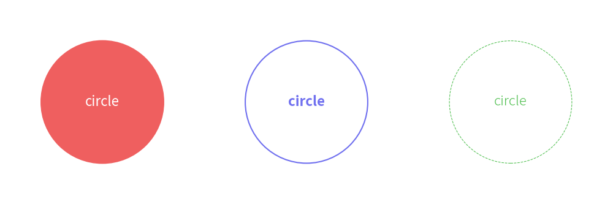

============
Shape Style
============

Drawlib uses ``ShapeStyle`` for styling shapes. 
For a shape's text, it uses ``ShapeTextStyle``, which is similar to ``TextStyle`` but is a different type.

ShapeStyle
=============

ShapeStyle is used for styling shapes. 
Additionally, shape alignment is configured within ShapeStyle.

Here are attributes of ShapeSyel.

* haligh
* valign
* lwidth
* lcolor
* lstyle
* fcolor
* alpha

All of these attributes are optional. 
If you don't specify values for them, the default theme values are applied.

Alignment
-----------

You can configure the alignment of shapes, except for ``arrow()`` and ``polygon()``, which specify drawing points explicitly and therefore do not have alignment options.

The default alignment is centered both horizontally and vertically. Y
ou can specify ``"left"``, ``"center"``, or ``"right"`` for horizontal alignment (``halign``). 
Similarly, you can specify ``"bottom"``, ``"center"``, or ``"top"`` for vertical alignment (``valign``). 
For more details and examples, please refer to the Coordinate and Alignment page.

Style
-------

``ShapeStyle`` possesses styling attributes, categorized as follows:

* Line style
* Line style
* Line and fill style

Currently, the fill style includes only the color attribute (``fcolor``), where f stands for fill.
The only attribute that applies to both line and fill is ``alpha``. 
Other attributes are for the shape's line and start with l, which implies line.

Here are three examples:

.. literalinclude:: image_shapestyle1.py
   :language: python
   :linenos:
   :caption: image_shapestyle1.py

Left example has non transparent style.
Center has fcolor transparent.
Right has alpha value.

.. figure:: image_shapestyle1.png
    :width: 600
    :class: with-border
    :align: center

    ShapeStyle

If you don't need a shape border line, set ``lwidth=0``. 
If you don't need a shape fill color, set ``fcolor=Colors.Transparent`` or ``fcolor=Colors.White``. 
These are typical shape styling configurations.

ShapeTextStyle
================

ShapeTextStyle is similar to ``TextStyle``, which is used for drawing text with the ``text()`` function. 
The differences between them are:

- ``ShapeTextStyle``: Allows shifting the x and y coordinates of the text from the center of the shape and changing the angle.
- ``TextStyle``: Allows configuring the text background.

ShapeTextStyle has these attributes.

- halign: Ignored (for future implementation)
- valign: Ignored (for future implementation)
- color: Text color
- size: Text size
- font: Text font
- xy_shift: Shifting from the original drawing point
- angle: Text angle (default is the same as the shape angle)

Here are three examples:

.. literalinclude:: image_textstyle1.py
   :language: python
   :linenos:
   :caption: image_textstyle1.py

You can configure text styles.
But also, you can configure text positioning which you can see right example.

Below is a figure illustrating these styles:

.. figure:: image_textstyle1.png
    :width: 600
    :class: with-border
    :align: center

    ShapeTextStyle

As you can see from the center text example, text normally follows the shape's angle. 
However, you can override it, as shown in the right example. 
In that example, we also move the text positioning via ``xy_shift``. 
The x and y values are not absolute coordinates but are relative to the shape's dimensions.

Theme's Pre-defined Styles
============================

Shapes can use pre-defined styles from the theme you choose.

The style syntax is: ``<color>_<type>_<thickness>``. 
If the color, type, and thickness are default, they are not shown in the style name.

Each style type has variations for line and fill styles with ``ShapeStyle``. 
``ShapeTextStyle`` cannot use these styles.

- default: Has border and fill color
- ``flat``: Has no border
- ``solid``: Shape has an outline but no fill
- ``dashed``: Dashed outline, no fill

Each thickness types has variation of line width except ``flat`` which doesn't have line.
On ``ShapeTextStyle``, it means tyep of fonts.

- ``thin``: Half of the default line width; font is thin
- default: Regular line width; font is regular
- ``bold``: Double the default line width; font is bold

Here are three examples:

.. literalinclude:: image_theme1.py
   :language: python
   :linenos:
   :caption: image_theme1.py

In this example, we use theme ``"default2"``.
Below is a figure illustrating these styles:

    Theme's styles

