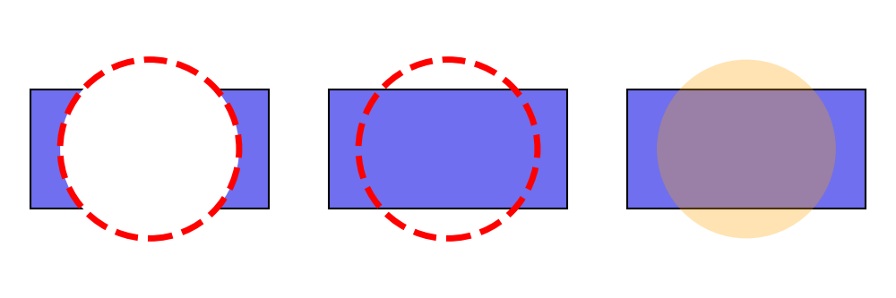

============
Shape Style
============

Drawlib uses ``ShapeStyle`` for styling shape.
Regarding shape's text, it uses ``ShapeTextStyle`` which is similar to ``TextStyle`` but differnt one.

ShapeStyle
=============

ShapeStyle is used for styling shape.
But shape alignment is also configured at ShapeStyle.

Here are attributes of ShapeSyel.

* haligh
* valign
* lwidth
* lcolor
* lstyle
* fcolor
* alpha

All of them are optional. 
When you don't specify values to them, default theme value is applied.

Alignment
-----------

You can configure alignment of shape except ``arrow()`` and ``polygon()``.
They specify drawing points specifically, so alignment doesn't exist.

Default alighment is center on both horizontal and vertical.
You can specify ``left``, ``center``, ``right`` for horizontal alignment ``halign``.
And also, you can specify ``bottom``, ``center`` and ``top`` for vertical alignment ``valign``.
We explain details in coodinate and alignment page.
Please check it for details and examples.

Style
-------

``ShapeStyle`` posses styling attributes.
They are categorized to below.

* line style
* fill style
* line and fill style

Currently, fill style is only color ``fcolor``.
``f`` means fill.
And also, style which is applied on both line and fill is only ``alpha``.
Other attributes are for shape line.
They starts from ``l`` which implies line.

Here are 3 examples.

.. literalinclude:: image_shapestyle1.py
   :language: python
   :linenos:
   :caption: image_shapestyle1.py

Left example has non transparent style.
Center has fcolor transparent.
Right has alpha value.

    image_shapestyle1.png

If you don't need shape border line, please set ``lwidth=0``.
If you don't need shape fill color, please set ``fcolor=Colors.Transparent``.
They are typical shape styling.

ShapeTextStyle
================

ShapeTextStyle is similar to ``TextStyle`` which is used for drawing text function ``text()``.
Difference of them are

* ShapeTextSyle: able to shift xy coordinate from center of shape. able to change angle
* TextStyle: able to configure text background

ShapeTextStyle has these attributes.

* halign: ignored. For future implementation
* valign: ignored. For future implementation
* color: text color
* size: text size
* font: text font
* xy_shift: shifting from original drawing point
* angle: text angle. default is same to shape angle

Here are 3 examples.

.. literalinclude:: image_textstyle1.py
   :language: python
   :linenos:
   :caption: image_textstyle1.py

You can configure text styles.
But also, you can configure text positioning which you can see right example.

.. figure:: image_textstyle1.png
    :width: 500
    :class: with-border
    :align: center

    image_textstyle1.png

As you can see from center text example, text follows shape angle normally.
However you can override it as right example.
In that one, we also move text positioning via ``xy_shift``.
X and Y are not absolute coordinate value.
But inside of shape value.