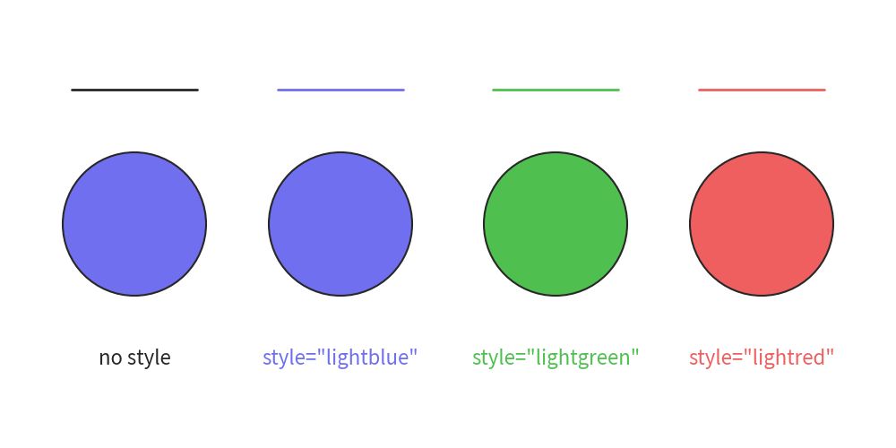
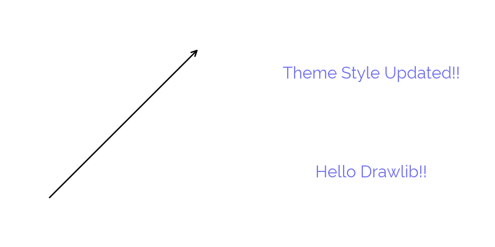
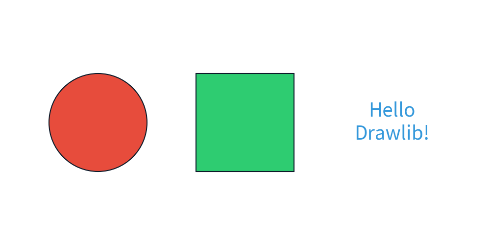
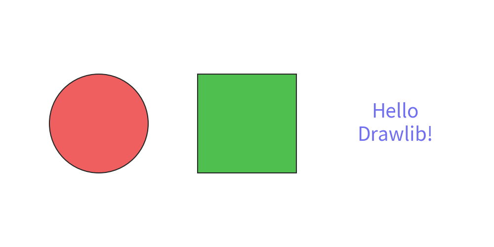

==================
Theme feature
==================

Drawlib posses theme feature.
Default theme is applied automatically at start.

Theme is a combination of pre-defined styles.
If you don't specify style to drawing items, pre-defined theme style will be applied.
Or you can specify style with shortcut such as ``text((10, 10), "Hello", style="blue")``.

Understanding drawlib's theme feature will release you defining lots of style object.
And also, your illustration can achieve consistency of styles.

They are key concept of drawlib's theme system.

- Theme feature exists under ``dtheme``.
- Posses official themes. Default theme is ``default``.
- Each theme posses default styles for drawing items.
- Other theme styles can be used with keywords.
- You can modify existing theme
- Able to create your own new theme

We will take care basic things in this doc.
Advanced topics are covered in Theme chapter docs.

Get list of official docs
===========================

Drawlib posses few official themes.
Default theme is ``default``.
To use other theme, you need to specify its name.

You can get list of official theme names.

.. literalinclude:: get_theme_names.py
   :language: python
   :linenos:
   :caption: How to get official theme names

Apply Official Themes
========================

Here is a circle with default(not specify any) theme.

.. literalinclude:: image1_1.py
   :language: python
   :linenos:
   :caption: image1_1.py

Executing this code yields the following image:

.. figure:: image1_1.png
    :width: 500
    :class: with-border
    :align: center

    theme "default"

As you can see, circle color is light blue.
It is default style color.

Let's change theme to ``gray``.
And draw it again.

.. literalinclude:: image1_2.py
   :language: python
   :linenos:
   :caption: image1_2.py

Changing theme is achieved by config option such as ``config(theme=<theme_name>)``.
It is a shortcut of theme handling function ``dtheme.apply_official_theme(<theme_name>)``.
Executing this code yields the following image:

.. figure:: image1_2.png
    :width: 500
    :class: with-border
    :align: center

    theme "gray"

You can see gray circle.
The difference of code is almost specifying theme and last line.
Function ``clear()`` will initialize drawing state.
But ``theme`` and ``Dimage.cache`` are exceptions.
They will be keeped even if ``clear()`` is called.
Think about it, you create your own styles and want to apply many image buildings.
Clearing styles each drawing time might make let you having frastration.
So, it doesn't clear styles and caches.

In this time, we want to change theme to default again.
So, we delete not only drawing state, but also theme by calling ``clear(clear_theme=True)``.

Theme's pre-defined styles
=============================

Each drawing item uses theme's default style.
But you can apply optional styles easily by providing style name to drawing functions style args.
Let's check default theme's other styles.

.. literalinclude:: image2_1.py
   :language: python
   :linenos:
   :caption: image2_1.py

You can see, providing ``"blue"``, ``"green"`` and ``"pink"`` to style.
Args style can take them.

- Style object such as ``ShapeStyle()`` and ``TextStyle()``. It depends on function that what style object can take.
- String. Theme's style name
- None. Default

When style get Style object, draw style as specified.
When string is provided, the function search theme's style name.
If it exist, apply it.
If it doens't, raise error.
None is a default value of style. Applying default style when arg style get None.

.. figure:: image2_1.png
    :width: 500
    :class: with-border
    :align: center

    Specifying theme style name

Default theme is same to "blue" on theme "default".
So, specifying "blue" to style is same to no-style.
However, "green" makes the shape green and "pink" makes it pink.
Style keywords "blue", "green" and "pink" can be used since default theme has styles which have the name.
On the other hand, theme ``gray`` doesn't have those style keywords. So specifying them makes value error.

You can check what style name you can use via ``dtheme.print_style_table()``

.. literalinclude:: print_theme_style_table.py
   :language: python
   :linenos:
   :caption: print_theme_style_table.py

Let's check another official theme ``flat``.
It is flat design style theme.

.. literalinclude:: image2_2.py
   :language: python
   :linenos:
   :caption: image2_2.py

    Specifying theme style name

Accessing Theme Styles
=======================

At previous examples, you use predefined styles.
Sometimes, you need to modify it slightly such as changing text size.
On that situation, you can use ``dtheme.<type>styles`` style caching objects.
Name is equivalent to drawlib's style class name.
For example

- ``IconStyle``: ``dtheme.iconstyles``
- ``ImageStyle``: ``dtheme.imagestyles``
- ``LineStyle``: ``dtheme.linestyles``
- ``LineArrowStyle``: ``dtheme.linearrowstyles``
- ``ShapeStyle``: ``dtheme.shapestyles``
- ``ShapeTextStyle``: ``dtheme.shapetextstyles``
- ``TextStyle``: ``dtheme.textstyles``

Are important caches.

Each style cache objects posses these methods.

- ``has(name)``: whether the name style exists or not
- ``list()``: get names of styles
- ``get(name)``: get style object
- ``set(name)``: set style object
- ``delete(name)``: delete style object

When you get and set objects, copied object is saved and retrieved.
No worry to modify style object after get/set.

.. literalinclude:: image3_1.py
   :language: python
   :linenos:
   :caption: image3_1.py

    Specifying theme style name

Drawlib can customize style per shape objects such as ``circle()`` and ``rectangle()``.
However, if you don't need to customize per shape types, just using ``dtheme.shapestyles`` and ``dtheme.shapetextstyles`` are OK.
If each style cache doesn't have the name style, it will use those values.

Accessing Theme Colors
=======================

When you create style object from scratch, you may want to get theme colors.
Drawlib provides ``dtheme.colors`` object.
It is almost same to last style cache object.
It has same name methods.

- ``has(name)``: whether the name color exists or not
- ``list()``: get names of colors
- ``get(name)``: get color
- ``set(name)``: set color
- ``delete(name)``: delete color

.. literalinclude:: image4_1.py
   :language: python
   :linenos:
   :caption: image4_1.py

Rename Style Name
=====================

If you have possibilities for changing theme later, please consider renaming style names.
For example, ``default`` theme's style name ``blue`` can't be used in many other themes.
Hard coding ``style="blue"`` makes difficulty of changing style.
To change theme, you need to change all illustration codes.

Suppose, we want to change theme from ``default`` to ``flat``.
In this situation, changing style name from ``blue`` to ``1`` might be useful for theme ``default``.
And also, changing style name from ``peter_river`` to ``1`` is useful for theme ``flat``.
I prefer "1", "2", "3" for anonym of primary color, secondary color etc.
But standadize to color name "blue", "red", "green" etc might be good too.

To change style name, we use ``dtheme.allstyles`` object.
It posses methods for modifying style name.
Here are the list of methods.

- ``rename(from_name, to_name)``
- ``copy(from_name, to_name)``
- ``delete(name)``

In our situation, we use ``dtheme.allstyles.rename()``.

OK, take a look at theme ``default`` code.

.. literalinclude:: image5_1.py
   :language: python
   :linenos:
   :caption: image5_1.py

Next, take a look at theme ``flat`` code.

.. literalinclude:: image5_2.py
   :language: python
   :linenos:
   :caption: image5_2.py

We did this name modification at illustration code in these examples.
But you should implement it on common style code which we explained at building many images topic.

Predefined Rich Themes
=========================

You can define your themes by your self.
However, if you are planning to use standard styles using our theme is recommended.
Each theme posses pre-defined styles with following rules.

.. figure:: manual/introductions/index/image_theme_matrix.png
   :width: 800
   :class: with-border
   :align: center

   Style name: ``<color>_<type>_<width>``

The difference of theme is what color you can use.
For example, theme ``essentials`` posses these colos.

.. figure:: manual/introductions/index/image_theme_colors.png
   :width: 800
   :class: with-border
   :align: center

   Colors of theme essentials

You can customize drawlib's pre-defined theme if you wants.
For example, changing default fonts are popular customization.
We don't mention detail at here, but we provides features for customizing styles easily.