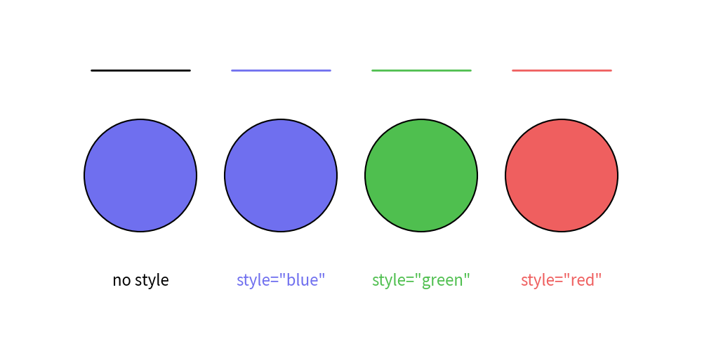
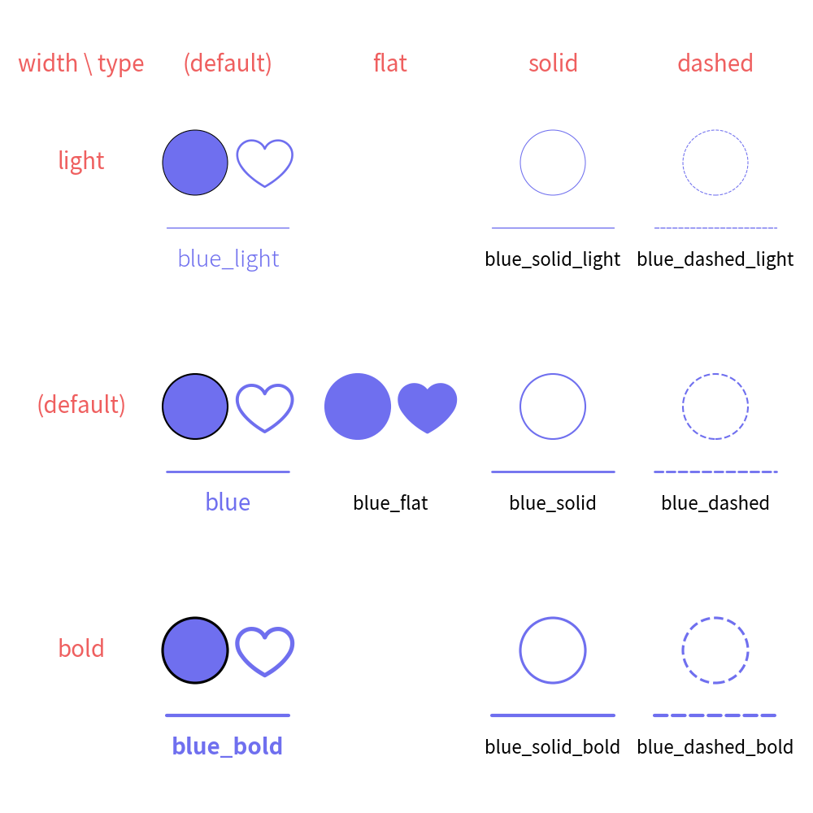

==================
Theme feature
==================

Drawlib possesses a theme feature. 
The default theme is applied automatically at the start.

A theme is a combination of predefined styles. 
If you don't specify a style for drawing items, the predefined theme style will be applied. 
Alternatively, you can specify a style with a shortcut, such as ``text((10, 10), "Hello", style="blue")``.

Understanding drawlib's theme feature will save you from defining many style objects. 
Additionally, your illustrations will achieve consistency in styles.

Here are the key concepts of drawlib's theme system:

- The theme feature exists under dtheme.
- Official themes are available. The default theme is default.
- Each theme has default styles for drawing items.
- Other theme styles can be used with keywords.
- You can modify existing themes.
- You can create your own new themes.

We will cover the basics in this document.
Advanced topics are covered in the theme chapter of the documentation.

Get List of Official Themes
=============================

Drawlib possesses a few official themes. 
The default theme is ``default``. 
To use another theme, you need to specify its name.

You can get a list of official theme names with ``dtheme.list_official_themes()`` function.
Here is an example.

.. literalinclude:: get_theme_names.py
   :language: python
   :linenos:
   :caption: How to get official theme names

As you can see, we supports these themes now.

- ``"default"``
- ``"default2"``
- ``"essentials"``
- ``"monochrome"``

Apply Official Themes
========================

Here is a circle with the default (not specified) theme.

.. literalinclude:: image1_1.py
   :language: python
   :linenos:
   :caption: image1_1.py

Executing this code yields the following image:

.. figure:: image1_1.png
   :width: 600
   :class: with-border
   :align: center

   theme "default"

As you can see, the circle color is light blue. 
If you don't provide any style, the theme's default style is applied. 
This is the default style of the ``default`` theme.

Let's change the theme to ``monochrome``. 
The ``dtheme.apply_official_theme()`` function takes the theme name as an argument. 
This will change the theme accordingly.

Here is an example code:

.. literalinclude:: image1_2.py
   :language: python
   :linenos:
   :caption: image1_2.py

The only difference in the code is specifying the theme. 
Executing this code yields the following image:

.. figure:: image1_2.png
    :width: 500
    :class: with-border
    :align: center

    theme "monochrome"

You can see a black outlined circle. 
This is the default style of the ``monochrome`` theme.

Notice
----------

The function ``clear()`` will initialize the drawing state, but ``theme`` and ``Dimage.cache`` are exceptions. 
They will be kept even if ``clear()`` is called.

Consider this: you create your own styles and want to apply them to many illustration codes. 
``clear()`` must be called between executing illustration codes. 
Clearing styles each time you draw might cause frustration. 
Therefore, it doesn't clear styles and caches.

To clear the theme and cache, please call ``dutil_canvas.initialize()``. 
This will initialize all canvas states.

Theme's Pre-defined Style names
===================================

In the previous example, we examined each theme's default styles. 
As mentioned, the default style is applied when no style is provided.

You can apply a theme's style to drawing items using its name. 
Drawing functions accept the style argument, which can take style classes like ``ShapeStyle`` and ``TextStyle``, as well as string style names. 
If the name exists, the corresponding style will be applied; otherwise, an error will occur.

The theme ``default`` includes the following style names:

- ``""``(blank): Default style applied when no style name is provided.
- ``"red"``: Light blue color
- ``"green"``: Light green color
- ``"blue"``: Light blue color
- ``"black"``: Black color
- ``"white"``: White color

Let's see them in action.

.. literalinclude:: image2_1.py
   :language: python
   :linenos:
   :caption: image2_1.py

In the example above, ``"blue"``, ``"green"``, and ``"red"`` are provided as style names. 
This method simplifies specifying styles by name rather than creating style objects.

Executing this code produces the following image:

   Specifying theme style name

You can view the available style names using ``dtheme.print_style_table()``.

.. literalinclude:: print_theme_style_table.py
   :language: python
   :linenos:
   :caption: print_theme_style_table.py

This will print a matrix showing style names and the supported style classes. 
For instance, theme default's style names can be used across all style classes.

Style Name Rules
=====================

The theme ``default`` primarily uses color style names, whereas other themes offer a wider variety of styles compared to default. 
These themes follow common naming rules.

Before delving into the rules, let's examine another official theme, ``default2``, with an example:

.. literalinclude:: image3.py
   :language: python
   :linenos:
   :caption: image3.py

In the previous example, the styles were primarily color names. 
However, ``default2`` introduces additional descriptors this time.

Executing this code results in the following image:

.. figure:: image3.png
   :width: 500
   :class: with-border
   :align: center

   Specifying theme style name

The style names in ``default2`` follow this syntax: ``<color>_<type>_<thickness>``. 
If the color, type, and thickness are default, they may not appear in the style name.

Each style type has variations for line and fill styles with ``ImageStyle``, ``ShapeStyle``, ``LineStyle``. 
``IconStyle`` supports only default and ``flat``(fill) style types.
``TextStyle``, ``ShapeTextStyle`` cannot use these styles.

- default: Has border and fill color
- ``flat``: Has no border
- ``solid``: Shape has an outline but no fill
- ``dashed``: Dashed outline, no fill

Each thickness types has variation of line width for ``ImageStyle``, ``ShapeStyle``, ``LineStyle``.
On ``TextStyle`` and ``ShapeTextStyle``,  it refers to font weight:

- ``thin``: Half of the default line width; font is thin
- default: Regular line width; font is regular
- ``bold``: Double the default line width; font is bold

Here is a matrix illustrating style types and thickness:

   Matrix of style type and thickness

In this matrix example, we use only the color ``"blue"``, but other colors are also available. 
Note that ``ImageStyle`` and ``ShapeTextStyle`` are not explicitly shown, but they follow similar principles to ``ShapeStyle`` and ``TextStyle`` regarding theme styles.

Understanding these rules is key to mastering drawlib's theme styles. 
For detailed information on each theme, please refer to the theme chapter.