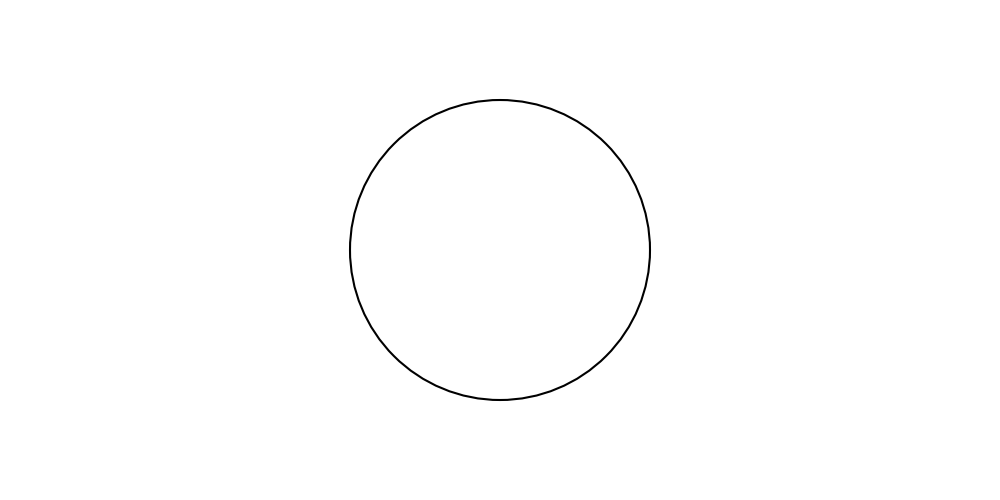

==================
Theme feature
==================

Drawlib posses theme feature.
Default theme is applied automatically at start.
It is a combination of styles.
If you don't specify style to drawing items, theme style will be applied.
This feature will ease styling effort.

They are key concept of drawlib's theme system.

- Posses official themes. Default theme is ``default``.
- Each theme posses default styles for all drawing items.
- Few other styles can be used keywords.
- You can create your own theme

Let's check them before going details.

Apply Official Themes
========================

Here is a circle with default(not specify any) theme.

.. literalinclude:: image1_1.py
   :language: python
   :linenos:
   :caption: image1_1.py

Executing this code yields the following image:

.. figure:: image1_1.png
    :width: 500
    :class: with-border
    :align: center

    theme "default"

As you can see, circle color is light blue.
It is default style color.

Let's change theme to ``gray``.
And draw it again.

.. literalinclude:: image1_2.py
   :language: python
   :linenos:
   :caption: image1_2.py

Changing theme is achieved by config option such as ``config(theme=<theme_name>)``.
It is a shortcut of theme handling function ``dtheme.apply_official_theme(<theme_name>)``.
Executing this code yields the following image:

    theme "gray"

You can see gray circle.
The difference of code is almost specifying theme and last line.
Function ``clear()`` will initialize drawing state.
But ``theme`` and ``Dimage.cache`` are exceptions.
They will be keeped even if ``clear()`` is called.
Think about it, you create your own styles and want to apply many image buildings.
Clearing styles each drawing time might make let you having frastration.
So, it doesn't clear styles and caches.

In this time, we want to change theme to default again.
So, we delete not only drawing state, but also theme by calling ``clear(clear_theme=True)``.

Theme's pre-defined styles
=============================

Each drawing item uses theme's default style.
But you can apply optional styles easily by providing style name to drawing functions style args.
Let's check default theme's other styles.

.. literalinclude:: image1_3.py
   :language: python
   :linenos:
   :caption: image1_3.py

You can see, providing ``"blue"``, ``"green"`` and ``"pink"`` to style.
Args style can take them.

- Style object such as ``ShapeStyle()`` and ``TextStyle()``. It depends on function that what style object can take.
- String. Theme's style name
- None. Default

When style get Style object, draw style as specified.
When string is provided, the function search theme's style name.
If it exist, apply it.
If it doens't, raise error.
None is a default value of style. Applying default style when arg style get None.

.. figure:: image1_3.png
    :width: 500
    :class: with-border
    :align: center

    theme "gray"

Default theme is same to "blue" on theme "default".
So, specifying "blue" to style is same to no-style.
However, "green" makes the shape green and "pink" makes it pink.
Style keywords "blue", "green" and "pink" can be used since default theme has styles which have the name.

On the other hand, theme ``gray`` doesn't have those style keywords. So specifying them makes value error.
Theme gray posses another styles ``"gray1"``, ``"gray2"``, ``gray3``.
Applyint them to style will work fine.

Please be careful it depends on drawing function that what style name can be used.
You can check what style names current theme have by issuing ``dtheme.print_style_table()``.
It will generate style table on console.

.. literalinclude:: image1_3.py
   :language: python
   :linenos:
   :caption: image1_3.py

We will cover how to access them at next topic.

Accessing Theme Styles
=========================

You can modify official theme and your theme.
``dtheme`` provides style management object for each items.
Such as

- ``dtheme.linestyles``
- ``dtheme.shapestyles``
- ``dtheme.textstyles``

Each object posses these methods.

- ``has(name:str = "")``
- ``list()``
- ``get(name:str = "")``
- ``set(style:Style, name:str = "")``
- ``delete(name:str = "")``

They modify style caches like ``dict``.
name is key and style is value.
Default value of ``name`` is blank string and the pair value contains default style.
If you want to get default style, just issue ``dtheme.linestyles.get()``.
If you want to get predifined green style, issue ``dtheme.linestyles.get("green")``.

They will return copy of original style.
Since return value is copied one, you can modify the object.
Modification doesn't effects original styles.

When you want to change theme's style slightly, get and modification might be useful.
If you want to change theme style completly, get, modify, set might be useful.
Here is a example.

Fallback Mechanism of ShapeStyle and ShapeTextStyle
========================================================

Drawlib posses lots of shape drawing functions such as ``circle()`` and ``rectangle()``.
Each shape types posses style caches.

- ``dtheme.circlestyles``
- ``dtheme.rectanglestyles``

If you want to change only 1 shape type, use them.
However, setting styles for each shape type requires lots of effort.
If you want to apply common styles to all shape types, use ``dtheme.shapestyles`` instead.

Drawlib's each shape's get() method has fallback mechanism.

1. Check whether specific shape type posses style name.
2. If it has, return it.
3. If it doesn't, request ``dtheme.shapestyles`` to return same style name.
4. If it has, return it.
5. If it doesn't, not found error happens.

This behavior is also applied to shape text styles.
If ``dtheme.circletextstyles`` can't find the style name, it asks to ``dtheme.shapestexttyles``.

Please remember, default value (key is "") must be set to them.

- ``dtheme.iconstyles``
- ``dtheme.imagestyles``
- ``dtheme.linestyles``
- ``dtheme.linesarrowtyles``
- ``dtheme.shapestyles``
- ``dtheme.shapetextstyles``
- ``dtheme.textstyles``

Drawing functions use there default values if style is not specified.
If default value doesn't exsit, you will get error.
Official theme configures them of course.

LineStyle and ArrowStyle.
============================

Please remember how function ``line()`` specifies style.
Arg ``style`` can take both ``LineStyle`` and ``lineArrowStyle``.
Functions able to judge whether it is line or arrow line through checking types.
However, using style name via str make the situation comples.
Function can't judge whether the style name ``green`` is line or arrow line.

Drawlib approach's this problem with simple solutions.

- Prefer ``LineStyle`` rather than ``LineArrowStyle``
- Additional name is set for LineArrowStyle.

If both style posses style name ``green``, line will be displayed since it has high priority.
If you want to use LineArrowStyle, you have 2 options.

- Get style object first. And then pass it to line function.
- Use name ``"la-<style name>"``. It is additionally set to ``dtheme.linearrowstyles``.

Passing "green" to arg style draws line.
And passing "arrow-green" to it draws arrow-line.

IconStyle color
=================

Icon can use only 1 color.
But each official theme posses 2 colors for each style name.
For example, style "blue" posses ``lcolor(line-color)`` and ``fcolor(fill-color)`` for shapes.

When you pass "blue" to icon's style, lcolor is used.
But you can specify which color via

- ``lc-<style_name>``: lcolor-blue
- ``fc-<style_name>``: fcolor-blue

TextShapeStyle's white
========================

There are many chances that drawing colored shape with white text.
So, ``white`` is automatically added to TextShapeStyle's style.
It uses text color white and other parameters come from default.
If official theme posses ``white`` in definition, this auto add feature will be disabled for the theme.
