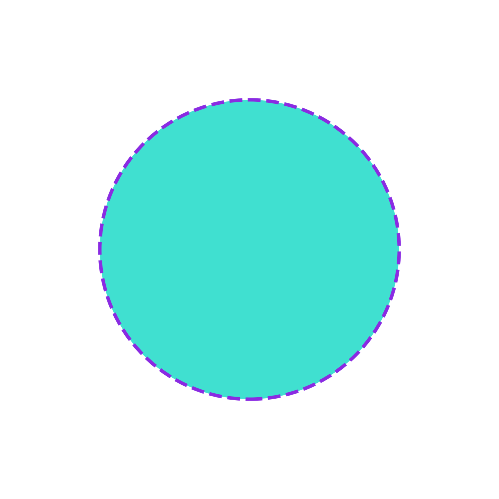
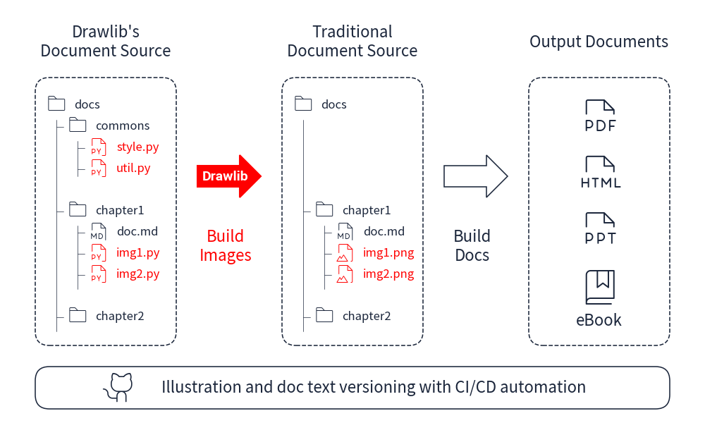
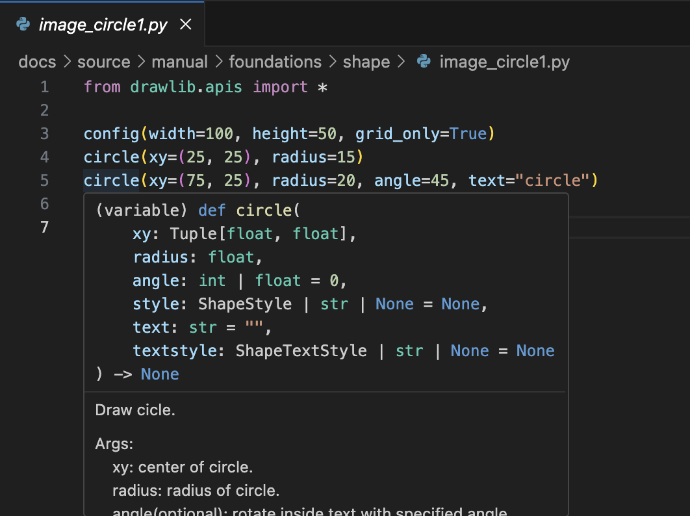

===============
About drawlib
===============

Drawlib is a pure Python drawing library designed to facilitate Illustration as Code. 
Instead of focusing solely on creating polished illustrations, Drawlib emphasizes generating illustrations directly from code.

For instance, consider the following Python code:

.. literalinclude:: image1.py
   :language: python
   :linenos:
   :caption: image1.py

Execute it with the following command:

.. code-block:: none

   $ python image1.py

This will generate an image file:

    image1.png

As illustrated, Drawlib generates an image corresponding to your code.

Drawlib applies style (the equivalent of CSS) to drawing content (the equivalent of HTML). 
You can apply the style directly when you draw, as shown above. 
However, specifying detailed styles is usually unnecessary. 
Instead, it is recommended to use predefined style names for styling.

Benefit of "Illustration as Code"
==================================

In today's world, many technical documents are managed using version control systems such as Git. 
However, managing illustrations poses a challenge since they are typically binary files rather than text-based. 
Drawlib offers a solution by generating illustrations from pure Python code, allowing you to manage them with version control systems just like any other code.

Drawlib is optimized for drawing a large number of illustrations with a consistent style. 
This can be easily achieved by creating a theme file (which is simply Python code) and importing it into your illustration codes. 
Here is a typical use case of Drawlib:

    Build many images at same time

As a real-world example, almost all of the documentation images are created using Drawlib. 
The build flow is similar to the image above. 
We first build images using Drawlib, then build the document via Sphinx, and finally publish it to the Internet. 
These images are built by scripts locally for quick verification of the drawing results. 
To reduce human error and operation costs, we run CI/CD processes when code is committed to the GitHub repository.

Drawlib adopts the theme feature, similar to a slide theme. 
When you change the theme, the default theme style is automatically applied to all images. 
If you want to slightly change the style, modifying the theme will affect all images that reference it. 
This ensures consistent image styling with minimal effort.

Because it is Python 
======================

Many readers of this document might already be familiar with Python. 
With Drawlib, you can leverage Python and its extensive ecosystem to enhance your illustration workflow. 
Some benefits include:

- Creating custom functions to group drawing actions
- Using loops for repeated drawing tasks
- Utilizing conditional branches (if statements) within your drawing code
- Receiving assistance from your IDE (I recommend VSCode with Python extensions)
- Getting familiar Python error messages when encountering issues in your code

You don't need to learn another programming language or domain-specific language (DSL) to achieve illustration as code. 
Here is an example of VSCode's help screenshot for the ``circle()`` function:

As you can see, VSCode provides detailed information about the function and offers auto-completion and other helpful features.

If you are familiar with Python, you should be able to understand how to use Drawlib with just a few hours of practice. 
The design of Drawlib is consistent and Pythonic, making it intuitive for Python developers.