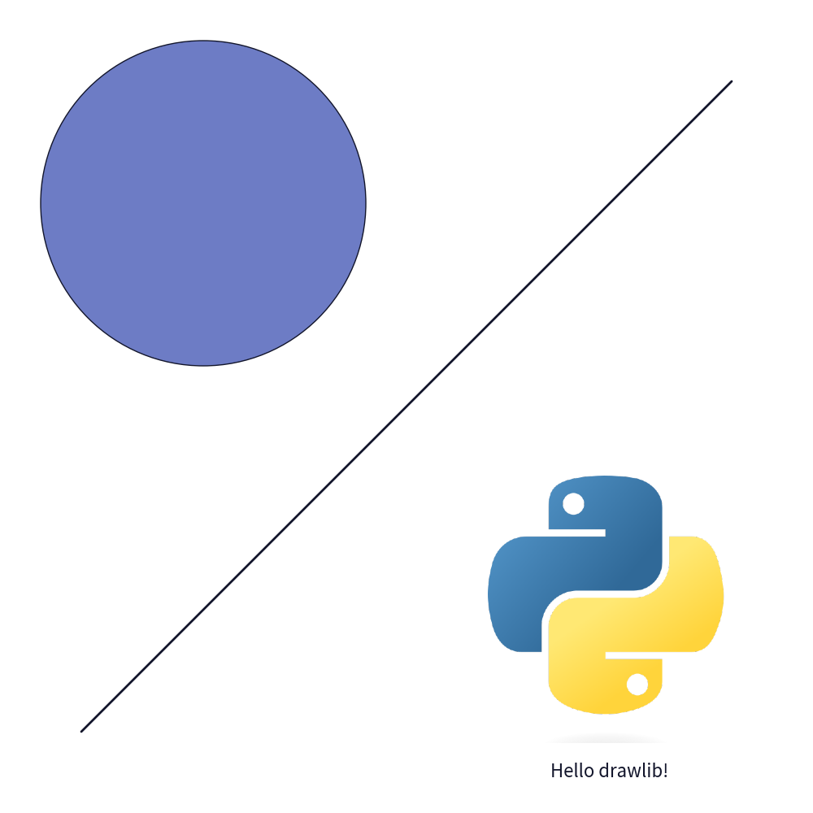
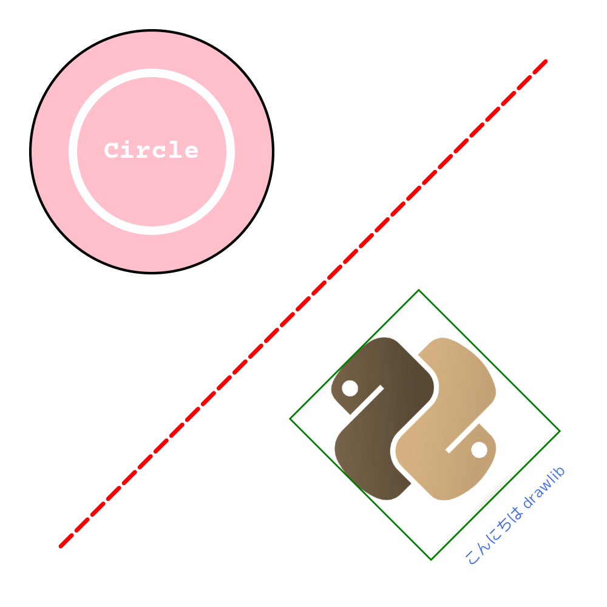

=============
Quick Start
=============

Concept
=========
Drawlib is pure python drawing library.
It is designed to achieve "Illustration as Code".
It means you will get illust as you code.
Which is difficult to achieve in many illustration tools such as illustrator, powerpoint etc.

Import and call functions
===========================

You can use library functions for drawing shapes/lines/text/images to canvas.
All functions are defined in 1 module ``drawlib.apis``. 

We recommend importing all functions rather than specifying function names like this. 

.. code-block:: python

    from drawlib.apis import *

Usual python program doesn't recommend this.
But you are writing just script for illustration.
Messhy import is not good rather than simple import.

After importing functions, start drawing with these procedure normally.

1. configure canvas settings (it is optional. but recommended)
2. draw shapes/lines/text/images repeatedly as your wish
3. save image

For example, write this code.

.. literalinclude:: image1.py
   :language: python
   :linenos:
   :caption: image1.py

You can provide positinal args like above line example.
And also, you can use named args like above circle example.

File name is not important from point of python grammer.
But from point of Illustration as code, the file name should match to generating image name.
We want to get image file ``image1.png``, the the code name is ``image1.python``.

After writing code, call it as normal python code.

.. code-block:: bash

    $ python image1.py

After that, ``image1.png`` which is same to code name is generated if there are no problems.

This is default behavior of ``save()`` function.
If you specify image name ar its arg, you will get the image with specified format.
For example ``save("myimage.jpg")`` will create JPEG image ``myimage.jpg`` on same directory.

    image1.png

In this example, we use only simple solid lines and circle, cute picture image.
But you can use various line type, shape etc.
Please check details on each docs.

Tips.
Showing grid line is very useful when you are are creating illustrations.
You can check corrdinate of you drawing objects easily.
It can be achieved option of function ``config()``.
For example ``config(width=10, height=10, grid=True)`` will generate 2 files normal illustration and illustration with grid.

    image2_grid.png

If you requires only image file with grid line, use ``grid_only=True`` option instead.
You can control Grid line style if you wants.

Styling
============

You might want to change styling of drawing objects.
Such as 

- line color
- shape fill color
- text font etc.

It can be achieved by creating these drawlib's style objects.

- ``TextStyle``
- ``LineStyle``
- ``LineArrowStyle``
- ``ShapeStyle``
- ``ShapeTextStyle``

After creating objects, pass it to drawing objects.
Then, your style is applied to them.
If you didn't it, default style is applied.

OK, let's look at examples.
We will draw red thick dashed line.

.. literalinclude:: image3.py
   :language: python
   :linenos:
   :caption: image3.py

This code will generate this image as your guess.

    image3.png

This styling object way provides you consistent drawing object style.
You define style first.
Apply them to many objects.
Then, your image has similar style objects which has harmony.

As you can see, we also apply effects to image(python log).
It can be achieved with Dimage and its method.

Please check each docs for details.

Next steps
============

We believe you understand the basic concepts of drawlib.
We recommend reading docs with this order.

1. Canvas
2. Line, Shape, Text
3. Styles
4. Pimage

After reading them, you can use drawlib's basic functions.

If you are planning to use drawlib for creating your documentation/book etc which requires lots of images.
I recommend to check them too.

- BulkOps
- API Version

They will provide how to make consistent images with small effort.
Such as applying same drawing style across images, using same icons on many images.
If you take care API versioning, it will keep your drawlib code live long.