=============
Quick Start
=============

Standard Procedure for Drawing with Drawlib
==============================================

Below is the standard procedure for drawing using Drawlib:

1. Import Drawlib library: Begin by importing the Drawlib library into your Python environment.
2. (Optional) Import Your Style Code and Utilities: Optionally, import any custom style definitions or utility functions you may have.
3. (Optional) Configure the Canvas: Set up the canvas by specifying its size and resolution.
4. Draw Elements: Use Drawlib's APIs to draw icons, images, lines, shapes, or text on the canvas as needed.
5. Save the Canvas: Once your drawing is complete, save the canvas to an image file.

While detailed explanations will be provided in subsequent documents, let's briefly overview each step with an example.

.. literalinclude:: image_abstract1.py
   :language: python
   :linenos:
   :caption: image_abstract1.py

Execute this code using the Python command:

.. code-block:: bash

    $ python image_abstract1.py

After execution, an image file named "image_abstract1.png," corresponding to the code's content, will be generated.

   image_abstract1.png (corresponding to code file name)

Now, let's proceed to explore the functionality of Drawlib step by step.

Importing Drawlib
===================

Drawlib is a pure Python library that you can import and use like any other library after installation. 
While many libraries spread their APIs across multiple packages, drawlib consolidates all its public APIs within the ``drawlib.apis`` package.

We recommend importing all APIs using the wildcard ``*``, as shown below:

.. code-block:: python

    from drawlib.apis import *

Although conventional Python programming guidelines (PEP) discourage wildcard imports for clarity and maintenance reasons, in the context of illustrating typical scenarios, simplicity in accessing APIs takes precedence.

This import style ensures that you have immediate access to all the latest APIs available in your drawlib installation. 
You can then proceed to import your custom styles and utilities as needed, akin to importing CSS and utility JavaScript code in an HTML header. 
We will provide detailed explanations on this aspect later.

If you need to use older APIs, you can achieve this by importing them using the following style:

.. code-block:: python

    from drawlib.v0_1.apis import *

Here, ``v0_1`` corresponds to version ``0.1.*``.

Configuring the Canvas Size and DPI
=======================================

After importing the Drawlib library, you can start drawing. 
However, it's recommended to configure the canvas to define parameters such as size using the ``config()`` function. 
For example:

.. code-block:: python

    config(width=100, height=100)

This snippet sets the canvas width to 100 units and height to 100 units. 
These units represent coordinates within the canvas, not pixel values. 
With both dimensions set to 100, the coordinate range for both x and y axes is from 0 to 100. 
If you set both dimensions to 10, specifying x=20 would be out of range. 
Drawlib does not raise an error in this case, but your item may not render as expected. 
By default, both width and height are set to 100 units.

If you configure the canvas with ``config(width=200, height=100)``, it will produce a wider canvas while maintaining the coordinate system for each item. 
See the output image below:

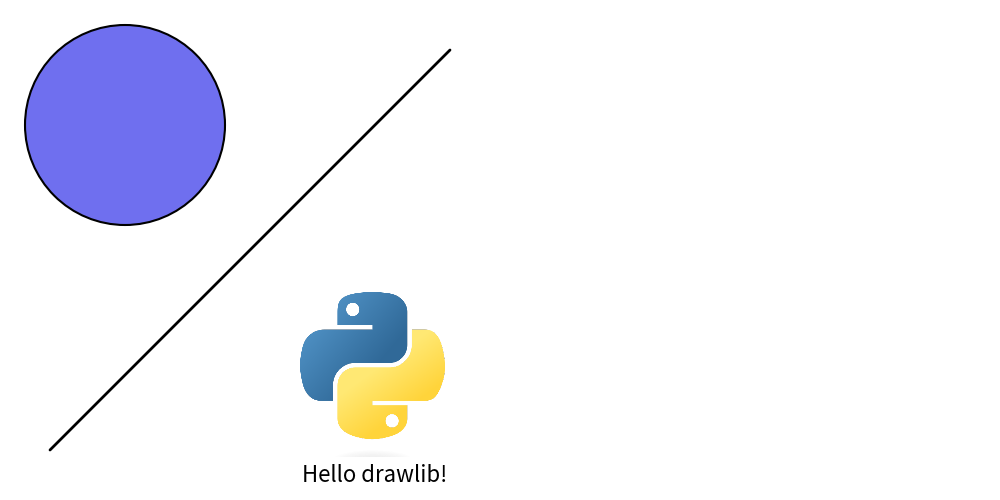

    image_config1.png

For higher resolution images, adjusting the DPI (Dots Per Inch) is necessary:

.. code-block:: python

    config(dpi=200)

Drawlib maintains a consistent canvas width of 10 inches. 
Therefore, changes in the coordinate-based width from the previous example do not affect the output.

In the given example, a canvas size of "10 inches x 200 DPI" results in an image width of 2000 pixels.
Increasing the DPI to 400 would double the image width to 4000 pixels. 
However, generating high-resolution images consumes more time and disk space. 
While there is no maximum set value, a DPI of 1000 may be excessive.
Default DPI value is 100.

Configuring the Canvas Grid
=======================================

The ``config()`` function in Drawlib offers several advanced options, including the grid feature, 
which can be particularly useful for positioning items on your canvas quickly:

.. code-block:: python

    config(width=100, height=100, grid=True)

Enabling ``grid=True`` adds a grid to your image without affecting the normal image generation. 
Therefore, there's no need to remove the ``grid=True`` option to obtain an image without a grid. 
If you specifically require only a grid image, you can use ``grid_only=True`` instead. 
By default, both grid and grid_only are set to False.

The effects of these adjustments are demonstrated in the following files:

.. figure:: image_config2.png
    :width: 450
    :class: with-border
    :align: center

    Image without grid

    Image with grid

Code file ``image_config2.py`` yield two files: ``image_config2.png`` and ``image_config2_grid.png``.
Image file without grid is normal file name.
Image file with grid has ``_grid`` on its last.

Coordinate and alignment
==========================

Drawlib organizes its drawing functionalities into five main categories: Icon, Image, Line, Shape, and Text. 
Before delving into these categories, understanding Drawlib's coordinate system is essential, as all drawing objects rely on it.

Each drawing object in Drawlib is positioned using xy coordinates. 
The placement of these xy coordinates depends on horizontal (``halign``) and vertical (``valign``) alignment settings. 
Common alignment options include:

Horizontal alignment ``halign``
-----------------------------------

* left
* center
* right

Vertical alignment ``valign`` 
-------------------------------

* bottom
* center
* top

Let's examine these alignment options through an example:

.. literalinclude:: image_coordinate1.py
   :language: python
   :linenos:
   :caption: image_coordinate1.py

In this example, horizontal and vertical alignment are specified within the style object, with defaults set to ``halign="center"`` and ``valign="center"``.

The resulting image demonstrates the effects of different alignments:

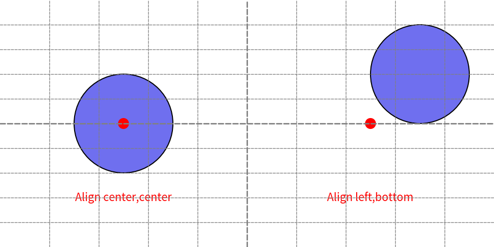

    Horizontal/Vertical alignments

In the image, the left circle's xy coordinates are aligned "center, center" as specified, 
while the right circle's xy coordinates are aligned "left, bottom".

By default, Drawlib sets the alignment for shapes like rectangles to "center, center". 
This differs from many other drawing systems, which often default to "left, bottom" for rectangle-related shapes. 
Drawlib's choice of "center, center" simplifies the process of aligning items of varying sizes both vertically and horizontally.

Despite the default setting, there may be cases where "left, bottom" alignment is preferred over "center, center". 
In such situations, it's recommended to define a custom style object with the desired alignment settings and apply it selectively to specific items.
You can overrides primary style with secondary style easily. Please take a look foundation chapter for details.

Drawing icon
===============

Drawing an icon is similar to drawing an image. 
However, while an image typically refers to a png/jpeg picture, drawlib's icon is a Font Icon. 
If you're unfamiliar with Font Icons, I recommend checking out FontAwesome first.

Drawlib version 0.1 offers two methods for drawing icons:

* Using the ``icon()`` function.
* Utilizing the ``icon_phosphor`` module and its functions.

If you wish to draw an icon using your own font icon file, you can employ the icon() function. 
For instance, if you want to utilize FontAwesome (which is not supported by default), you need to provide the file and drawing parameters to this function.

The icon_phosphor module provides embedded font icons and functions for drawing them. 
It leverages Phosphor (https://phosphoricons.com), which offers icons that are easy to use and facilitate "Illustration as Code" since they are accessible to anyone.

Here's an example using icon_phosphor:

.. literalinclude:: image_icon1.py
   :language: python
   :linenos:
   :caption: image_icon_1.py

This code generates the following output image:

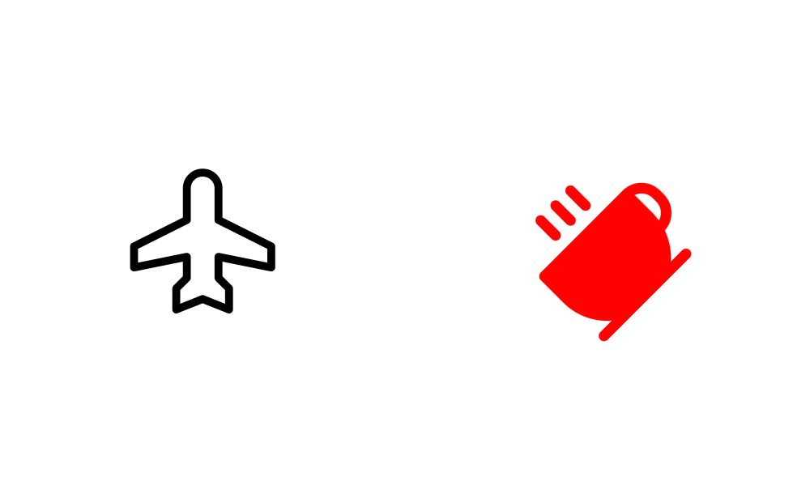

    icon() and icon_phosphor draw icons

As demonstrated, the function name determines the icon to be drawn, while the ``IconStyle`` can be adjusted to modify color, style, and other attributes.

For detailed instructions on using the icon() function, please refer to the icon documentation. 
This topic is beyond the scope of this quick start guide.

Drawing image
===============

The ``image()`` function draws the provided image onto the Canvas at the specified xy coordinates and width. 
The height is automatically calculated based on the width to maintain the original image aspect ratio. 
If you need to adjust the aspect ratio, you can utilize the ``Dimage`` class, which I will discuss later.

Here's an example using the ``image()`` function:

.. literalinclude:: image_image1.py
   :language: python
   :linenos:
   :caption: image_image1.py

Execute this code using the Python command to get image.

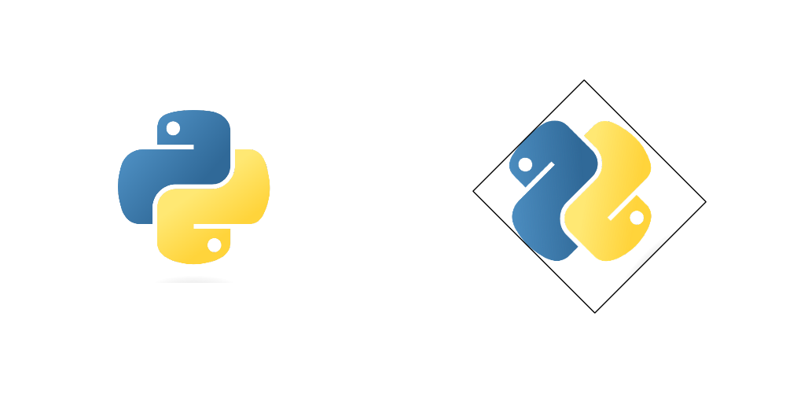

    image() draws image

As you can observe, you can specify the angle and use the ``ImageStyle`` to manage alignment and border lines.

If you wish to modify the image itself, consider utilizing the ``Dimage`` class, which provides numerous methods for image manipulation. 
Take a look at this example:

.. literalinclude:: image_image2.py
   :language: python
   :linenos:
   :caption: image_image2.py

The ``Dimage`` class is a string-like object. 
Methods for applying effects do not modify the image itself but create a new image object. 
Therefore, we use method chaining to apply operations such as mirroring (horizontal reverse) and sepia (changing color).

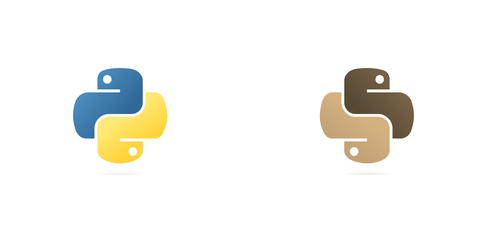

    Dimage applies effects to the image

Both the ``image()`` function and the ``Dimage`` class accept images from the popular Pillow library. 
If you wish to perform advanced image processing, it's advisable to do so using Pillow and then utilize image() and Dimage for handling the processed images.

Additionally, if the original image is of high resolution and drawlib compromises its quality upon saving, consider increasing the DPI (dots per inch) using the ``config()`` function.

Drawing line
===============

Drawlib features the ``line()`` function for drawing lines, but it offers various other line-drawing options as well:

* line
* line_curved
* line_bezier1
* line_bezier2
* lines
* lines_curved
* lines_bezier

Functions starting with "line" are designed to draw lines from point xy1 to point xy2, while those starting with "lines" are designed for lines passing through multiple points. 
Let's explore some of these line types:

.. literalinclude:: image_line1.py
   :language: python
   :linenos:
   :caption: image_line1.py

The ``line_curved()`` function draws a line from xy1 to xy2, but the bend parameter allows you to create curved lines. 
A bend value of 0.2 indicates a curved line 1.2 times longer than a straight line, while a value of -0.2 creates a curve in the opposite direction.

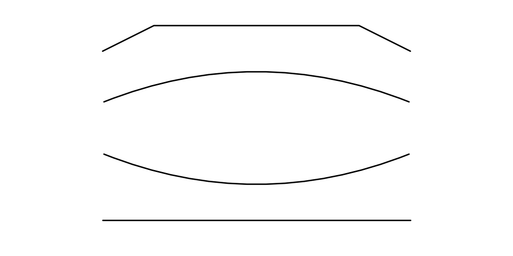

    image_line1.png

Bezier line functions are a bit more complex. 
Please refer to the line documentation for details. However, they are incredibly useful for controlling complex curves.

From point of line styling, we have these 2 categories.

* Arrow head
* Visual styles: Color, width, line style(solid, dashed etc) etc.

Arrow head has logical meaning (HTML equivalent), so we will specify it at function arg ``arrowhead``.
But visual style has less meaning (CSS equivalent), then we will specify it as styling class ``LineStyle``.

Consider this example showcasing styling:

.. literalinclude:: image_line2.py
   :language: python
   :linenos:
   :caption: image_line2.py

With LineStyle, you can configure line width, color, style, and more. 
Arrow head style is specified in function directry.

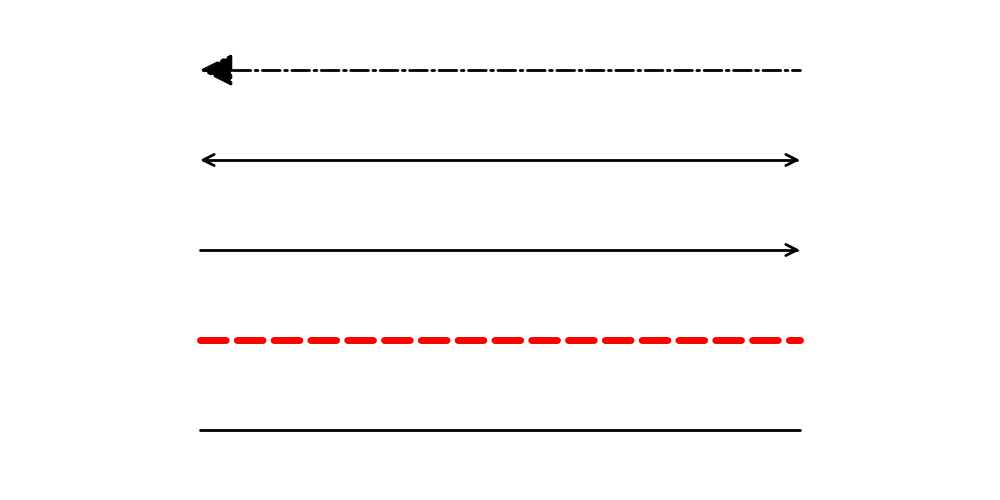

    line() draws line

While the ``arrow()`` function also draws arrows, it is not a line but rather a shape. 
Keep in mind that if you wish to draw an arrow line, utilize line() and related functions with LineArrowStyle.

Drawing shapes
================

Drawlib's keyword ``Shape`` encompasses a variety of shapes such as circles, rectangles, and more. 
While you're already familiar with the ``circle()`` function, Drawlib version 0.1 introduces several other functions for drawing shapes:

* arrow()
* arc()
* bubblespeech()
* chevron()
* circle()
* donuts()
* ellipse()
* fan()
* parallelogram()
* polygon()
* rectangle()
* regularpolygon()
* rhombus()
* shape()
* star()
* trapezoid()
* triangle()
* wedge()

Most of these functions fall into one of two categories: circle-like or rectangle-like. 
Circle-type shapes are defined by parameters such as xy coordinates and radius, while rectangle-type shapes are defined by parameters like xy coordinates, width, and height. 
The exceptions are arrow(), polygon(), and shape().

We won't delve into the specifics in this quick start guide, but it's worth noting that the ``shape()`` function is particularly versatile for creating custom shape objects. 
When you use it, tasks like positioning your item at a specified xy coordinate and adjusting its angle are automatically handled.

Let's explore two examples: a circle-like shape, ``star()``, and a rectangle-like shape, ``rectangle()``.

.. literalinclude:: image_shape1.py
   :language: python
   :linenos:
   :caption: image_shape1.py

This code generates the following image:

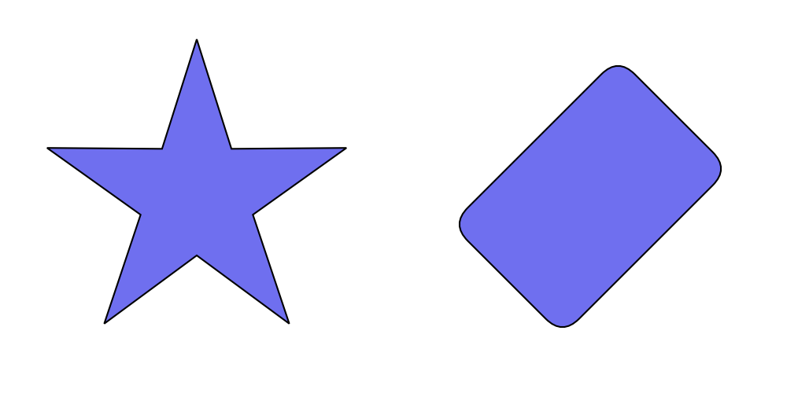

    image_shape1.png

Circle-type shapes are defined by their radius, while rectangle-type shapes are defined by their width and height. 
By default, the xy coordinate marks the center of the shape. 
Except for arrow() and polygon(), all functions can accept an angle parameter.

Shapes can also be styled using two types of styles:

- ``ShapeStyle``: for basic shape styling such as line width, color, and fill color
- ``ShapeTextStyle``: for styling text within a shape

The ShapeTextStyle allows you to specify parameters like color, size, font, and more. 
Additionally, it offers xy_shift and angle options. 
When you specify xy_shift, you can adjust the position of the text within the shape. 
Keep in mind that the angle parameter in ShapeTextStyle overrides the shape's angle for the text.

Let's examine a styling example:

.. literalinclude:: image_shape2.py
   :language: python
   :linenos:
   :caption: image_shape2.py

This code generates the following output:

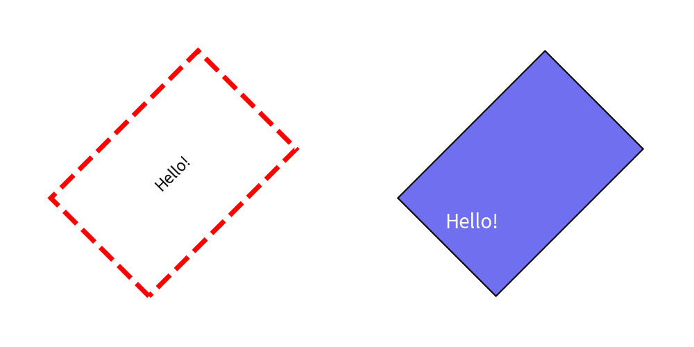

    image_shape2.png

In the left example, we configure ShapeStyle to add style to the rectangle. 
Parameters like l-something represent line-something, and fcolor stands for fill-color. 
Options for shape lines are nearly identical to those for LineStyle. 
If you don't require a shape line, simply set ``lwidth=0``, and if you don't need a fill color, set ``fcolor=Colors.Transparent``. 
Notice how the text angle follows the shape angle by default.

In the right example, we configure ShapeTextStyle for the center text within the rectangle. 
Parameters such as color, size, font, etc., are similar to TextStyle. 
However, ShapeTextStyle includes additional options like xy_shift and angle.

When you specify xy_shift, you can move the center point of the text. 
Remember that the xy value is not a global coordinate but is relative to the shape, taking its angle into account. 
Therefore, specifying ``(-10, 0)`` moves the center point not only to the left but also downward since the shape has a 45-degree angle.

The angle option in ShapeTextStyle overrides the shape's angle for the text. 
If left unspecified, the text inside the right rectangle should be at a 45-degree angle. 
However, since we've specified it in the style, it remains at 0 degrees.

Drawing texts
================

The ``text()`` function is used to render text onto the canvas. 
It requires specifications for xy coordinates, the text message, and an optional angle. 
All other text parameters are defined within the ``TextStyle``.

TextStyle differs slightly from ShapeTextStyle, which we discussed earlier. 
Unlike ShapeTextStyle, it lacks features like xy_shift and angle, as these can be directly configured as arguments in text(). 
However, TextStyle includes an option that ShapeTextStyle doesn't: text background options.

Let's examine some code examples:

.. literalinclude:: image_text1.py
   :language: python
   :linenos:
   :caption: image_text_1.py

Executing this code yields the following image:

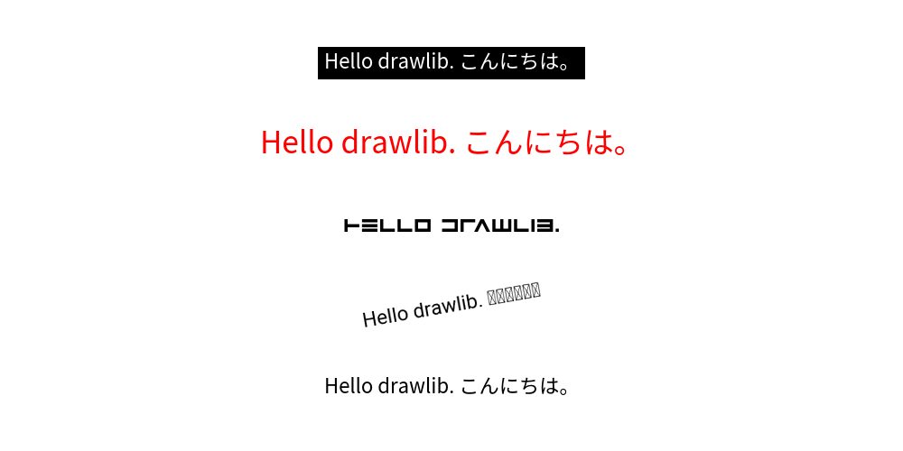

    image_text_1.png

In this example, we've configured several TextStyle parameters. 
I've used Japanese text for testing purposes. 
As you can see, the Roboto font fails to render it correctly. 
Be cautious when using non-alphabet characters. 
Drawlib supports a variety of embedded fonts, categorized under Font-Something classes. 
For instance, Japanese fonts are defined within FontJapanese.

Remember, fonts are downloaded from the internet the first time you use them, after which they're cached locally within the drawlib library on your machine. 
Fonts that haven't been used before won't be downloaded. 
However, attempting to call text() with a new font can result in a download error. 
Therefore, make sure to download fonts before entering internet-restricted areas.

Calling text() with new font will make download error.
Please download fonts before you go to internet restricted area.

In the third example, we've prepared a font file locally and utilized it. 
If drawlib doesn't include the font you wish to use, you can provide it to the style's font parameter using the ``FontFile`` class.

In the fourth and fifth examples, we've configured text parameters such as color, size, and background. 
These settings may not be particularly complex, but it's important to note that the font size remains constant regardless of changes in canvas width and height. 
Doubling the canvas size won't result in halving the font text size; it remains the same as the original size.

Using Official Theme
====================

In Drawlib, you can define the style of drawing items using style class objects such as ``ShapeStyle`` and ``TextStyle``. 
However, specifying styles for each item can be cumbersome and may lead to inconsistency. 
To address this, Drawlib provides a theme and style feature, allowing you to choose a theme and easily apply its styles by name.

Here is an example. Note that the ``style`` argument takes text values.

.. literalinclude:: image_theme1.py
   :language: python
   :linenos:
   :caption: image_theme1.py

The style has this syntax: ``<color>_<type>_<weight>``. 
If the type and weight are default, they are not shown in the style name. 
Executing this code yields the following image:

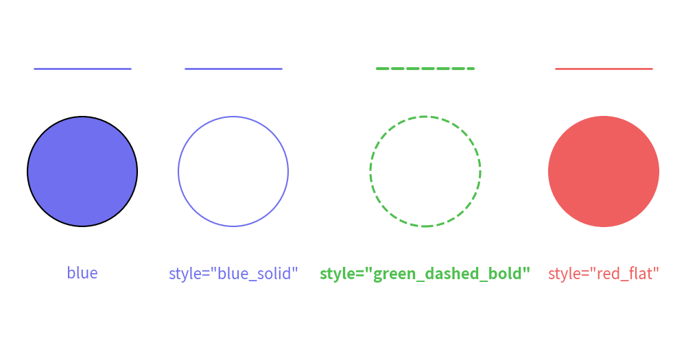

    image_theme1.png

Drawlib offers several official themes:

- ``default``
- ``essentials``
- ``monochrome``

The style naming rules are consistent across all themes. 
However, the ``default`` theme default primarily focuses on colors to keep it simple for beginners.
You can check the available style names for each style class using ``dtheme.print_style_table()``. 
Note that many style names support only a few style classes because "flat (no border fill)" styles do not suit lines and text.

Here's how you can print the available styles in a theme:

.. literalinclude:: print_theme_styles.py
   :language: python
   :linenos:
   :caption: print_theme_styles.py