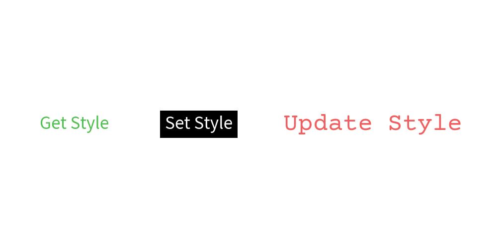

=================
Advanced Topics
=================

We will cover advanced theme topics here which is not covered at foundation chapter's theme section.

Accessing Theme Styles Manually
=================================

Theme styles are used like ``text(xy=(10,10), text="Hello Drawlib!", style="blue")`` normally.
You can access the style manually through ``dtheme`` module functions.

Each style are stored in cache object ``dtheme.<type>styles``.
Name is equivalent to drawlib's style class name.
Here are major objects:

- ``IconStyle``: ``dtheme.iconstyles``
- ``ImageStyle``: ``dtheme.imagestyles``
- ``LineStyle``: ``dtheme.linestyles``
- ``LineArrowStyle``: ``dtheme.linearrowstyles``
- ``ShapeStyle``: ``dtheme.shapestyles``
- ``ShapeTextStyle``: ``dtheme.shapetextstyles``
- ``TextStyle``: ``dtheme.textstyles``

Each style cache objects posses these methods.

- ``has(name)``: whether the name style exists or not
- ``list()``: get names of styles
- ``get(name)``: get style object
- ``set(name)``: set style object
- ``delete(name)``: delete style object

Those methods are internally called in drawing functions.
This kind of manual theme style access is useful in these situations.

- Get theme style and modify
- Set updated theme style
- Customize: get and modify, after that set

Here is an example of updating style.

.. literalinclude:: image_access1.py
   :language: python
   :linenos:
   :caption: image_access1.py

Executing the code generate below output:

   Specifying theme style name

Customize Style for Each Shapes
----------------------------------

Drawlib can customize style per shape objects such as ``circle()`` and ``rectangle()``.
dtheme posses style cache object per shape types.
For example, there are these objects.

- ``dtheme.circlestyles``
- ``dtheme.rectanglestyles``

It is almost same to ``dtheme.shapestyles``.
However the priority of specific shape style object is high rather than general shape style object.
Suppose, you call ``circle(xy(50, 50), radius=20, style="red")``.
The circle function will search theme style like this.

1. Check whether ``dtheme.circlestyles`` has key "red". If yes, apply it.
2. Check whether ``dtheme.shapestyles`` has key "red". If yes, apply it.
3. Raise not found exception.

Regarding ``ShapeTextStyle``, it will also do same behavior.
dtheme posses ``dtheme.circletextstyles`` and ``dtheme.shapetextstyles``. Former priority is high on ``circle()`` function.

Override Theme's style with merge()
======================================

Rename Style Name
=====================

Drawlib official theme provides style names which starts from color such as ``red``, ``red_solid``, ``red_bold``.
If you hardcode color based names to your many illustration code, changing color requires huge illustration code change.

If the color itself has meaning, using color name is OK.
However, if you want to use color with consistency like this

- primary color: blue
- secondary color: green
- third color: red

you should rename theme style names something like. And use the new names at your illustration codes.

- from blue to "1"
- from green to "2"
- from red to "3"

If you do this, changing primary color is easy because you don't need to touch illustration code.
But changing to

- from red to "1"
- from green to "2"
- from blue to "3"

Not only changing primary color, you can adopt completly different color theme too.

- change theme from "default2" to "essentials"
- from navy to "1"
- from teal to "2"
- from orange to "3"

To change style name, we use ``dtheme.allstyles`` object.
It posses methods for modifying style name.
Here are the list of methods.

- ``rename(from_name, to_name)``
- ``copy(from_name, to_name)``
- ``delete(name)``

In our situation, we use ``dtheme.allstyles.rename()``.

OK, take a look at theme ``default2`` code.

.. literalinclude:: image5_1.py
   :language: python
   :linenos:
   :caption: image5_1.py

We rename theme style first.
And then, used new names in illustration codes.

It generate this output.

.. figure:: image5_1.png
    :width: 600
    :class: with-border
    :align: center

Next, take a look at changing theme ``essentials``.

.. literalinclude:: image5_2.py
   :language: python
   :linenos:
   :caption: image5_2.py

We rename theme style name again at begenning of the code.
However, the illustration code is exactly same to previous code.

It generate this output:

.. figure:: image5_2.png
    :width: 600
    :class: with-border
    :align: center

We define styles at example code at this time.
However, it is normally configured at shared style code.
It means changing only style code results in large style change for illustration codes without any code change.
If color it self doesn't have big meaning, we recommend using alias name for future style change.

Accessing Theme Colors
=======================

When you add style object for current theme, you may want to get theme colors as reference.
Drawlib provides ``dtheme.colors`` object for that purpose.

It is almost same to last style cache objects.
It has same name methods.

- ``has(name)``: whether the name color exists or not
- ``list()``: get names of colors
- ``get(name)``: get color
- ``set(name)``: set color
- ``delete(name)``: delete color

Here is an example of accessing style colors.

.. literalinclude:: image_colors1.py
   :language: python
   :linenos:
   :caption: image_colors1.py

As you can see, you can get list of color names.
And able to get RGBA from color name.