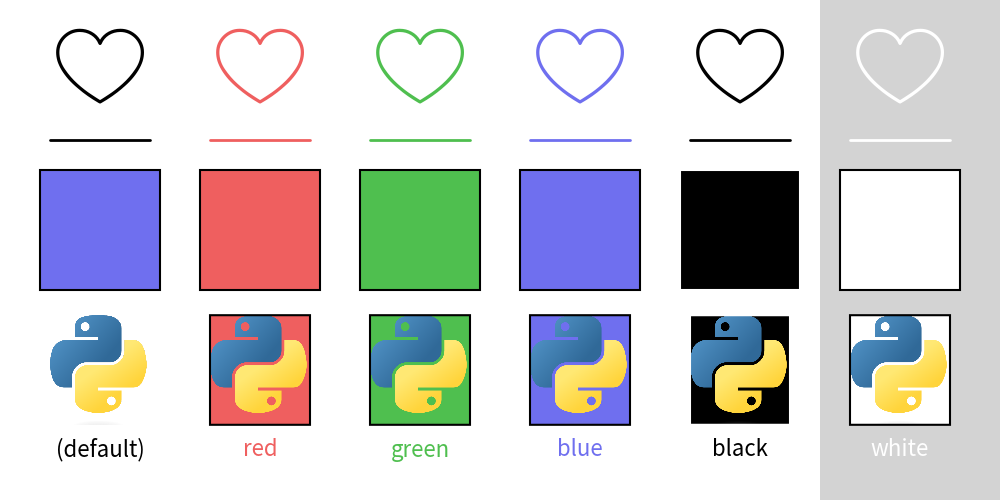

=================================
Official Theme: default
=================================

Theme ``default`` is default drawlib theme.
It is traditional styling and requires less knowledge to use.

Theme ``default2`` might be better if you want to use many style types such as flat(no-border) and outlined shapes.
Theme ``essentials`` is more colorful theme which posses many colors but style rule is exactry same to ``default2``.
It is a super set of ``default2`` and ``monochrome``.

The theme color is exactly same to default.

Main Colors
==============

Theme default posses 5 colors.

- ``red``: RGB(239, 95, 95)
- ``green``: RGB(79, 191, 79)
- ``blue``: RGB(111, 111, 239)
- ``black``: RGB(0, 0, 0)
- ``white``: RGB(255, 255, 255)

Here is a color chart.

.. figure:: image_colors.png
    :width: 600
    :class: with-border
    :align: center

    image_colors.png

Style Names
==============

Theme default posses 6 style names which includes default(no-name).

- default(no name): black for icon/line/text, light blue for shape fill.
- ``blue``: black for shape line. light blue for all others.
- ``green``: black for shape line. light green for all others.
- ``red``: black for shape line. light red for all others.
- ``black``: black for all.
- ``white``: black for shape line. white for others.

Here is a example of theme styles.
Each drawing items are applied the styles.

- heart: ``icon()``
- line: ``line()``
- rectangle: ``rectangle()``
- python logo: ``image()``
- text: ``text()``

    image_colors.png

You can check which style name supports what style class via ``dtheme.print_style_table()``.

.. literalinclude:: print_style_table.py
   :language: python
   :linenos:
   :caption: style table

Theme ``default`` supports all style class on all style names.