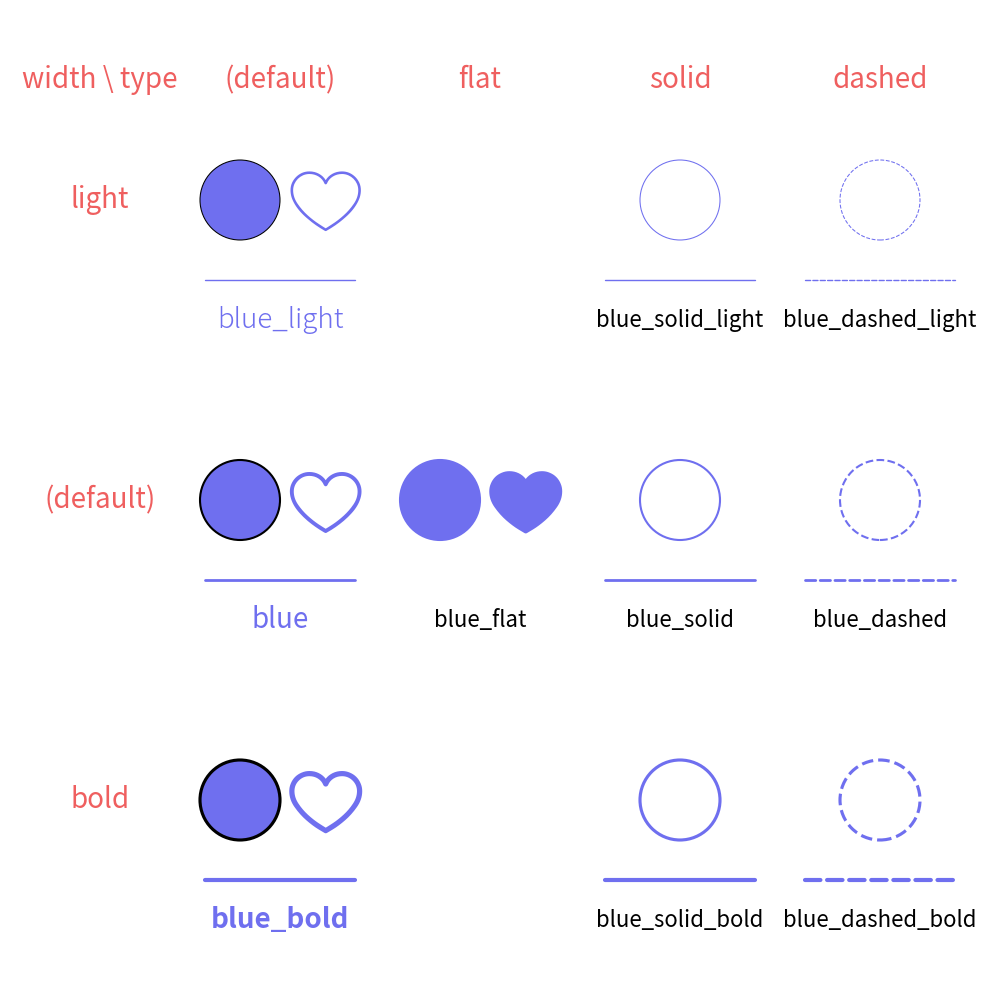
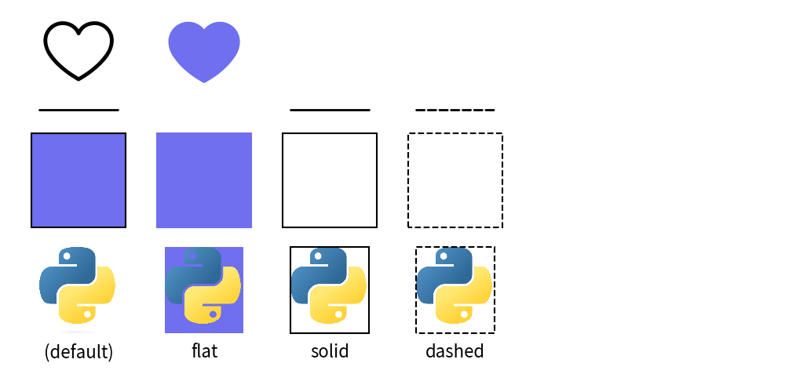
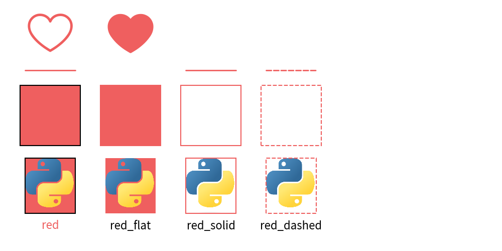
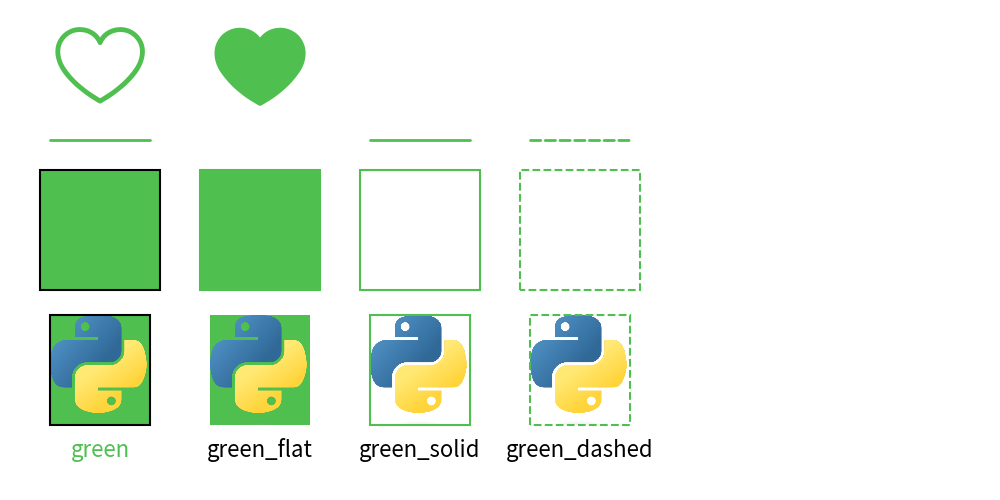
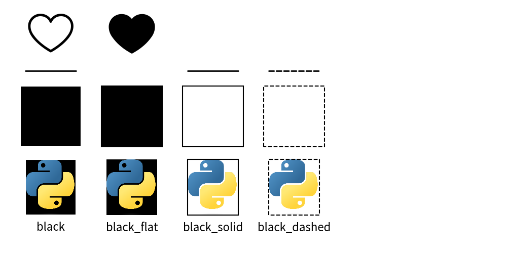
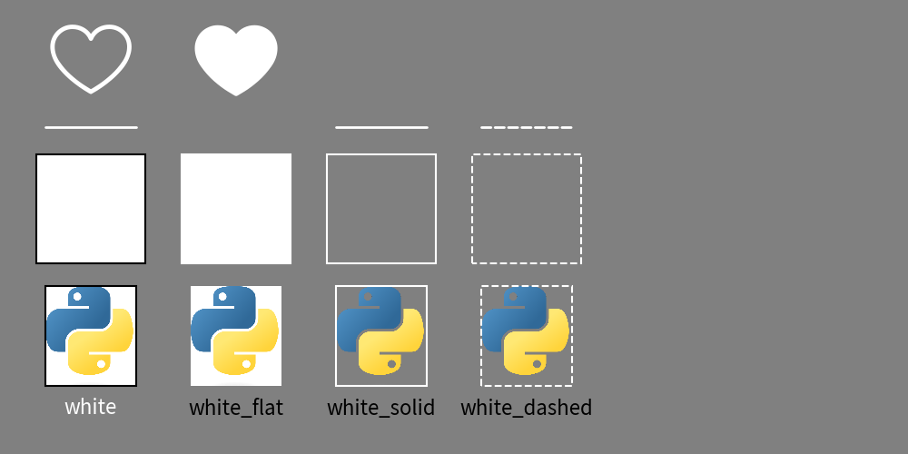

=================================
Official Theme: default
=================================

The ``default`` theme is the standard Drawlib theme.
We will explain style naming rule at this document.

Colors
==============

The ``default`` theme includes 5 colors.

.. figure:: image_colors.png
    :width: 600
    :class: with-border
    :align: center

    Theme ``default`` color chart

Here is a list of the colors. 
You can use ``ColorsThemeDefault`` to retrieve RGB codes by their names.

- ``red``: RGB(239, 95, 95)
- ``green``: RGB(79, 191, 79)
- ``blue``: RGB(111, 111, 239)
- ``black``: RGB(0, 0, 0)
- ``white``: RGB(255, 255, 255)

Here is a color chart:

Style Types
===============

The default theme possesses these style types for all colors:

- default: Has both border and fill color
- ``flat``: No border (actually has a white color)
- ``solid``: Shape has an outline but no fill
- ``dashed``: Dashed line, dashed outline

Each style type has variations of weight (line width, font weight) except for ``flat``, which doesn't have a line:

- ``light``: Half of default's line width. Font light.
- ``default``: Font regular.
- ``bold``: Double the default's line width. Font bold.

Remember, the style names follow this syntax: ``<color>_<type>_<weight>``. 
If the color, type, and weight are default, they may not appear in the style name.

Let's take a look at a matrix with the blue color as an example:

    Style type and width

As you can see, each style has these effects:

- ``ShapeStyle``: Both style and width work.
- ``IconStyle``: Line width can be controlled with width; flat style makes it fill.
- ``LineStyle``: Width has an effect; flat style doesn't support line.
- ``TextStyle``: Only the default type is supported; width affects font (light/regular/bold).

Although not shown in the example, other styles have these effects:

- ``ImageStyle``: Similar to ShapeStyle, but the default has no line and fill.
- ``ShapeTextStyle``: Similar to TextStyle.

You can check which style supports which style class by calling ``dtheme.print_style_table()``. 
It will generate a matrix of style names and style classes. 
If ``x`` is checked, it means it is supported. 

Let's take a look at the blue example:

.. code-block:: none

    +----------------+------+------------+-----------+-----------+------------+------------------+-----------------+-------------+-------------------+------------------+
    | class \ name   | blue | blue_light | blue_bold | blue_flat | blue_solid | blue_solid_light | blue_solid_bold | blue_dashed | blue_dashed_light | blue_dashed_bold |
    +----------------+------+------------+-----------+-----------+------------+------------------+-----------------+-------------+-------------------+------------------+
    | IconStyle      | x    | x          | x         | x         |            |                  |                 |             |                   |                  |
    | ImageStyle     | x    | x          | x         | x         | x          | x                | x               | x           | x                 | x                |
    | LineStyle      | x    | x          | x         |           | x          | x                | x               | x           | x                 | x                |
    | ShapeStyle     | x    | x          | x         | x         | x          | x                | x               | x           | x                 | x                |
    | ShapeTextStyle | x    | x          | x         |           |            |                  |                 |             |                   |                  |
    | TextStyle      | x    | x          | x         |           |            |                  |                 |             |                   |                  |
    +----------------+------+------------+-----------+-----------+------------+------------------+-----------------+-------------+-------------------+------------------+

As you can see, ``flat`` doesn't have a weight(light, bold). 
It can be used for only ``IconStyle``, ``ImageStyle``, and ``ShapeStyle``. 

Here is a tip for remembering the rule:

- default type supports all classes.
- flat supports styles that can be filled.
- solid and dashed support styles that have a line.

Please remember, this naming rule is common in other official themes as well.

Style Names
==============

Here is a list of style names:

.. literalinclude:: print_style_table.py
   :language: python
   :linenos:
   :caption: style table

color: default
----------------

color: ``red``.
----------------

color: ``green``.
-------------------

color: ``blue``.
-------------------

.. figure:: image_style_blue.png
    :width: 600
    :class: with-border
    :align: center

color: ``black``.
-------------------

color: ``white``.
-------------------

