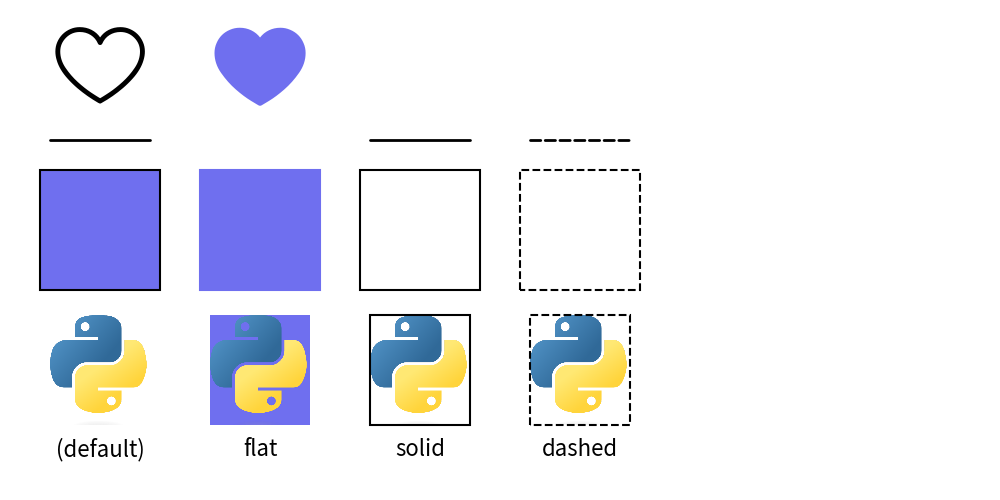
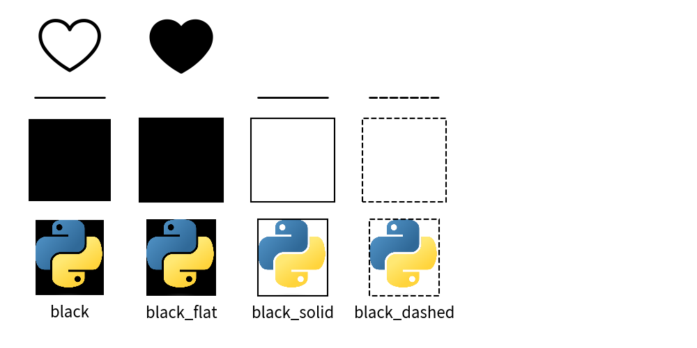

=========================
Official Theme: default2
=========================

Theme ``default2`` is enhancement of default theme ``default``.
Theme ``default`` has only 1 style per color.
But theme ``default2`` posess 4 styler per color.

Colors
==============

Theme default2 posses 5 colors.

- ``red``: RGB(239, 95, 95)
- ``green``: RGB(79, 191, 79)
- ``blue``: RGB(111, 111, 239)
- ``black``: RGB(0, 0, 0)
- ``white``: RGB(255, 255, 255)

.. figure:: image_colors.png
    :width: 600
    :class: with-border
    :align: center

    image_colors.png

Style Types
===============

Theme ``default2`` posses these style types for all colors.
Original theme ``default`` posses only default style.

- default: Having border and fill color
- ``flat`` style: Having no border. (white color actually)
- ``solid`` style: Shape has outline but no fill.
- ``dashed`` style: Dashed line, Dashed outline.

Each style types has variation of line width except ``flat`` which doesn't have line.

- ``thin`` : half of default
- default : equivalent to regular
- ``bold`` : double of default

Let's take a look at matrix with blue color example.

.. figure:: image_matrix.png
    :width: 600
    :class: with-border
    :align: center

    Style type and width

As you can see, each style has these effects.

- ``ShapeStyle``: both style and width works.
- ``IconStyle``: line width can be controlled with width. flat style make it fill.
- ``LineStyle``: width have effect. flat style doesn't support line.
- ``TextStyle``: only type default is supported. width becomes font thin/regular/bold.

We didn't show example, but other style has these effects.

- ``ImageStyle``: Same to ShapeStyle
- ``LineArrowStyle``: Same to LineStyle
- ``ShapeTextStyle``: Same to TextStyle

You can check which style supports which style class via calling ``dtheme.print_style_table()``.
It will generate matrix of style name and style class.
If ``x`` is checked, it means supported.
Lets take a look blue example.

.. code-block:: none

    +----------------+------+-----------+-----------+-----------+------------+-----------------+-----------------+-------------+------------------+------------------+
    | class \ name   | blue | blue_thin | blue_bold | blue_flat | blue_solid | blue_solid_thin | blue_solid_bold | blue_dashed | blue_dashed_thin | blue_dashed_bold |
    +----------------+------+-----------+-----------+-----------+------------+-----------------+-----------------+-------------+------------------+------------------+
    | IconStyle      | x    | x         | x         | x         |            |                 |                 |             |                  |                  |
    | ImageStyle     | x    | x         | x         | x         | x          | x               | x               | x           | x                | x                |
    | LineStyle      | x    | x         | x         |           | x          | x               | x               | x           | x                | x                |
    | LineArrowStyle | x    | x         | x         |           | x          | x               | x               | x           | x                | x                |
    | ShapeStyle     | x    | x         | x         | x         | x          | x               | x               | x           | x                | x                |
    | ShapeTextStyle | x    | x         | x         |           |            |                 |                 |             |                  |                  |
    | TextStyle      | x    | x         | x         |           |            |                 |                 |             |                  |                  |
    +----------------+------+-----------+-----------+-----------+------------+-----------------+-----------------+-------------+------------------+------------------+

As you can see, ``flat`` doesn't have width. It can be used for only IconStyle, ImageStyle, ShapeStyle.
Here is a cheat for remembering the rule. 

- default type supports all classes.
- flat supports styles which can be filled.
- solid and dashed supports styles which has line.

Please remember this rule and naming for using official themes.
Theme ``essentials`` and ``monochrome`` follows exactry same rule.

If you let others use your theme, we recommend let your theme to follow this rule.

Style Names
==============

Here is a list of style names.

.. literalinclude:: print_style_table.py
   :language: python
   :linenos:
   :caption: style table

And output of each styles.

style ``blue``.

.. figure:: image_style_blue.png
    :width: 600
    :class: with-border
    :align: center

style ``green``.

.. figure:: image_style_green.png
    :width: 600
    :class: with-border
    :align: center

style ``pink``.

.. figure:: image_style_pink.png
    :width: 600
    :class: with-border
    :align: center

style ``black``.

black's shape has line color white.

style ``white``.

.. figure:: image_style_white.png
    :width: 600
    :class: with-border
    :align: center
