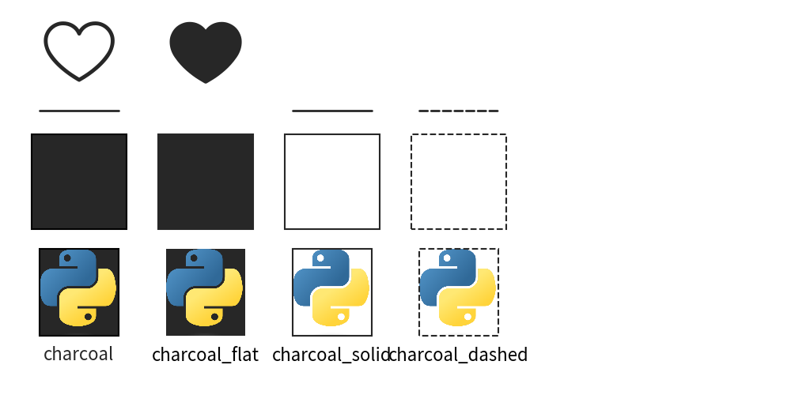
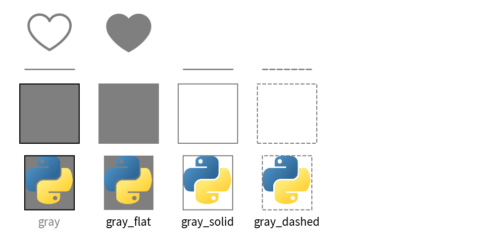
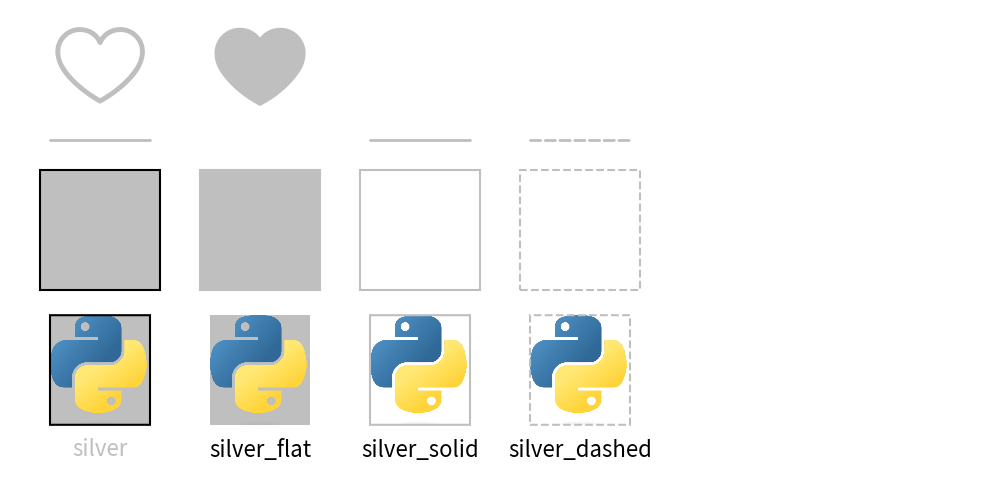
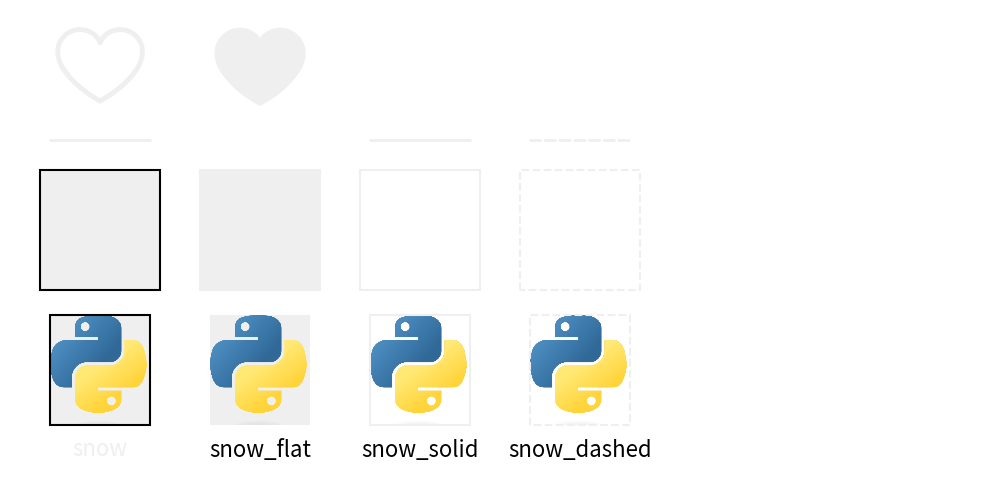

=================================
Official Theme: monochrome
=================================

Theme ``monochrome`` has colors between black and white.
There are many possibility that printed documents and published books has only black color.
This theme is useful for those kind of situation.

Style rule is almost same to simple theme ``simple``.
If you don't know the style, please check it first.

Colors
==============

Theme monochrome posses 5 colors between black and white.

.. figure:: image_colors.png
    :width: 600
    :class: with-border
    :align: center

    image_colors.png

- ``black``: RGB(0, 0, 0)
- ``charcoal``: RGB(39, 39, 39)
- ``graphite``: RGB(63, 63, 63)
- ``gray``: RGB(127, 127, 127)
- ``silver``: RGB(191, 191, 191)
- ``snow``: RGB(239, 239, 239)
- ``white``: RGB(255, 255, 255)

Style Names
==============

Here is a list of style names.

.. literalinclude:: print_style_table.py
   :language: python
   :linenos:
   :caption: style table

And output of each styles.

Style ``black``

.. figure:: image_style_black.png
    :width: 600
    :class: with-border
    :align: center

    Theme Style black

Style ``charcoal``

    Theme Style charcoal

Style ``graphite``

    Theme Style graphite

Style ``gray``

    Theme Style gray

Style ``silver``

    Theme Style silver

Style ``snow``

    Theme Style snow

Style ``white``

.. figure:: image_style_white.png
    :width: 600
    :class: with-border
    :align: center

    Theme Style white