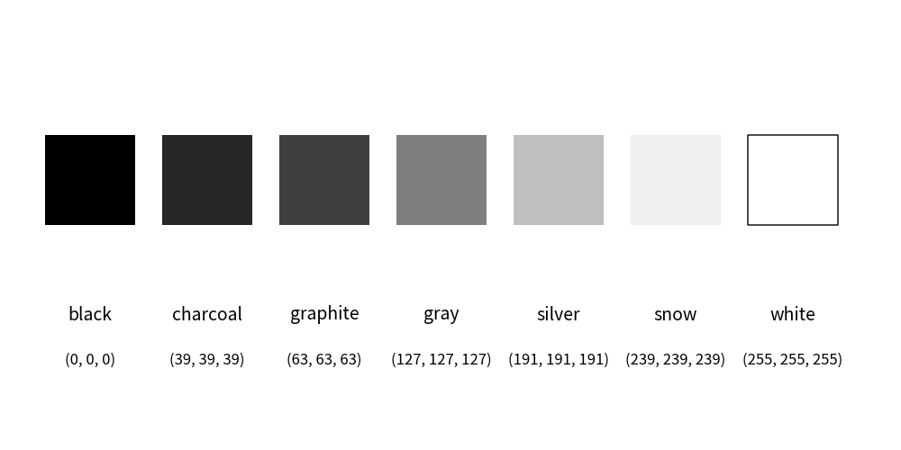
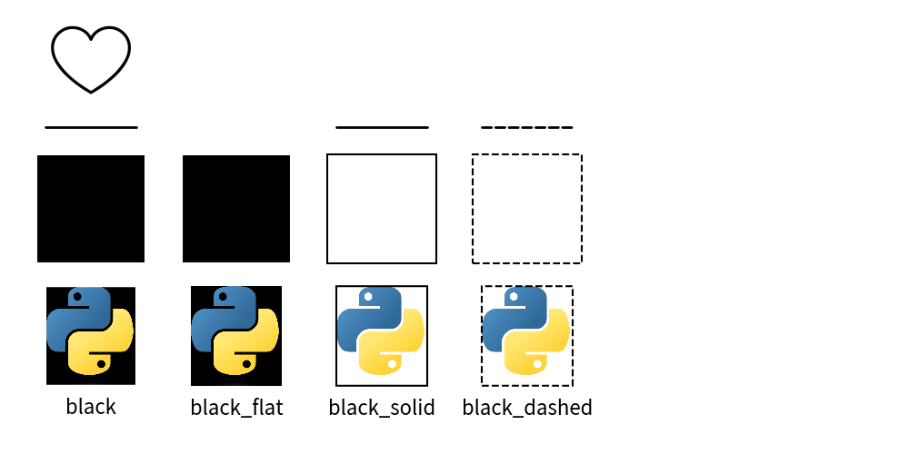
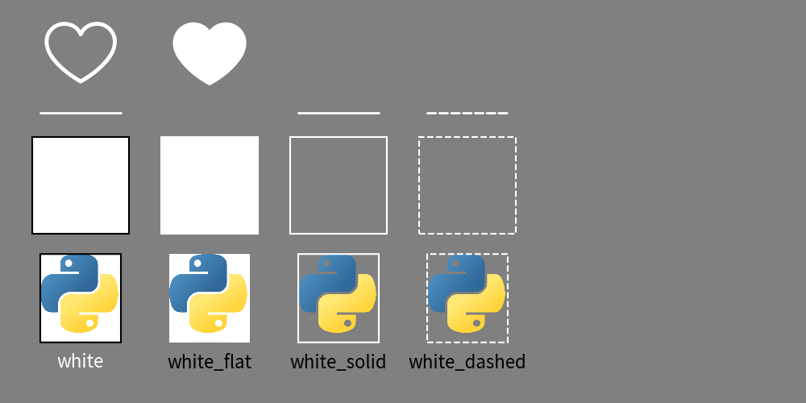

=================================
Official Theme: monochrome
=================================

Theme ``monochrome`` has colors between black and white.
There are many possibility that printed documents and published books has only black color.
This theme is useful for those kind of situation.

Style rule is almost same to simple theme ``simple``.
If you don't know the style, please check it first.

Colors
==============

Theme monochrome posses 5 colors between black and white.

    image_colors.png

- ``black``: black (main)
- ``gray1``: dark gray
- ``gray2``: gray
- ``gray3``: light gray
- ``white``: white

Style Names
==============

Here is a list of style names.

.. literalinclude:: print_style_table.py
   :language: python
   :linenos:
   :caption: style table

And output of each styles.

style default.

style ``black``.

style ``gray1``.

style ``gray2``.

style ``gray3``.

black's shape has line color white.

style ``white``.

