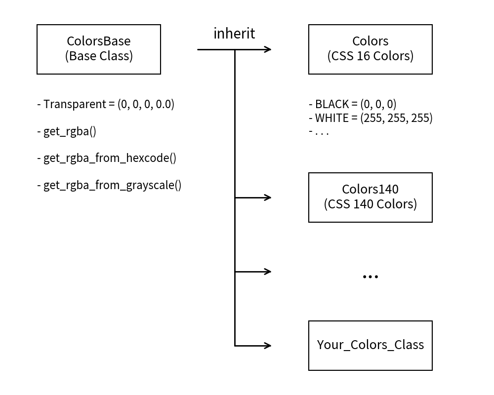
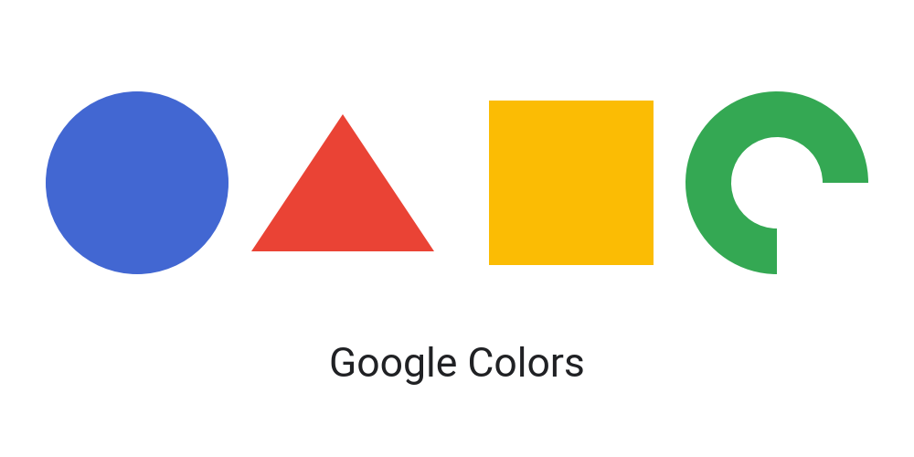

===============
Color Classes
===============

Drawlib's color format is either RGB (Red, Green, Blue) or RGBA (RGB with Alpha). 
The RGB format is represented as tuple(0-255, 0-255, 0-255), and the RGBA format is tuple(0-255, 0-255, 0-255, 0.0-1.0).
For simplicity, Drawlib does not support string color codes (e.g., "red") or hex style codes (e.g., "#00FF00").

However, using RGB can be inconvenient for basic colors.
Therefore, we provide Color classes. Currently, we offer the following classes:

- Colors: basic web 16 colors + Transparent
- Colors140: basic web 140 colors + Transparent
- ColorsThemeDefault: Colors which are used in theme ``default``
- ColorsThemeEssentials: Colors which are used in theme ``essentials``
- ColorsThemeMonochrome: Colors which are used in theme ``monochrome``
- ColorBase: Base class for creating your own Color class

Here is an image showing their relationships:

   Structure of color classes

As you can see, ``ColorsBase`` class implements the ``Transparent`` color and utility functions. 
Each child class inherits these and implements its own colors. 

You can create your own color class as well. 
Let's look at an example of creating a Google color class at end of this page.

Colors
========

The ``Colors`` class contains the following members:

- Transparent: (0, 0, 0, 0.0)
- Aqua: (0, 255, 255)
- Black: (0, 0, 0)
- Blue: (0, 0, 255)
- Fuchsia: (255, 0, 255)
- Gray: (128, 128, 128)
- Green: (0, 128, 0)
- Lime: (0, 255, 0)
- Maroon: (128, 0, 0)
- Navy: (0, 0, 128)
- Olive: (128, 128, 0)
- Purple: (128, 0, 128)
- Red: (255, 0, 0)
- Silver: (192, 192, 192)
- Teal: (0, 128, 128)
- White: (255, 255, 255)
- Yellow: (255, 255, 0)

Colors140
===========

The ``Colors140`` class contains the following members:

- Transparent: (0, 0, 0, 0.0)
- AliceBlue: (240, 248, 255)
- AntiqueWhite: (250, 235, 215)
- Aqua: (0, 255, 255)
- Aquamarine: (127, 255, 212)
- Azure: (240, 255, 255)
- Beige: (245, 245, 220)
- Bisque: (255, 228, 196)
- Black: (0, 0, 0)
- BlanchedAlmond: (255, 235, 205)
- Blue: (0, 0, 255)
- BlueViolet: (138, 43, 226)
- Brown: (165, 42, 42)
- BurlyWood: (222, 184, 135)
- CadetBlue: (95, 158, 160)
- Chartreuse: (127, 255, 0)
- Chocolate: (210, 105, 30)
- Coral: (255, 127, 80)
- CornflowerBlue: (100, 149, 237)
- Cornsilk: (255, 248, 220)
- Crimson: (220, 20, 60)
- Cyan: (0, 255, 255)
- DarkBlue: (0, 0, 139)
- DarkCyan: (0, 139, 139)
- DarkGoldenRod: (184, 134, 11)
- DarkGray: (169, 169, 169)
- DarkGreen: (0, 100, 0)
- DarkKhaki: (189, 183, 107)
- DarkMagenta: (139, 0, 139)
- DarkOliveGreen: (85, 107, 47)
- DarkOrange: (255, 140, 0)
- DarkOrchid: (153, 50, 204)
- DarkRed: (139, 0, 0)
- DarkSalmon: (233, 150, 122)
- DarkSeaGreen: (143, 188, 143)
- DarkSlateBlue: (72, 61, 139)
- DarkSlateGray: (47, 79, 79)
- DarkTurquoise: (0, 206, 209)
- DarkViolet: (148, 0, 211)
- DeepPink: (255, 20, 147)
- DeepSkyBlue: (0, 191, 255)
- DimGray: (105, 105, 105)
- DodgerBlue: (30, 144, 255)
- FireBrick: (178, 34, 34)
- FloralWhite: (255, 250, 240)
- ForestGreen: (34, 139, 34)
- Fuchsia: (255, 0, 255)
- Gainsboro: (220, 220, 220)
- GhostWhite: (248, 248, 255)
- Gold: (255, 215, 0)
- GoldenRod: (218, 165, 32)
- Gray: (128, 128, 128)
- Green: (0, 128, 0)
- GreenYellow: (173, 255, 47)
- HoneyDew: (240, 255, 240)
- HotPink: (255, 105, 180)
- IndianRed: (205, 92, 92)
- Indigo: (75, 0, 130)
- Ivory: (255, 255, 240)
- Khaki: (240, 230, 140)
- Lavender: (230, 230, 250)
- LavenderBlush: (255, 240, 245)
- LawnGreen: (124, 252, 0)
- LemonChiffon: (255, 250, 205)
- LightBlue: (173, 216, 230)
- LightCoral: (240, 128, 128)
- LightCyan: (224, 255, 255)
- LightGoldenRodYellow: (250, 250, 210)
- LightGray: (211, 211, 211)
- LightGreen: (144, 238, 144)
- LightPink: (255, 182, 193)
- LightSalmon: (255, 160, 122)
- LightSeaGreen: (32, 178, 170)
- LightSkyBlue: (135, 206, 250)
- LightSlateGray: (119, 136, 153)
- LightSteelBlue: (176, 196, 222)
- LightYellow: (255, 255, 224)
- Lime: (0, 255, 0)
- LimeGreen: (50, 205, 50)
- Linen: (250, 240, 230)
- Magenta: (255, 0, 255)
- Maroon: (128, 0, 0)
- MediumAquaMarine: (102, 205, 170)
- MediumBlue: (0, 0, 205)
- MediumOrchid: (186, 85, 211)
- MediumPurple: (147, 112, 219)
- MediumSeaGreen: (60, 179, 113)
- MediumSlateBlue: (123, 104, 238)
- MediumSpringGreen: (0, 250, 154)
- MediumTurquoise: (72, 209, 204)
- MediumVioletRed: (199, 21, 133)
- MidnightBlue: (25, 25, 112)
- MintCream: (245, 255, 250)
- MistyRose: (255, 228, 225)
- Moccasin: (255, 228, 181)
- NavajoWhite: (255, 222, 173)
- Navy: (0, 0, 128)
- OldLace: (253, 245, 230)
- Olive: (128, 128, 0)
- OliveDrab: (107, 142, 35)
- Orange: (255, 165, 0)
- OrangeRed: (255, 69, 0)
- Orchid: (218, 112, 214)
- PaleGoldenRod: (238, 232, 170)
- PaleGreen: (152, 251, 152)
- PaleTurquoise: (175, 238, 238)
- PaleVioletRed: (219, 112, 147)
- PapayaWhip: (255, 239, 213)
- PeachPuff: (255, 218, 185)
- Peru: (205, 133, 63)
- Pink: (255, 192, 203)
- Plum: (221, 160, 221)
- PowderBlue: (176, 224, 230)
- Purple: (128, 0, 128)
- RebeccaPurple: (102, 51, 153)
- Red: (255, 0, 0)
- RosyBrown: (188, 143, 143)
- RoyalBlue: (65, 105, 225)
- SaddleBrown: (139, 69, 19)
- Salmon: (250, 128, 114)
- SandyBrown: (244, 164, 96)
- SeaGreen: (46, 139, 87)
- SeaShell: (255, 245, 238)
- Sienna: (160, 82, 45)
- Silver: (192, 192, 192)
- SkyBlue: (135, 206, 235)
- SlateBlue: (106, 90, 205)
- SlateGray: (112, 128, 144)
- Snow: (255, 250, 250)
- SpringGreen: (0, 255, 127)
- SteelBlue: (70, 130, 180)
- Tan: (210, 180, 140)
- Teal: (0, 128, 128)
- Thistle: (216, 191, 216)
- Tomato: (255, 99, 71)
- Turquoise: (64, 224, 208)
- Violet: (238, 130, 238)
- Wheat: (245, 222, 179)
- White: (255, 255, 255)
- WhiteSmoke: (245, 245, 245)
- Yellow: (255, 255, 0)
- YellowGreen: (154, 205, 50)

ColorsThemeDefault
======================

The ``ColorsThemeDefault`` class contains the following members:

- Red: (239, 95, 95)
- Green: (79, 191, 79)
- Blue: (111, 111, 239)
- Black: (0, 0, 0)
- White: (255, 255, 255)

ColorsThemeEssentials
======================

The ``ColorsThemeEssentials`` class contains the following members:

- Red:  (255, 23, 23)
- LightRed: (239, 95, 95)
- Green: (15, 127, 15)
- LightGreen: (79, 191, 79)
- Blue: (31, 31, 255)
- LightBlue: (111, 111, 239)
- Yellow: (239, 239, 31)
- Purple: (127, 31, 127)
- Orange: (255, 95, 31)
- Navy: (15, 15, 127)
- Pink: (239, 63, 239)
- Charcoal: (39, 39, 39)
- Graphite: (63, 63, 63)
- Gray: (127, 127, 127)
- Silver: (191, 191, 191)
- Snow: (239, 239, 239)
- Teal: (15, 127, 127)
- Olive: (127, 127, 31)
- Brown: (159, 31, 31)
- Black: (0, 0, 0)
- White: (255, 255, 255)
- Aqua: (47, 239, 239)
- GreenYellow: (127, 207, 31)
- Ivory: (239, 239, 207)
- Steel: (96, 96, 143)

ColorsThemeMonochrome
======================

The ``ColorsThemeMonochrome`` class contains the following members:

- Black: (0, 0, 0)
- Charcoal: (39, 39, 39)
- Graphite: (63, 63, 63)
- Gray: (127, 127, 127)
- Silver: (191, 191, 191)
- Snow: (239, 239, 239)
- White: (255, 255, 255)

Implement Your Own Colors
===========================

We provide a base class for colors called ``ColorsBase``. 
You can define your own color palette class by extending this base class.

Suppose you are an official partner of Google, eligible to use their corporate colors. 
Let's define these colors and use them.

Partner Marketing Hub: Google News Color Palette.
https://partnermarketinghub.withgoogle.com/brands/google-news/visual-identity/color-palette/

.. literalinclude:: image_mycolor.py
   :language: python
   :linenos:
   :caption: image_mycolor.py

In this example, we define a color class and use it in image drawing code. 
Typically, you should define your color class in a styling module and import it into your image code.

Here is the output:

