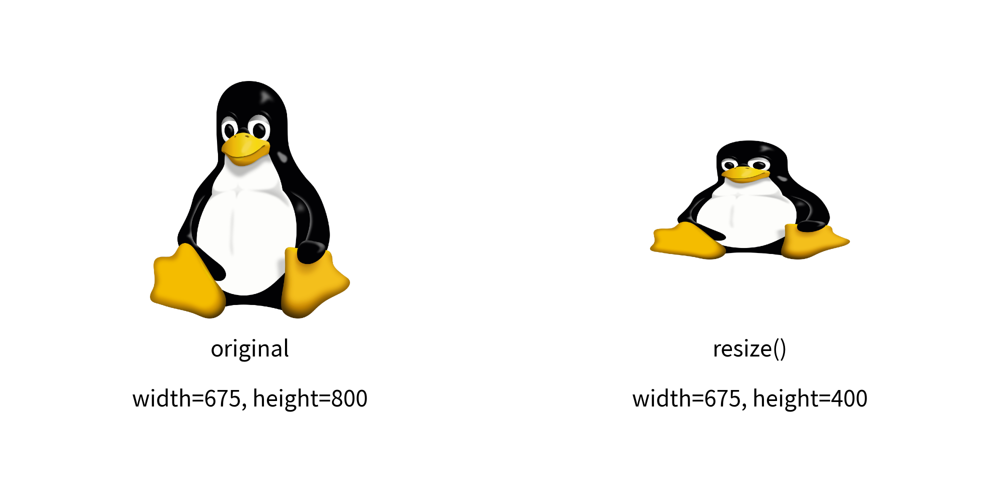
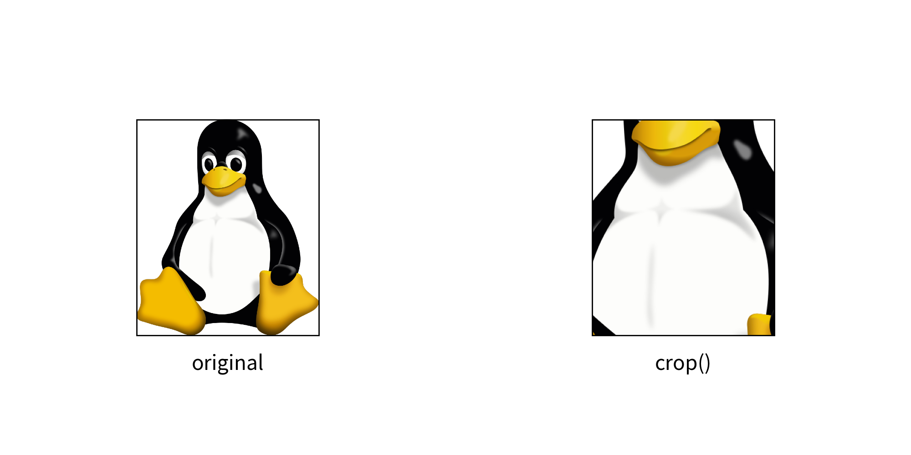
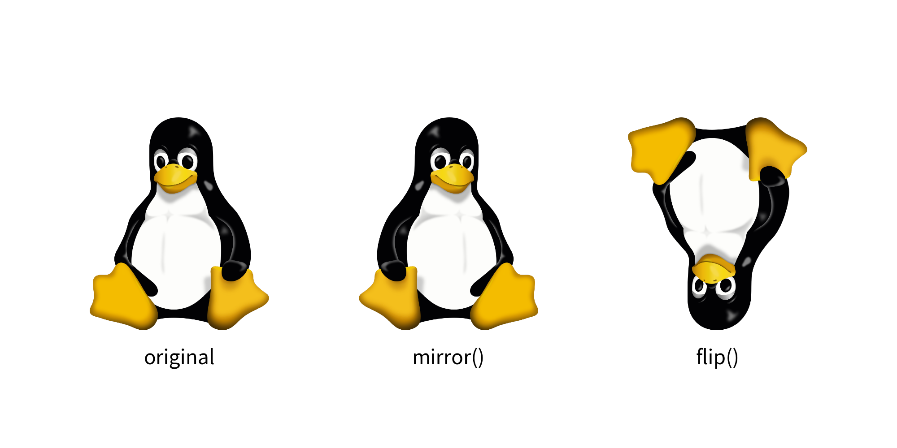
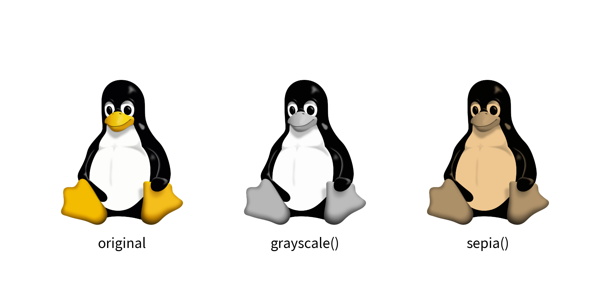
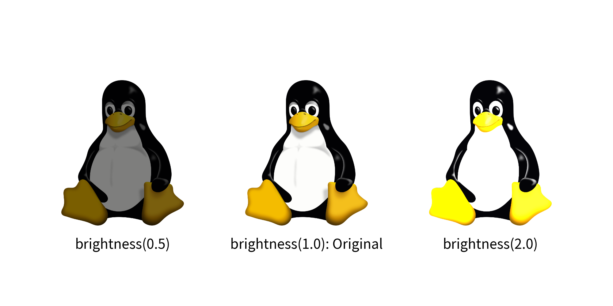
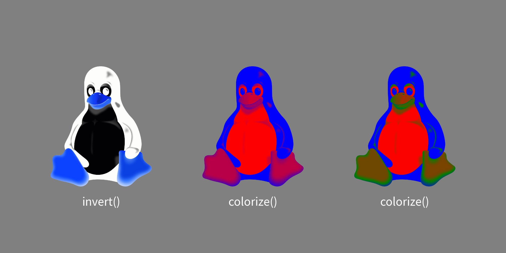
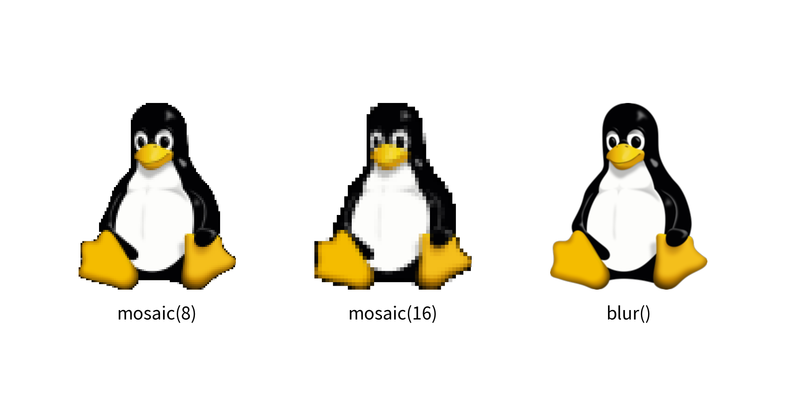

=================
Dimage
=================

The ``image()`` function draws an image from a file. 
If you want to specify a file path and show it as is, providing a relative path is acceptable.

``Dimage`` is an image data class in Drawlib. 
It is useful in the following situations:

- Applying effects to images
- Caching (loading data in one place and using it in many places)

The ``image()`` function can take a Dimage object and draw the image.

Image Cache Feature
=====================

Each illustration code can refer to image files for drawing the image. 
If the image is used only in the code, this is fine.

However, if many of your illustration codes refer to the same image file, pointing to the same file is not ideal. 
In such cases, changing the file name and location becomes difficult. 
Dimage's cache feature is useful in this situation. 
You can cache the image in the style code, and all illustration codes can access it through the cache name.

Dimage possesses a class attribute ``cache``. 
This means you can access it like ``Dimage.cache``. 
It is an image cache management object with the following methods:

- ``has(name:str)``: Checks if the cache exists
- ``set(name:str, image:str|Dimage|PIL.Image)``: Caches image data with the specified name
- ``list()``: Gets all cache names
- ``get(name:str)``: Retrieves cache data by name
- ``delete(name:str)``: Deletes cache data

Here is an example:

.. literalinclude:: image_cache.py
   :language: python
   :linenos:
   :caption: image_cache.py

In this example, we first cache an image using the ``set()`` function. 
The function has an ``image`` argument, which can handle a string (file name), Dimage object, or PIL.Image object. 
When you cache an image with a name, the object is automatically copied or converted to a Dimage internally.

You can retrieve the image using the ``get()`` function. 
It will return the copied image data that matches the key name.

Here is the output:

Not only can you cache images loaded from files, but you can also cache images you have modified. 
If you repeatedly use some images, we recommend using this feature as well.

Things Controlled by ``image()``
=================================

Dimage is a helper for the ``image()`` function. 
Therefore, Dimage does not include features that are implemented in ``image()``. 
These features are not included:

- Rotate: Controlled by the ``angle`` option
- Add Border: Controlled by the ``lwidth`` and ``lcolor`` attributes of ``ImageStyle``

Save Dimage to File
=====================

Dimage can save its data to a file without using Drawlib's canvas. 
The ``save()`` method performs this function. 
It requires a mandatory argument, ``file``. 
While the file argument in Canvas's ``save()`` is optional, it is required for Dimage's ``save()``.

If you provide a relative path, the image file will be saved relative to the script's path. 
An absolute path will also work.

Get Image Pixel Size 
=======================

You can get the original image size using the ``get_image_size()`` method. 
It returns a tuple of width and height. 

This method is helpful for determining the dimensions of the image before performing operations like ``resize()`` or ``trim()``

Resizing and Changing Aspect
===============================

The ``resize()`` method in Dimage takes two arguments: ``width`` and ``height``. 
These dimensions refer to the original pixel size of the image data, not the size on Drawlib's canvas.

Before resizing, you can check the original width and height using the ``get_image_size()`` method. 
If you want to maintain the aspect ratio of the original image, you should calculate either the new width or the new height while keeping the ratio between them. 
If you want to change the aspect ratio, you need to calculate both the new width and height accordingly.

Here's an example of changing the aspect ratio where we halve the image height:

.. literalinclude:: image_getsize_resize.py
   :language: python
   :linenos:
   :caption: image_getsize_resize.py

In this example, we retrieve the original image dimensions using ``get_image_size()``.
And then resize the image using ``resize()``.
We keep original width, but new height is half of original. 
Finally, the resized image is drawn with ``image()`` function.

Here is the output:

   resize

Crop
==========

If an image contains unnecessary parts, you can trim or crop it using the ``crop()`` method. 
This method accepts the following arguments:

- x: Specifies the starting point from the left (0 to x pixels will be cropped).
- y: Specifies the starting point from the bottom (0 to y pixels will be cropped).
- width: Specifies the width of the cropped area starting from x.
- height: Specifies the height of the cropped area starting from y.

Here's an example that keeps the center 50% of the image:

.. literalinclude:: image_crop.py
   :language: python
   :linenos:
   :caption: image_crop.py

In this example, we calculate the cropping parameters to keep the center 50% of the image. 
We then use the ``crop()`` method to apply the cropping operation to the Dimage object. 
Finally, the cropped image can be used in drawing operations with ``image()``.

Here is the output:

   crop()

Flip Horizontally and Vertically
==================================

You can easily flip an image using Dimage:

- Horizontal Flip: Use the ``mirror()`` method.
- Vertical Flip: Use the ``flip()`` method.

Here's an example:

.. literalinclude:: image_mirror_flip.py
   :language: python
   :linenos:
   :caption: image_mirror_flip.py

Here is the output:

Change color
==============

Drawlib provides several functions to modify the color of images:

- ``grayscale()``: Converts the image to grayscale
- ``sepia()``: Applies a sepia tone effect to the image

Here's an example:

.. literalinclude:: image_grayscale_sepia.py
   :language: python
   :linenos:
   :caption: image_grayscale_sepia.py

Here is the output.

- ``brightness()``:  Adjusts the brightness of the image

A value of ``0.0`` makes the image completely dark, ``1.0`` keeps the original brightness, and values greater than ``1.0`` increase the brightness.

Here's an example:

.. literalinclude:: image_brightness.py
   :language: python
   :linenos:
   :caption: image_brightness.py

Here is an output.

- ``invert()``: Reverses the RGB values of the image
- ``colorize()``: Applies colors to a grayscale image. If the image is not grayscaled, it will be automatically grayscaled before colorize.

.. literalinclude:: image_invert_colorize.py
   :language: python
   :linenos:
   :caption: image_invert_colorize.py

Here is the output.

Apply Effects
================

You can apply various effects to images using Drawlib:

- ``mosaic()``: Applies a mosaic effect to the image. You can specify the size of mosaic blocks with the optional ``block_size`` argument. Default is 8.
- ``blur()``: Applies a blur effect to the image

Here's an example:

.. literalinclude:: image_mosaic_blur.py
   :language: python
   :linenos:
   :caption: image_mosaic_blur.py

Here is the output.

