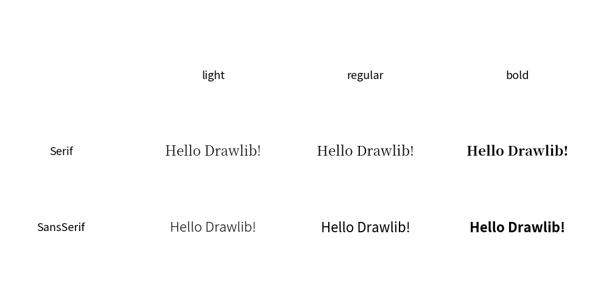
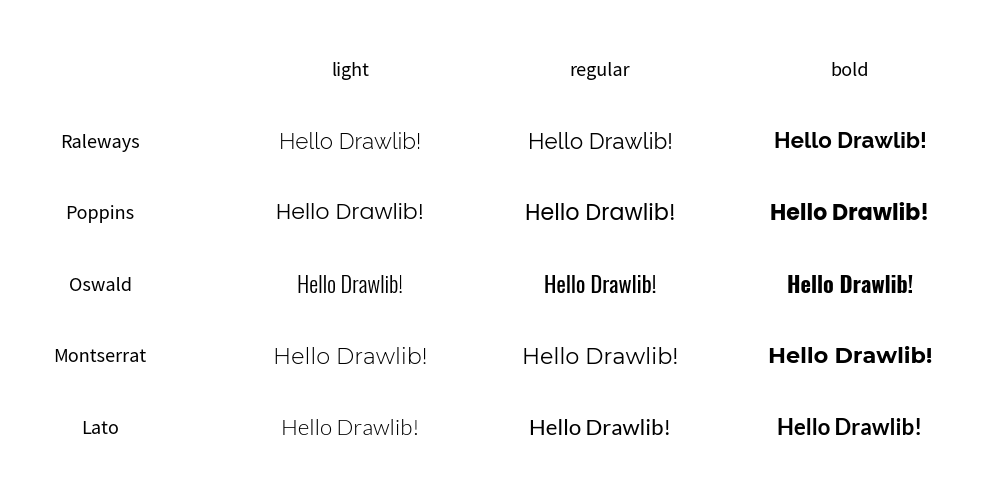
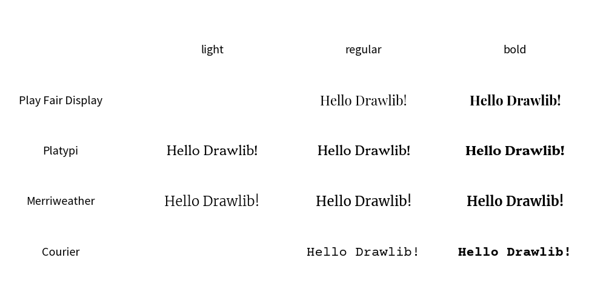
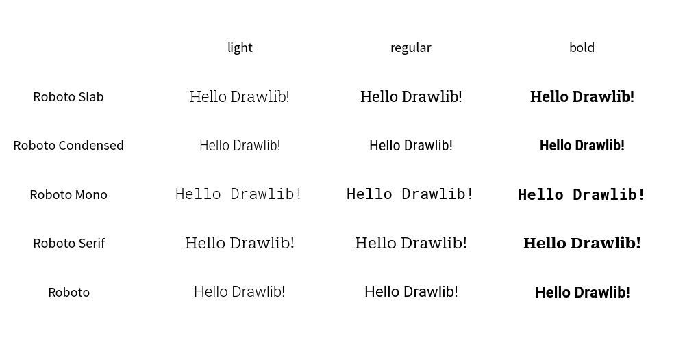
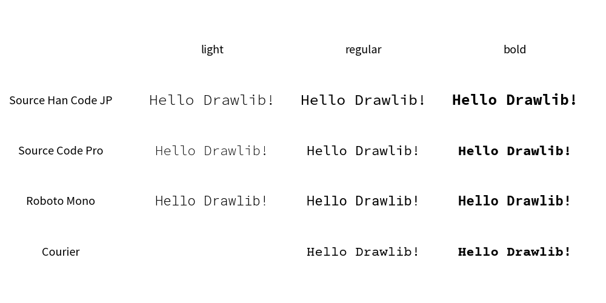
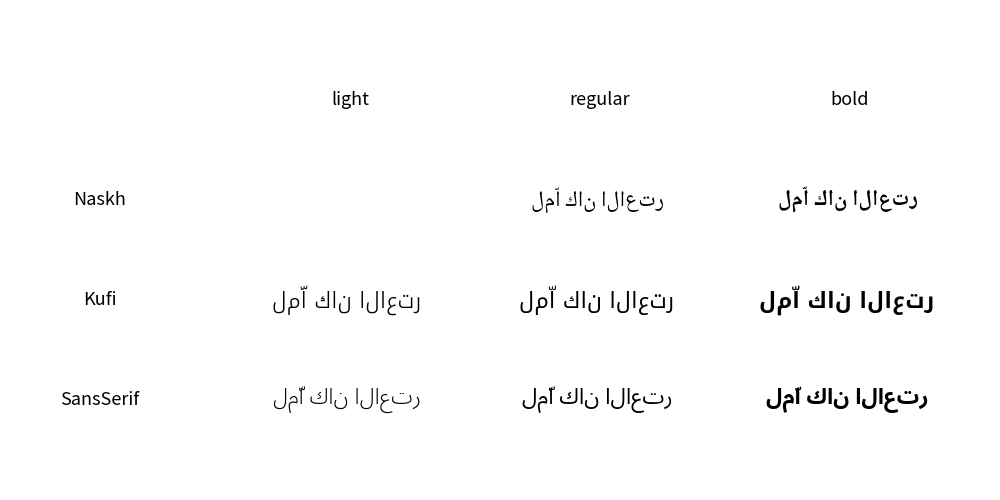
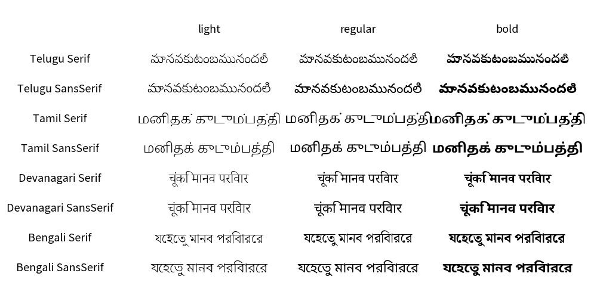
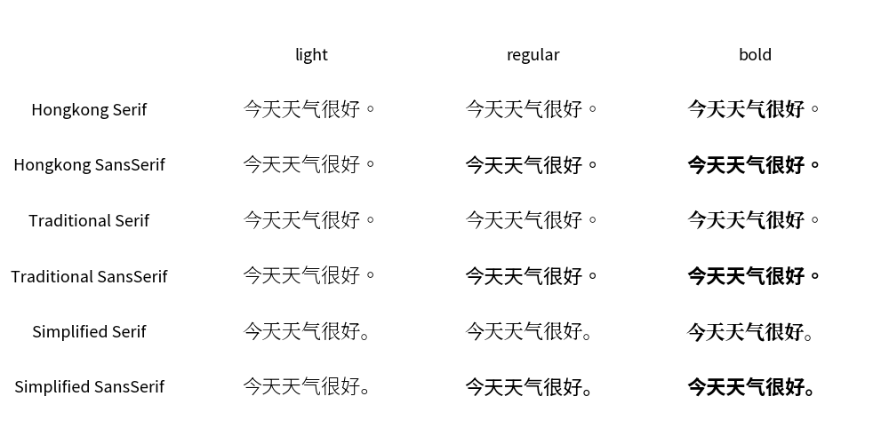
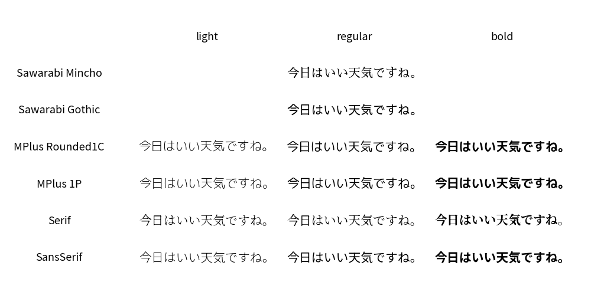
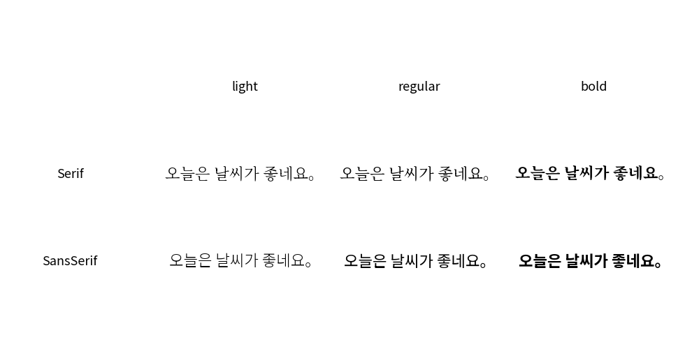

=============
Font Classes
=============

In Drawlib, fonts are categorized into various Font Classes, each serving different purposes and supporting different styles and languages. 
Here's an overview of the supported Font Classes:

- Default Fonts

    - ``Font``: Supports both SanSerif and Serif fonts for Alphabet and CJK (Chinese, Japanese, Korean) characters.

- Alphabet Fonts

    - ``FontSansSerif``: Specifically SanSerif fonts for Alphabet characters.
    - ``FontSerif``: Specifically Serif fonts for Alphabet characters.
    - ``FontMonoSpace``: Monospace fonts, where each character occupies the same amount of horizontal space.
    - ``FontSourcecode``:  A subset of FontMonoSpace fonts, optimized for source code display using ``dsart.sourcecode()``.
    - ``FontRoboto``: Fonts from the Roboto family, tailored for Alphabet characters.

- Local Language Fonts

    - ``FontArabic``: Fonts specifically designed for Arabic script.
    - ``FontBrahmic``: Fonts for Brahmic scripts used in India and neighboring countries.
    - ``FontChinese``: Fonts tailored for Chinese characters.
    - ``FontJapanese``: Fonts designed for Japanese characters.
    - ``FontKorean``: Fonts specifically for Korean characters.
    - ``FontThai``: Fonts optimized for Thai script.

Each font class supports various styles, though some fonts may have fewer styles available:

- Light: A lighter weight variant of the font.
- Regular: The standard, normal-weight variant of the font.
- Bold: A heavier, bold-weight variant of the font.

Due to the large file sizes of font files, Drawlib does not include them in the initial package when installed via pip. 
Instead, the necessary font files are downloaded dynamically the first time they are used. 
This approach minimizes the initial package size and allows for on-demand fetching of resources. 
Once downloaded, these font files are cached on your local machine.

If needed, you can manage the font cache using the ``drawlib --purge_font_cache`` command. 
This command clears the cached font files from your system, freeing up storage space if necessary.

FontFile
============

The ``FontFile`` class in Drawlib allows users to utilize custom fonts for rendering text using the ``text()`` function and similar methods. 
Here's how you can use the FontFile class in your Python code:

.. literalinclude:: image_file.py
   :language: python
   :linenos:
   :caption: image_file.py

Executing this code generate the output:

    Using font file

Font
===========

The ``Font`` class in Drawlib provides default fonts. 
Here's an overview of the fonts available in the Font class:

- SanSerif Fonts

    - ``SANSSERIF_LIGHT``: Noto SansSerif CJK(Chinese, Japanese, Korean)
    - ``SANSSERIF_REGULAR``
    - ``SANSSERIF_BOLD``

- Serif Fonts

    - ``SERIF_LIGHT``: Noto Serif CJK Japanese
    - ``SERIF_REGULAR``
    - ``SERIF_BOLD``

By default, the Drawlib's default theme uses ``Font.SANSSERIF_REGULAR``. 
This font choice is based on its standard shape and wide coverage across different languages and populations.

The following image illustrates the fonts available in the Font class:

    class Font

FontSansSerif
=================

Class ``FontSansSerif`` contains popular SansSerif fonts for alphabet languages.

- Lato

    - ``LATO_LIGHT``
    - ``LATO_REGULAR``
    - ``LATO_BOLD``

- Raleways

    - ``RALEWAYS_LIGHT``
    - ``RALEWAYS_REGULAR``
    - ``RALEWAYS_BOLD``

- Montserrat

    - ``MONTSERRAT_LIGHT``
    - ``MONTSERRAT_REGULAR``
    - ``MONTSERRAT_BOLD``

- Oswald

    - ``OSWALD_LIGHT``
    - ``OSWALD_REGULAR``
    - ``OSWALD_BOLD``

- Poppins

    - ``POPPINS_LIGHT``
    - ``POPPINS_REGULAR``
    - ``POPPINS_BOLD``

The following image illustrates the fonts available in the FontSansSerif class:

    class FontSansSerif

FontSerif
==========

Class ``FontSerif`` contains popular Serif fonts for alphabet languages.

- Courier

    - ``COURIER_REGULAR``
    - ``COURIER_BOLD``

- Merriweather

    - ``MERRIWEATHER_LIGHT``
    - ``MERRIWEATHER_REGULAR``
    - ``MERRIWEATHER_BOLD``

- Platypi

    - ``PLATYPI_LIGHT``
    - ``PLATYPI_REGULAR``
    - ``PLATYPI_BOLD``

- PlayFairDisplay

    - ``PLAYFAIRDISPLAY_LIGHT``
    - ``PLAYFAIRDISPLAY_REGULAR``
    - ``PLAYFAIRDISPLAY_BOLD``

The following image illustrates the fonts available in the FontSerif class:

    class FontSansSerif

FontRoboto
=============

Class ``FontRoboto`` famous and popular Roboto group fonts.

- Roboto

    - ``ROBOTO_LIGHT``
    - ``ROBOTO_REGULAR``
    - ``ROBOTO_BOLD``

- Roboto Serif

    - ``SERIF_LIGHT``
    - ``SERIF_REGULAR``
    - ``SERIF_BOLD``

- Roboto Mono

    - ``MONO_LIGHT``
    - ``MONO_REGULAR``
    - ``MONO_BOLD``

- Roboto Condensed

    - ``CONDENSED_LIGHT``
    - ``CONDENSED_REGULAR``
    - ``CONDENSED_BOLD``

- Roboto Slab

    - ``SLAB_LIGHT``
    - ``SLAB_REGULAR``
    - ``SLAB_BOLD``

The following image illustrates the fonts available in the FontRoboto class:

    class FontRoboto

FontMonoSpace
===============

Class ``FontMonoSpace`` contains  mono space fonts.
Almost all are for alphabet, but SourceHanCodeJP supports Japanese.

- Courier

    - ``COURIER_REGULAR``
    - ``COURIER_BOLD``

- Roboto Mono

    - ``ROBOTO_MONO_LIGHT``
    - ``ROBOTO_MONO_REGULAR``
    - ``ROBOTO_MONO_BOLD``

- SourceCodePro

    - ``SOURCECODEPRO_LIGHT``
    - ``SOURCECODEPRO_REGULAR``
    - ``SOURCECODEPRO_BOLD``

- SourceHanCodeJP

    - ``SOURCEHANCODEJP_LIGHT``
    - ``SOURCEHANCODEJP_REGULAR``
    - ``SOURCEHANCODEJP_BOLD``

The following image illustrates the fonts available in the FontMonoSpace class:

    class FontSansSerif

FontArabic
============

Class ``FontArabic`` contains Arabic fonts.

- Sans Serif

    - ``SANSSERIF_LIGHT``
    - ``SANSSERIF_REGULAR``
    - ``SANSSERIF_BOLD``

- Kufi

    - ``KUFI_LIGHT``
    - ``KUFI_REGULAR``
    - ``KUFI_BOLD``

- Naskh

    - ``NASKH_LIGHT``
    - ``NASKH_REGULAR``
    - ``NASKH_BOLD``

The following image illustrates the fonts available in the FontArabic class:

    class FontArabic

FontBrahmic
============

Class ``FontBrahmic`` contains fonts for characters which delived from Brahmic.

- Bengali

    - ``BENGALI_SANSSERIF_LIGHT``
    - ``BENGALI_SANSSERIF_REGULAR``
    - ``BENGALI_SANSSERIF_BOLD``
    - ``BENGALI_SERIF_LIGHT``
    - ``BENGALI_SERIF_REGULAR``
    - ``BENGALI_SERIF_BOLD``

- Devanagari

    - ``DEVANAGARI_SANSSERIF_LIGHT``
    - ``DEVANAGARI_SANSSERIF_REGULAR``
    - ``DEVANAGARI_SANSSERIF_BOLD``
    - ``DEVANAGARI_SERIF_LIGHT``
    - ``DEVANAGARI_SERIF_REGULAR``
    - ``DEVANAGARI_SERIF_BOLD``

- Tamil

    - ``TAMIL_SANSSERIF_LIGHT``
    - ``TAMIL_SANSSERIF_REGULAR``
    - ``TAMIL_SANSSERIF_BOLD``
    - ``TAMIL_SERIF_LIGHT``
    - ``TAMIL_SERIF_REGULAR``
    - ``TAMIL_SERIF_BOLD``

- Telugu

    - ``TELUGU_SANSSERIF_LIGHT``
    - ``TELUGU_SANSSERIF_REGULAR``
    - ``TELUGU_SANSSERIF_BOLD``
    - ``TELUGU_SERIF_LIGHT``
    - ``TELUGU_SERIF_REGULAR``
    - ``TELUGU_SERIF_BOLD``

The following image illustrates the fonts available in the FontBrahmic class:

    class FontBrahmic

FontChinese
============

Class ``FontChinese`` contains Chinese fonts.

- Simplified

    - ``SIMPLIFIED_SANSSERIF_LIGHT``
    - ``SIMPLIFIED_SANSSERIF_REGULAR``
    - ``SIMPLIFIED_SANSSERIF_BOLD``
    - ``SIMPLIFIED_SERIF_LIGHT``
    - ``SIMPLIFIED_SERIF_REGULAR``
    - ``SIMPLIFIED_SERIF_BOLD``

- Traditional

    - ``TRADITIONAL_SANSSERIF_LIGHT``
    - ``TRADITIONAL_SANSSERIF_REGULAR``
    - ``TRADITIONAL_SANSSERIF_BOLD``
    - ``TRADITIONAL_SERIF_LIGHT``
    - ``TRADITIONAL_SERIF_REGULAR``
    - ``TRADITIONAL_SERIF_BOLD``

- HongKong

    - ``HONGKONG_SANSSERIF_LIGHT``
    - ``HONGKONG_SANSSERIF_REGULAR``
    - ``HONGKONG_SANSSERIF_BOLD``
    - ``HONGKONG_SERIF_LIGHT``
    - ``HONGKONG_SERIF_REGULAR``
    - ``HONGKONG_SERIF_BOLD``

The following image illustrates the fonts available in the FontChinese class:

    class FontChinese

FontJapanese
============

Class ``FontJapanese`` contains Japanese fonts.

- Sans Serif

    - ``SANSSERIF_LIGHT``
    - ``SANSSERIF_REGULAR``
    - ``SANSSERIF_BOLD``

- Serif

    - ``SERIF_LIGHT``
    - ``SERIF_REGULAR``
    - ``SERIF_BOLD``

- Mplus 1P

    - ``MPLUS1P_LIGHT``
    - ``MPLUS1P_REGULAR``
    - ``MPLUS1P_BOLD``

- Mplus Rounded 1C

    - ``MPLUSROUNDED1C_LIGHT``
    - ``MPLUSROUNDED1C_REGULAR``
    - ``MPLUSROUNDED1C_BOLD``

- Sawarabi

    - ``SAWARABI_GOTHIC``
    - ``SAWARABI_MINCHO``

The following image illustrates the fonts available in the FontJapanese class:

    class FontJapanese

FontKorean
============

Class ``FontKorean`` contains Korean fonts.

- Sans Serif

    - ``SANSSERIF_LIGHT``
    - ``SANSSERIF_REGULAR``
    - ``SANSSERIF_BOLD``

- Serif

    - ``SERIF_LIGHT``
    - ``SERIF_REGULAR``
    - ``SERIF_BOLD``

The following image illustrates the fonts available in the FontKorean class:

    class FontKorean

FontThai
============

Class ``FontThai`` contains Thai fonts.

- Sans Serif

    - ``SANSSERIF_LIGHT``
    - ``SANSSERIF_REGULAR``
    - ``SANSSERIF_BOLD``

- Serif

    - ``SERIF_LIGHT``
    - ``SERIF_REGULAR``
    - ``SERIF_BOLD``

The following image illustrates the fonts available in the FontThai class:

.. figure:: image_FontThai.png
    :width: 600
    :class: with-border
    :align: center

    class FontThai

Request for Adding Fonts
=========================

We welcome suggestions for adding new fonts to our Drawlib library. 
To ensure compatibility and usability, please consider the following criteria before making a request:

- Free License: The font must be available under a free license.
- Compatibility: The font should work seamlessly with Drawlib. Note that emoji fonts may not be fully supported at this time.
- Language Support: Fonts for languages currently not supported by Drawlib are prioritized, including minor languages.
- Global Popularity: The font should be widely recognized and used globally.
- Regional Popularity: Fonts for local languages that are popular in specific regions are also highly considered.

Before submitting a request, we recommend testing the font using the ``FontFile()`` class to ensure it meets your requirements. 
At present, Drawlib does not include decorative or ornamental fonts.

Your input is valuable to us, and if your font suggestion meets these criteria, we will consider adding it in a future release.
