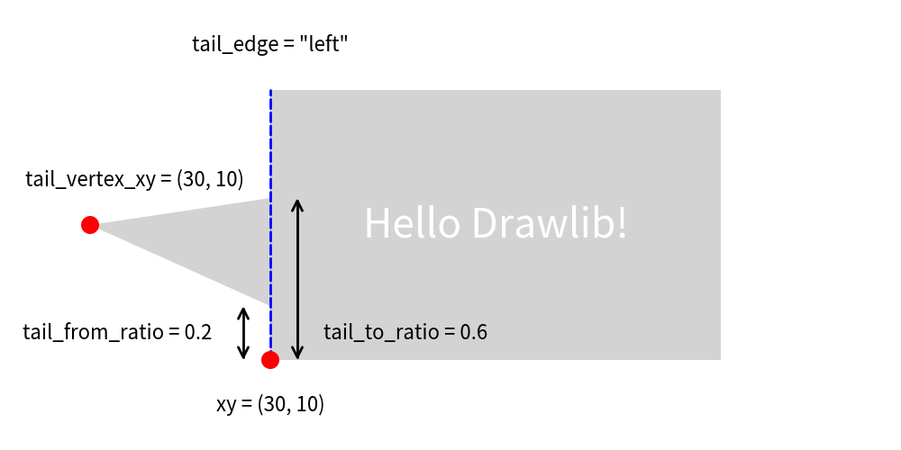

==========================
Smart Arts: Bubblespeech
==========================

The Bubblespeech feature in Drawlib allows you to create irregular bubble-shaped speech graphics, often used in illustrations. 
It's implemented within the ``dsart`` module as part of the Smart Art functions, offering advanced shape drawing capabilities.

Here's an example of using Bubblespeech in Drawlib:

.. literalinclude:: image1.py
   :language: python
   :linenos:
   :caption: image1.py

This function call draws a bubble speech shape with a tail starting from the right edge, beginning at 30% from the bottom, extending to 70% along its path.

.. figure:: image1.png
    :width: 600
    :class: with-border
    :align: center

    image1.png

In the example above, the options for drawing Bubblespeech are specified. The key parameters include:

- xy: Coordinates specifying the position of the bottom-left corner.
- tail_edge: Specifies the edge from which the tail extends (``left``, ``right``, ``bottom``, ``top``).
- tail_from_ratio: Determines where the tail starts along the specified edge (0.0 to 1.0).
- tail_vertex_xy: Specifies the exact vertex location of the tail.
- tail_to_ratio: Specifies where the tail ends along its path (must be greater than tail_from_ratio).

Please refer the below picture for understanding the parameters.

    image2.png

Ellipse like bubblespeech is not supported yet.