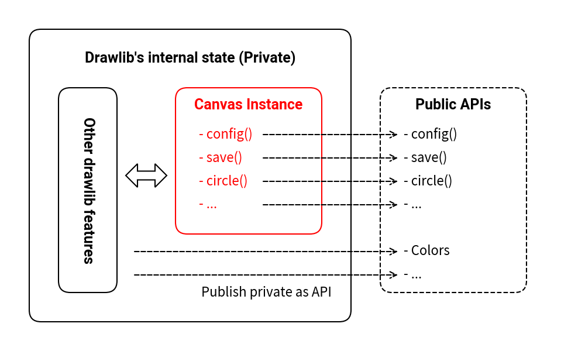
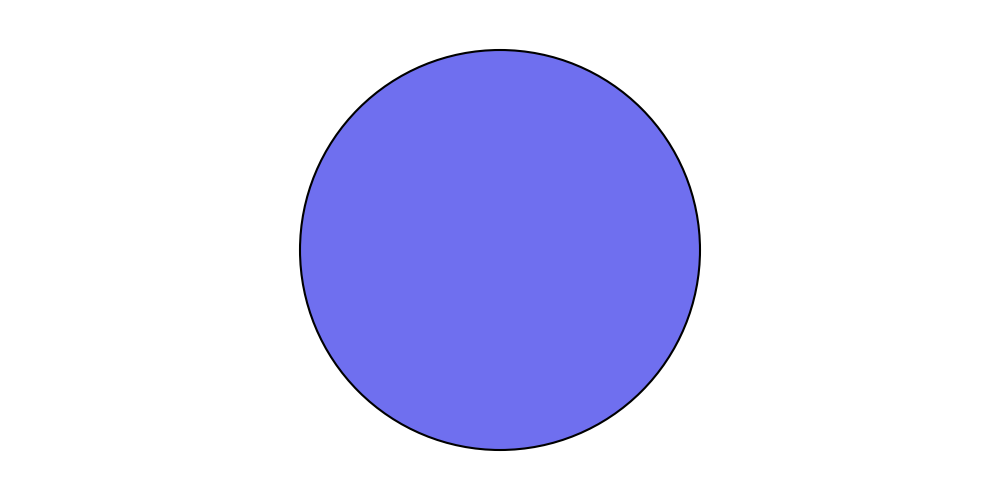
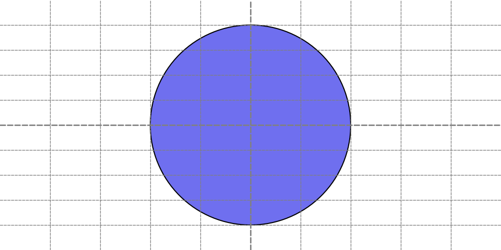
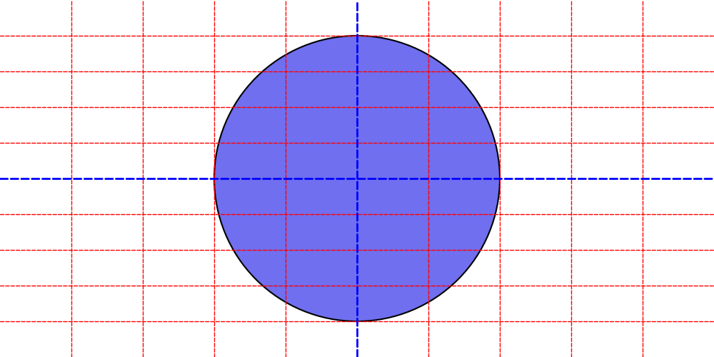
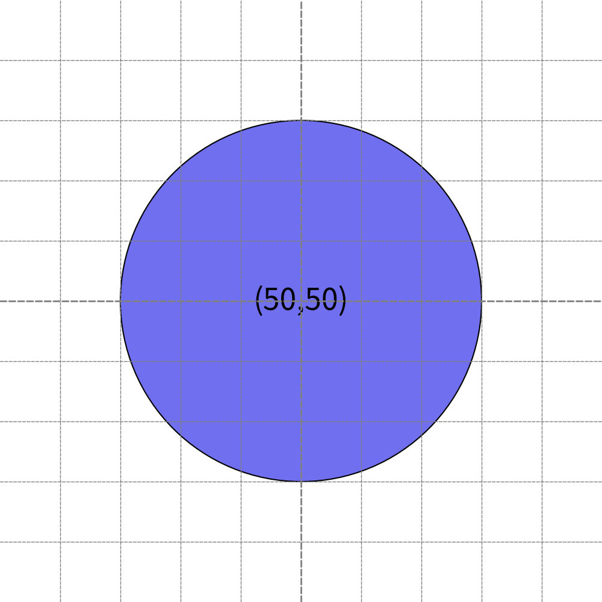
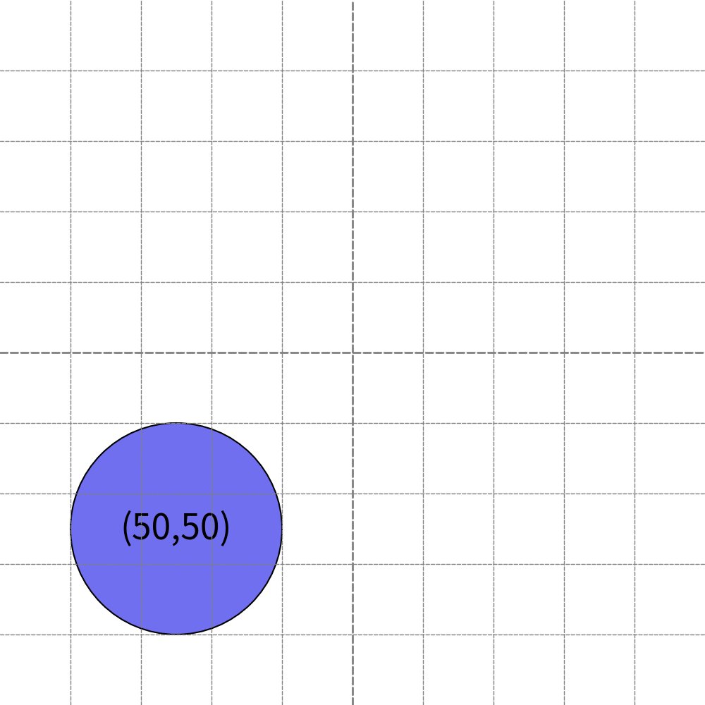
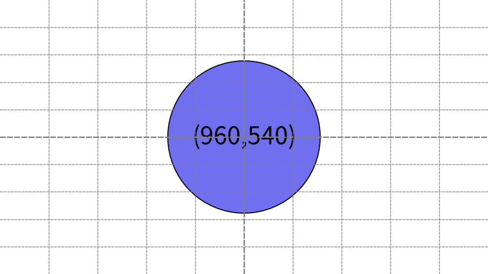
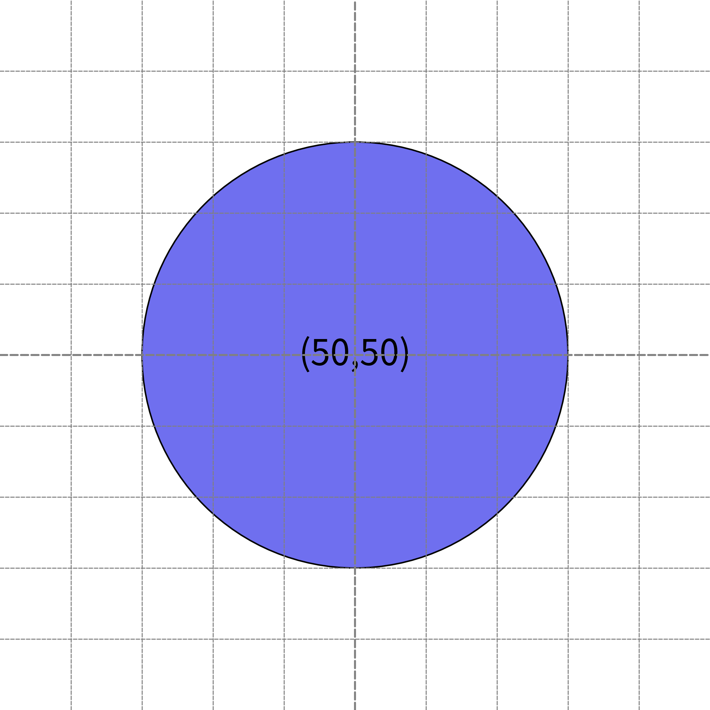
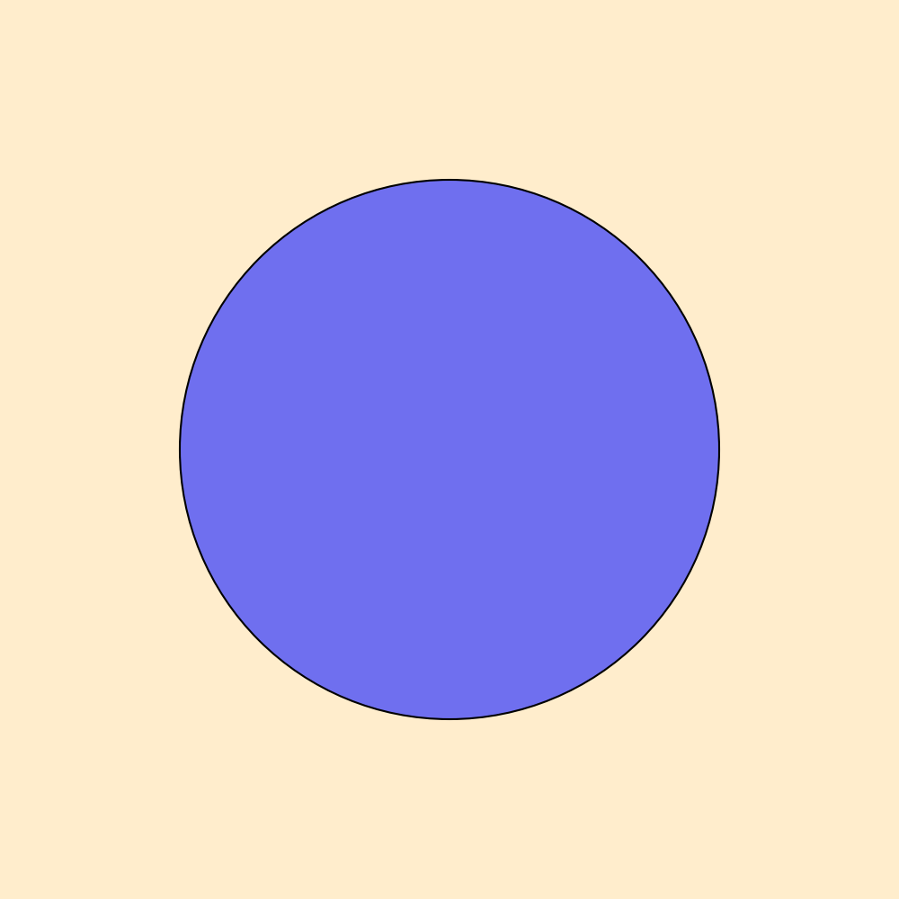

===============
Canvas
===============

Drawlib manages the canvas, allowing you to draw various elements such as lines and shapes onto it. 
Once your drawing is complete, you can save it as an image.

The canvas is a pivotal concept in drawlib, although it remains internal and isn't directly exposed to users. 
Below is a succinct overview of drawlib's canvas architecture:

    Canvas architecture

In this architecture, drawlib internally incorporates core functions and methods that are accessible to users through APIs defined in ``drawlib.apis``. 
When you invoke APIs like ``config()``, these functions internally interact with the canvas state.

For example, using the public API ``config(width=200, height=100)`` triggers an internal method that adjusts the canvas's dimensions to 200 pixels wide and 100 pixels high.
Similarly, calling the ``circle(...)`` API invokes an internal method that adds a circle to the canvas.

While it's technically possible to create your own instance of the Canvas and perform drawing operations, this approach isn't recommended.
This is because functionalities such as file handling and theme settings are integrated with drawlib's internal canvas management. 
Our architecture is designed to ensure:

- Accessibility for users unfamiliar with Python and object-oriented programming.
- Ease of learning and use.
- Simplicity akin to scripting for drawing operations.

Canvas-related APIs
=======================

The canvas in drawlib provides several categories of public APIs:

* APIs for managing the canvas itself.
* APIs for drawing icons.
* APIs for drawing images.
* APIs for drawing lines.
* APIs for drawing shapes.
* APIs for drawing text.
* Utility APIs that require canvas information.

This page focuses specifically on the APIs for managing the canvas itself, while other categories are covered in separate documentation sections.

* ``config()``: Configures the canvas by adjusting parameters such as size and background color.
* ``save()``: Exports the current canvas as an image file.
* ``clear()``: Resets the canvas state by clearing all configurations and drawn objects.

Both ``config()`` and ``save()`` are essential functions discussed in the introductory pages, as they are fundamental for creating illustrations. 
``clear()`` is useful when you need to refresh the canvas state, especially within scripts that create multiple illustrations sequentially. 
However, it's recommended to adhere to the guideline of having one illustration per script file. 
By following this recommendation, there's typically no need to explicitly call ``clear()``.

config()
===========

The ``config()`` API in drawlib manages various canvas configurations, encompassing:

* Size (width, height): Specifies the dimensions of the canvas in coordinate units.
* DPI (resolution): Sets the Dots Per Inch for the canvas, influencing image clarity.
* Grid: Enables a grid overlay on the canvas for visual alignment assistance.
* Canvas color (background color): Defines the background color of the canvas.
* Theme: Applies predefined styles across drawings, including item colors and line thicknesses.

We'll start with an exploration of grid settings, as they form the foundational basis and are used in conjunction with other configuration options.

Configuring Canvas Grid
-------------------------

During the process of creating illustrations, you may find yourself running your code multiple times to check how your changes affect the resulting image. 
As you iterate through this write/check/fix cycle, displaying a grid might prove beneficial for understanding item coordinates and sizes, aiding in aligning multiple objects within a single image.

Enabling the grid is straightforward; simply set the grid option to True. 
By default, this option is set to ``False``. Below is an example code snippet:

.. literalinclude:: image_grid1.py
   :language: python
   :linenos:
   :caption: image_grid1.py

Executing this code will generate two files:

* ``image_grid1.png``: The resulting image without the grid.
* ``image_grid1_grid.png``: The same image with the grid displayed.

By default, the file name is the same as the script file name. 
The grid version appends ``_grid`` to the file name.

The former image without the grid:

    image_grid1.png

The latter image with the grid displayed:

    image_grid1_grid.png

Normally, grid lines are removed after completing the creation of the drawing code. 
However, if you need to modify the illustration later, having the grid displayed again might be useful. 
To avoid repeatedly enabling/disabling the grid in your code, you can export both versions of the image files.

If you only require the grid illustration, you can use the ``grid_only=True`` option instead:

.. literalinclude:: image_grid2.py
   :language: python
   :linenos:
   :caption: image_grid2.py

This code will generate an image with grid lines but without the additional grid version file (image_grid2_grid.png).

.. figure:: image_grid2.png
    :width: 450
    :class: with-border
    :align: center

    Grid only option generate grid image only

To apply a specific line style to the grid, provide a ``LineStyle`` object to the following options:

* ``grid_style``: Sets the style for all grid lines.
* ``grid_centerstyle``: Overrides the style for the center grid lines.

Here's an example code snippet demonstrating the use of grid styles:

.. literalinclude:: image_grid3.py
   :language: python
   :linenos:
   :caption: image_grid3.py

This code will generate an image with the grid displayed using the provided line style. 
Note that providing a grid_style automatically sets the grid option to True, but you can override this by explicitly setting ``grid=False``.

    Changing grid line

Configuring Canvas Size
-------------------------

The canvas size and resolution are distinct concepts in Drawlib. 
Size refers to the coordinate system's values (the range of xy), while resolution pertains to the output image's pixel dimensions.

When configuring the canvas size, note that it doesn't directly affect the pixel dimensions of the output image by default. 
For example, setting ``width=10, height=10`` and ``width=100, height=100`` both generate images of the same pixel size.
However, to maintain the aspect ratio, ``width=10, height=5`` would produce an image with half the pixel height.

By default, Drawlib's canvas size is:

* Width: 100
* Height: 100

which can be adjusted using ``config(width=<value>, height=<value>)``. 
This default size usually suffices for typical situations. 
Therefore, we typically only adjust the height when we need to create horizontally wider images. 
There's no reason to set a very small value that requires using coordinate values close to 0.01. 
Conversely, excessively large values may become unwieldy.

Let's explore how changing the size affects the output. 
Below is a code snippet with ``config(width=100, height=100, ...)``:

.. literalinclude:: image_size1.py
   :language: python
   :linenos:
   :caption: image_size1.py

Executing this code generates the following image:

    width=100, height=100

Now, let's adjust the size to ``config(width=200, height=200, ...)``:

.. literalinclude:: image_size2.py
   :language: python
   :linenos:
   :caption: image_size2.py

This change results in a new image:

    width=200, height=200

For wider images, increase the width relative to the height. 
You can either increase the width or decrease the height. 
In the following example, we set the canvas coordinate size to full HD (1920x1080):

.. literalinclude:: image_size3.py
   :language: python
   :linenos:
   :caption: image_size3.py

This produces the image below:

    width=1920, height=1080

When setting the size, using simple values such as 50, 100, 150, 200 makes mathematical calculations easier. 
It's more challenging to compute half or quarter values of 1920 compared to 100.

Configuring DPI and Resolution
--------------------------------

Understanding DPI (Dots Per Inch) is crucial for grasping drawlib's rendering quality. 
However, before delving into DPI, it's essential to comprehend the actual implementation of drawlib's canvas size.

In the previous examples, you configured ``config(width=100, height=100)``, ``config(width=200, height=200)`` and ``config(width=1920, height=1080)``. 
One might assume that larger width and height values result in higher resolution images. 
However, let's check the actual image sizes:

.. code-block:: none

    $ file image_size1.png 
    image_size1.png: PNG image data, 1000 x 1000, 8-bit/color RGBA, non-interlaced

    $ file image_size2.png
    image_size2.png: PNG image data, 1000 x 1000, 8-bit/color RGBA, non-interlaced

    $ file image_size3.png
    image_size3.png: PNG image data, 1000 x 562, 8-bit/color RGBA, non-interlaced

As observed, all images have a pixel width of 1000.

DPI refers to the density of dots within one inch. 
The default DPI value in drawlib is ``100``, and the canvas width is always considered to be ``10 inches``. 
Hence, the 1000-pixel width arises from 10 inches x 100 DPI.

The first and second images have heights equal to their widths, resulting in a height of 1000 pixels. 
However, the third image (``image_size3.png``) has a coordinate width of 1920 and a height of 1080. 
In this case, 1920 correspond to 10 inches, while 1080 equate to 5.625 inches.
Then, 562 pixel height.

To export high-resolution images, you can adjust the DPI setting. 
For instance, 10 inches x 100 DPI equals 1000 pixels, whereas 10 inches x 200 DPI yields 2000 pixels. 
Let's demonstrate this with an example:

.. literalinclude:: image_dpi1.py
   :language: python
   :linenos:
   :caption: image_dpi1.py

Executing this code generates the following image:

    dpi=200

It seems there are no big differences from previous outputs.
However, it has different pixel width.

.. code-block:: none

    $ file image_dpi1.png 
    image_dpi1.png: PNG image data, 2000 x 2000, 8-bit/color RGBA, non-interlaced

Doubling the DPI results in a twofold increase in resolution. 
If you want to 1920px output for previous image, you can set ``config(width=1920, height=1080, dpi=192)`` instead.
10 inch width x 192 DPI generates 1920 pixel width image.

It's important to note that higher DPI settings can slow down image generation and require more disk space. 
Hence, setting excessively large values such as ``dpi=1000`` might not be advisable in typical scenarios.

Configuring Background Color and Alpha
---------------------------------------

There are situations where you may want to customize the background color of your illustrations, such as placing a black background image on a black background page. 
In such cases, you can configure the background color and alpha using the ``config()`` function.

By default, drawlib's background color depends on the adopted theme, but typically, it is white with an alpha value of 1.0 (completely opaque). 
You can adjust these settings by changing the theme's default background color and alpha. 
However, it's much simpler and takes precedence to configure them directly using ``config()``.

Let's look at an example:

.. literalinclude:: image_background1.py
   :language: python
   :linenos:
   :caption: image_background1.py

In this example, we've configured the background color to orange with an alpha value of 0.2. 
Executing this code generates the following output:

    Background color orange. Alpha 0.2

If you wish to create a completely transparent background image, you can set the background color to ``Colors.Transparent`` or set the alpha value to ``0``.

It's important to note that some image formats, such as JPG, do not support alpha values. 
Therefore, a non-transparent JPG file is not a bug; it's a limitation of the file format.

save() 
========

The ``save()`` function is used to save the canvas as an image file. 
If no arguments are provided, it defaults to saving a PNG image with the same name as the script file. 
For instance, calling save() in a script named ``myimage.py`` will generate ``myimage.png``.

We recommend using no arguments for save() because:

* It helps in easily understanding which script generated which image.
* PNG format suffices for normal situations.

Changing the Saving Filename
--------------------------------

The ``save()`` function offers optional arguments. 
If you wish to save the image with a specific name, you can use the ``file`` option. 
Here's an example:

.. literalinclude:: image_save1.py
   :language: python
   :linenos:
   :caption: image_save1.py

Executing this code generates the following image:

.. figure:: myimage.webp
    :width: 450
    :class: with-border
    :align: center

    File name: myimage.webp

In this case, you didn't specify a file path. 
In such situations, the image will be created in the same directory as the script file. 
Providing a file path works as follows:

* Absolute path: Saves the image normally.
* Relative path: Saves the image relative to the script file's directory.

Normally, Python handles relative paths from the entry point (where the program is started). 
However, drawlib handles relative paths from the script file's directory. 
If you prefer the traditional Python file path behavior, please convert the relative path to an absolute path first, then provide it to the save() function. 
It will work as you expect.

Changing the Saving Format
---------------------------

If you want to save the image with the script file name but specify a file format other than PNG, the ``format`` option is useful. 
It behaves almost the same as save() without options, but you can specify the file format. 
Here's an example:

.. literalinclude:: image_save2.py
   :language: python
   :linenos:
   :caption: image_save2.py

This code generate this file.

.. figure:: image_save2.jpg
    :width: 450
    :class: with-border
    :align: center

    File name: image_save2.jpg

Drawlib supports the following formats for now:

* PNG
* JPG
* WEBP
* PDF
