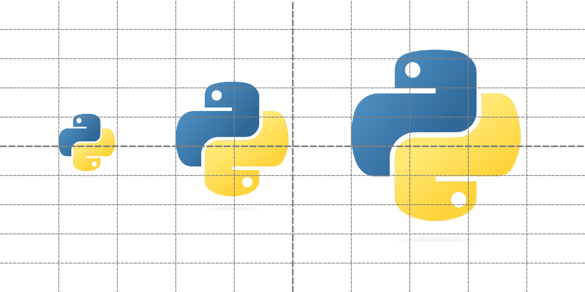
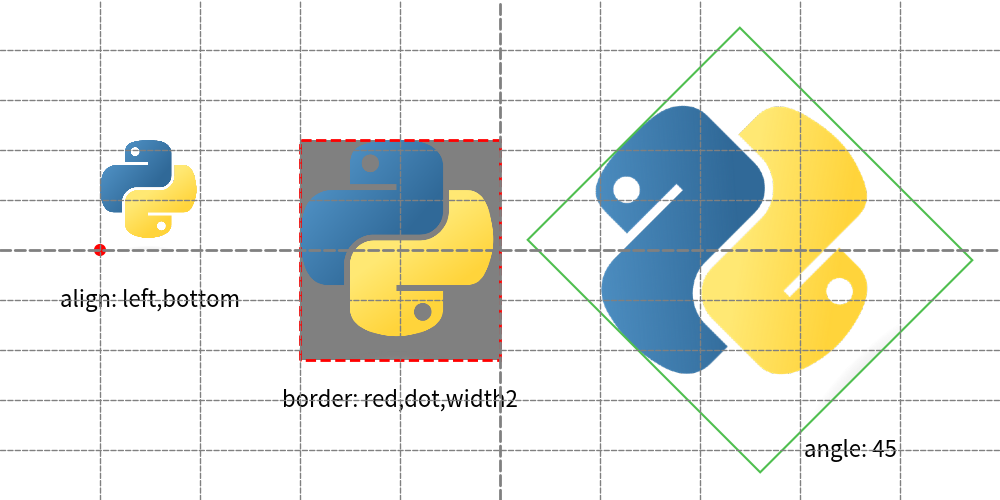
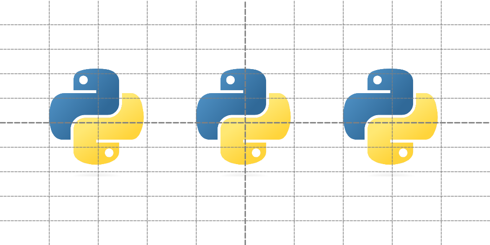

===============
Drawing Image
===============

Drawlib utilizes the ``image()`` function for drawing images.
You can specify:

* Coordinate
* Size
* Image source (file path string, Dimage, PIL.Image.Image)
* Angle
* Styling options

In this document, we'll begin with the basics of the image() function, followed by explanations of styling and different types of original image data.

image()
==========

The image() function accepts the following arguments:

- xy: Coordinates specifying the position of the image.
- width: Width of the image.
- image: Source of the image, which can be a file path string, Dimage object, or PIL.Image.Image object.
- angle: Rotation angle of the image (optional).
- style: Styling information, either as a string name or an ImageStyle object.

Coordinates and alignment work similarly to other drawing elements. 
Let's start with an example:

.. literalinclude:: image1.py
   :language: python
   :linenos:
   :caption: image1.py

Executing this code generates the following output:

    image1.png

By default, the xy coordinates position the center of the image.

ImageStyle
==============

Images can be styled using the ``ImageStyle`` data class, which includes:

* halign: Horizontal Align
* valign: Verteical Align
* lwidth: Line width
* lcolor: Line color
* lstyle: Line style
* fcolor: Fill color for transparent part

Let's check image styling with example.
Here is a code which specify stylings.

.. literalinclude:: image2.py
   :language: python
   :linenos:
   :caption: image2.py

The first image changes alignment.
Default alignment is center,center, but left,bottom might be useful sometimes.

Changing image border line and add color for transparent part at 2nd example.
Default is no border, no fill.

The 3rd example changes angle of image.
With specifying theme's style ``"green_solid"``.

Executing code generates this output.

    image with styles

Styling an image with ImageStyle allows adjustments such as alignment changes, border customization, and rotation.

Passing image objects
=========================

While file paths are commonly used, image() also accepts the following image objects:

``Dimage``: Drawlib's image utility class.
``PIL.Image.Image``: Images from the PIL (Pillow) library.

Here's an example demonstrating how to use these objects:

.. literalinclude:: image3.py
   :language: python
   :linenos:
   :caption: image3.py

Both instances are passed to arg ``image``.
Function ``image()`` will handle them correctly.

Both instances are passed to the image argument, and image() handles them correctly.

We utilize ``dutil_script.get_relative_path()`` to ensure correct file paths. 
Drawlib functions always interpret paths relative to the script's location.
But PIL function doesn't.
This utility function adjusts the path rule to match drawlib's conventions.

    image3.png

As shown, all three approaches yield the same drawing output. 
Dimage and PIL.Image.Image are particularly useful when applying effects to images or manipulating them programmatically.