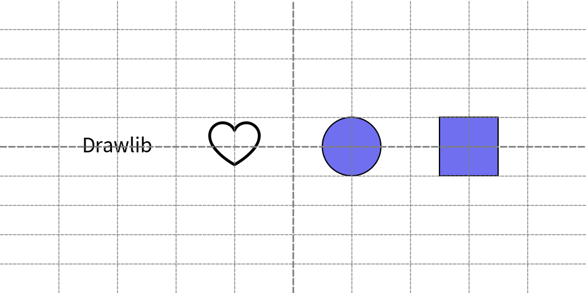

=======================
Coding Best Practices
=======================

Illustration code is used to generate images. 
If the illustration is simple, code quality may not be a major concern. 
However, for more complex outputs, maintaining high code quality is essential.

Following Drawlib's best practices can significantly improve the quality of your illustration code. 
These best practices align with common Python coding standards and also include specific guidelines for handling illustrations effectively.

Let's go through these practices one by one.

Consider Which Alignment is the Best
======================================

Many drawing items are aligned vertically and horizontally. 
Using horizontal and vertical alignment with "center" is often the best approach for aligning different types and sizes of objects.

Let's compare some example code with different alignments.

.. literalinclude:: image1.py
   :language: python
   :linenos:
   :caption: image1.py

Before diving into the code, let's examine the output image.

.. figure:: image1.png
    :width: 600
    :class: with-border
    :align: center

    Align left,bottom vs center,center

Both types of alignment produce a similar output.

Now, let's review the code. 
The upper drawings, starting from line 5, use horizontal left and vertical bottom alignment.
As you can see, the coordinates ``(x, y)`` are not straightforward, such as ``(19, 73)``, ``(45, 70),`` and ``(70, 70),``. 
These values were calculated, tested, and adjusted repeatedly to find good positions.

In contrast, the lower drawings, starting from line 22, use center alignment for both horizontal and vertical positions.
The coordinates are simple and easy to understand, such as ``(25, 25)``, ``(50, 25)``, and ``(75, 25)``. 
This simplicity is because each item's center is aligned with the coordinates, making the width and angle of each item irrelevant for vertical and horizontal alignment.

If you need to change the size and angle of each item, aligning left and bottom requires recalculation and position testing. 
However, center alignment does not require such adjustments.

We recommend using center alignment for typical situations. 
However, the best alignment depends on the context. 
Consider which alignment is best for your specific needs. 
You can also mix multiple alignments within one illustration.

Use Variables When Having Same Values
=======================================

In the previous example, changing the y position of all items required modifying each y coordinate individually. 
When aligning items horizontally, it's common for them to share the same y value, just as vertically aligned items often share the same x value.

To simplify this process, use variables for coordinates instead of hardcoding values. 
In this example, we use variables to align items horizontally.

.. literalinclude:: image2_1.py
   :language: python
   :linenos:
   :caption: image2_1.py

The variable ``y`` is straightforward, representing half the height. 
The variable ``x`` is a bit more complex but ensures equal x margins for the items.

Executing this code generate below image.

.. figure:: image2_1.png
    :width: 600
    :class: with-border
    :align: center

    Avoiding hard coding values

This approach makes it easy to change the canvas height and add new items. 
Let's change the canvas height to ``50`` and add a rectangle at last.

.. literalinclude:: image2_2.py
   :language: python
   :linenos:
   :caption: image2_2.py

As you can see, only a few points need modification. 
Using a variable for y simplifies the code. However, the x variable makes the code slightly more complex. 

    Easy to change positions with variables

New image align the items correctly.

If you do not plan to add many items, not using variables and calculations can be a valid choice. 
Initially, hardcoding 25, 50, and 75 for the x coordinates, as shown in the first example, is often simpler.
You can refactor your illustration code later of course.

Grouping by Functions
=======================

Using functions to group drawing operations is a highly recommended coding style in Drawlib. 
Functions are not only useful for repeated operations but also for organizing and abstracting your drawing logic. 

Here are some benefits of grouping items using functions:

- Abstract Design Understanding: Functions help to understand the high-level design of the image.
- Variable Localization: You can localize variables (like x, y) within the function, preventing them from affecting the global scope.
- Reusability: You can easily draw the same group of items in different locations by calling the function multiple times.

A common approach is to create functions for different alignment scenarios:

- ``left()``, ``center()``, ``right()``
- ``bottom()``, ``center()``, ``top()``
- group name of items

Within each function, you define base x and y coordinates at the start. 
All items in the function are positioned relative to these base coordinates. 
To move the entire group, you simply adjust the base x and y values.

Create Your Package
=====================

When creating multiple images, maintaining consistency across your illustrations is crucial. 
While it's possible to create independent image codes, packaging your code offers significant advantages. 

Here are some reasons why creating a package is beneficial:

- Consistent Style: By defining styles in one place, any changes to the style code will automatically affect all images, ensuring a uniform appearance.
- Utility Functions: You can create utility functions in a separate utility code file, simplifying your image code.
- Organization: Group images by chapters and sections for better organization and easier navigation.

Please take a look documents for building many images.