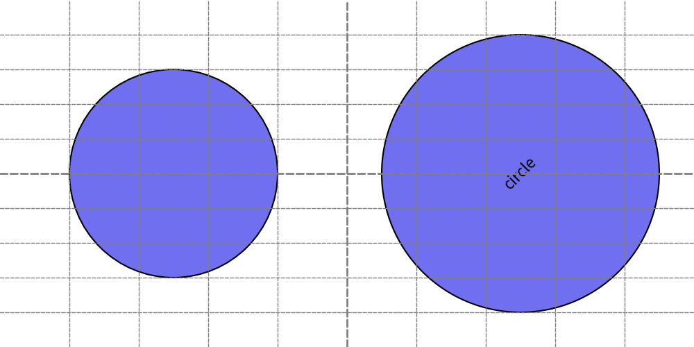
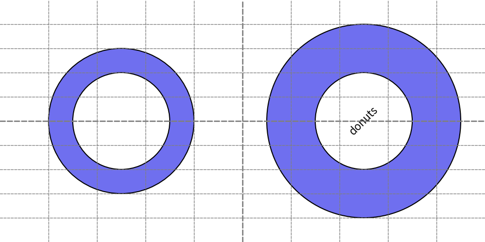
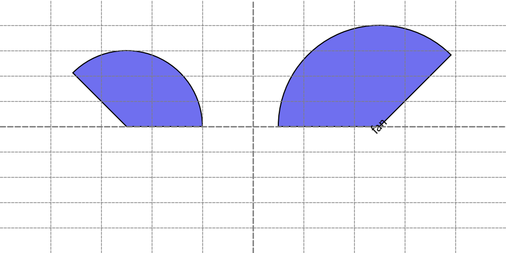
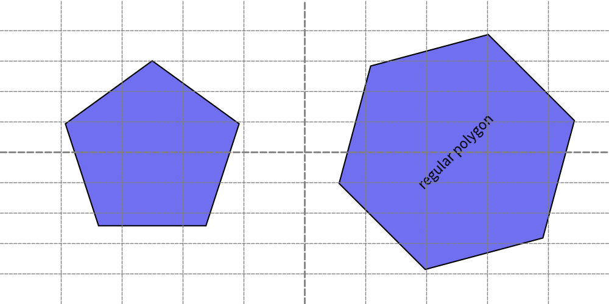
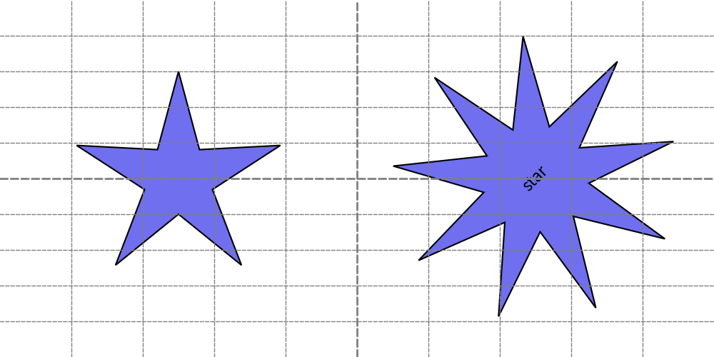
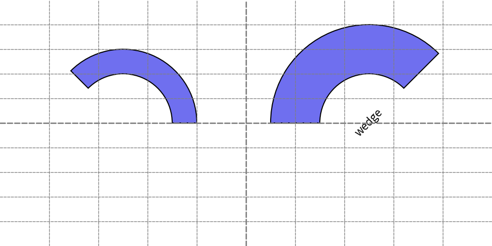

============================
Drawing Circle Like Shapes
============================

Circle-like Shapes
--------------------

Functions that draw circle-like shapes include:

* ``circle()``
* ``donuts()``
* ``fan()``
* ``regularpolygon()``
* ``star()``
* ``wedge()``

Circle-like shapes specify ``xy``, ``radius``, and other shape-specific arguments.

circle()
---------

The ``circle()`` function draws a circle and takes the following arguments:

* xy : X, Y coordinates.
* radius: Radius of the circle.
* angle: Angle which affects the text inside the circle.
* style: Style of the circle.
* text: Text displayed at the center of the circle.
* textsize: The font size of the text.
* textstyle: The style of the center text

Let's explore two examples.

.. literalinclude:: image_circle1.py
   :language: python
   :linenos:
   :caption: image_circle1.py

The circle shape itself does not have an angle effect, but the text inside does.

Executing the above script generates the following output:

    circle()

donuts()
---------

The ``donuts()`` function draws a donut-like shape. 
This shape is defined by an external radius and the width of the filled area, meaning the internal radius is calculated as ``external radius - width``.

This function takes these arguments.

* xy : X, Y coordinates.
* radius: Radius of the donuts.
* width: Width of donuts fill area
* angle: Angle which affects the text inside the donuts.
* style: Style of the donuts.
* text: Text displayed at the center of the donuts.
* textsize: The font size of the text.
* textstyle: The style of the center text

Let's explore two examples.

.. literalinclude:: image_donuts1.py
   :language: python
   :linenos:
   :caption: image_donuts1.py

By adjusting the ``radius`` and ``width`` arguments, you can control the size and thickness of the donut shape.
Executing the above script generates donut shapes with centered text, showing the usage of various arguments.

   donuts()

The ``donuts()`` function is essentially a simplified wrapper around the ``wedge()`` function, providing an easy way to draw donut shapes without needing to handle the internal radius calculations manually.

fan()
-------

The ``fan()`` function draws a fan shape, which is a sector of a circle. In other words, it creates a part of a circle from one angle to another.

* xy : X, Y coordinates.
* radius: Radius of the fan.
* from_angle: The starting angle of the fan.
* to_angle: The ending angle of the fan.
* angle: Angle of the fan.
* style: Style of the fan.
* text: Text displayed at the center of the fan.
* textsize: The font size of the text.
* textstyle: The style of the center text

There are three angle-related arguments:

* ``from_angle``: Defines where the fan shape starts.
* ``to_angle``: Defines where the fan shape ends.
* ``angle``: Rotates the entire fan shape after it is created.

Let's explore two examples.

.. literalinclude:: image_fan1.py
   :language: python
   :linenos:
   :caption: image_fan1.py

By adjusting the from_angle, to_angle, and angle arguments, you can create and position the fan shape as desired.

First example draws fan from angle(``from_angle``) 0 to angle(``to_angle``) 135.
Second example is same, but it rotate fan via specifying ``angle``. 

Executing the above script generates fan shapes with centered text, showing the usage of various arguments.

    fan()

The ``fan()`` function is essentially a simplified wrapper around the ``wedge()`` function, making it easy to draw fan shapes by specifying start and end angles, and then optionally rotating the shape.

regularpolygon()
------------------

The ``regularpolygon()`` function draws a regular polygon with a specified number of vertices.

This function takes these arguments.

* xy : X, Y coordinates.
* radius: Radius of the regularpolygon.
* num_vertices: Number of vertices of the polygon (must be 3 or more).
* angle: Angle of the regularpolygon.
* style: Style of the regularpolygon.
* text: Text displayed at the center of the regularpolygon.
* textsize: The font size of the text.
* textstyle: The style of the center text

Here are two examples demonstrating the use of ``regularpolygon()``:

.. literalinclude:: image_regularpolygon1.py
   :language: python
   :linenos:
   :caption: image_regularpolygon1.py

Executing the above script generates regular polygons with centered text, demonstrating the usage of various arguments.

    regularpolygon()

The ``regularpolygon()`` function allows you to specify the number of vertices from 3 upwards to create polygons of various shapes.

star()
--------

The ``star()`` function draws a star shape with a specified number of external vertices.

This function takes these arguments.

* xy : X, Y coordinates.
* radius_ext: Radius of the circle circumscribing the outermost vertices of the star.
* radius_int: Radius of the circle circumscribing the innermost vertices of the star.
* num_vertices: Number of external vertices of the star (must be 3 or more).
* angle: Angle of the star.
* style: Style of the star.
* text: Text displayed at the center of the star.
* textsize: The font size of the text.
* textstyle: The style of the center text

Here are two examples demonstrating the use of ``star()``:

.. literalinclude:: image_star1.py
   :language: python
   :linenos:
   :caption: image_star1.py

The ``star()`` function allows you to specify the number of external vertices to create stars of different shapes and sizes.
Executing the above script generates stars with centered text, demonstrating the usage of various arguments.

    star()

wedge()
--------

The ``wedge()`` function draws a wedge shape, which is a combination of a donut (ring) and a fan (sector of a circle).

This function takes these arguments.

* xy : X, Y coordinates.
* radius: Radius of the wedge.
* width : width of donuts fill area
* from_angle: Starting angle of the wedge.
* to_angle: Ending angle of the wedge.
* angle: Angle of the wedge.
* style: Style of the wedge.
* text: Text displayed at the center of the wedge.
* textsize: The font size of the text.
* textstyle: The style of the center text

Here is an example demonstrating the use of ``wedge()``:

.. literalinclude:: image_wedge1.py
   :language: python
   :linenos:
   :caption: image_wedge1.py

Executing the above script generates a wedge shape with centered text, demonstrating the usage of various arguments.

    wedge()

The ``wedge()`` function allows you to specify the radius, width, starting angle, and ending angle to create wedge shapes, which are useful for visualizing segments of circles with customizable styles and text.
