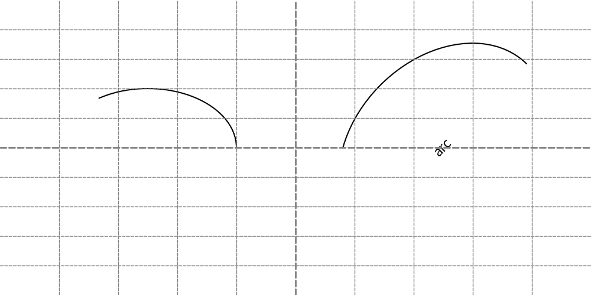
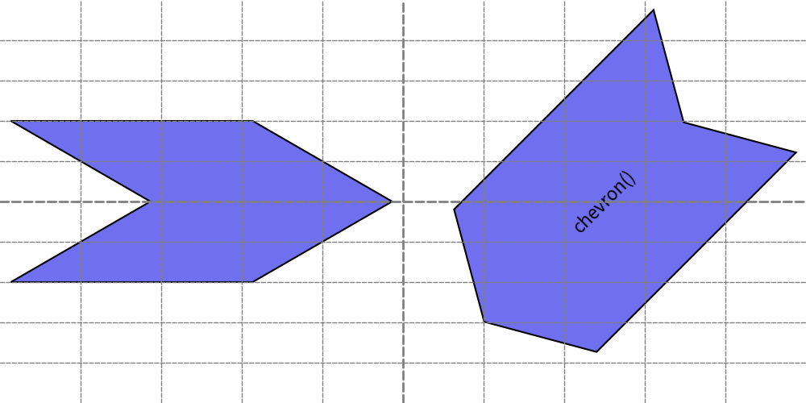
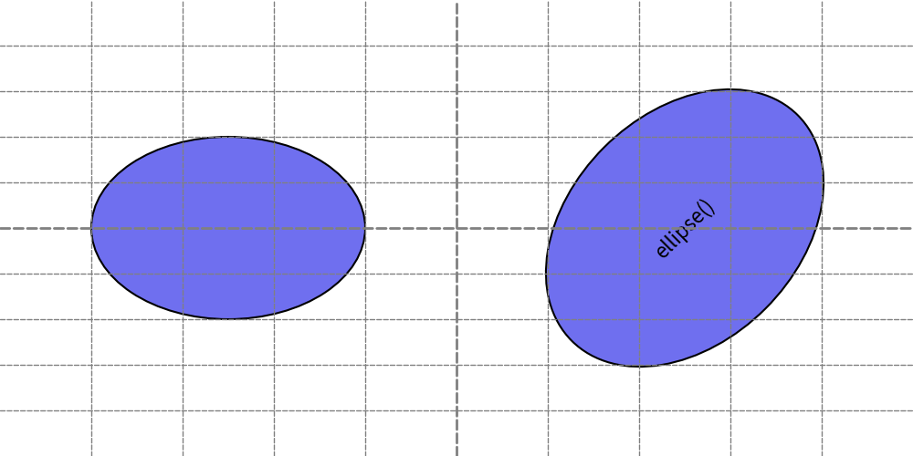
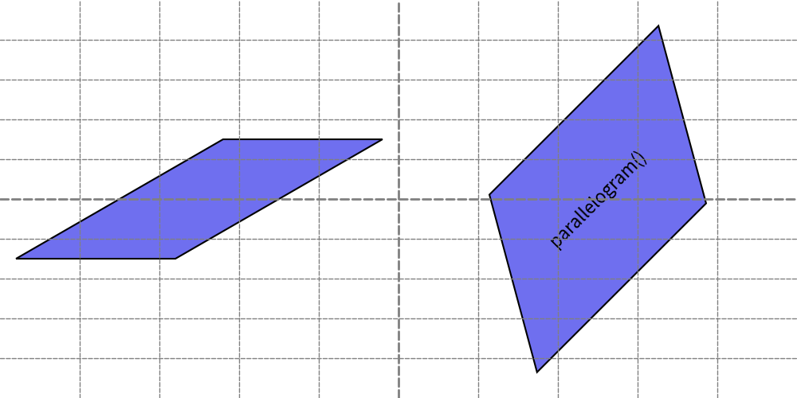
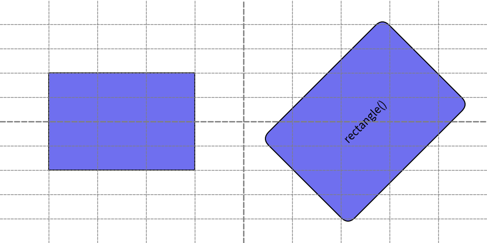
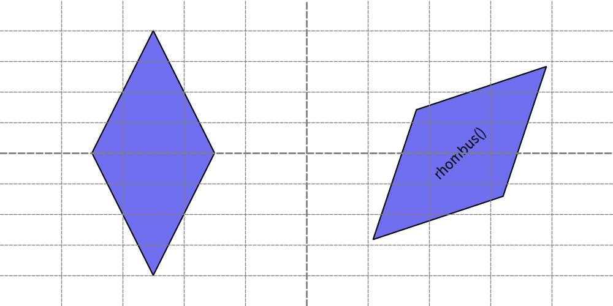
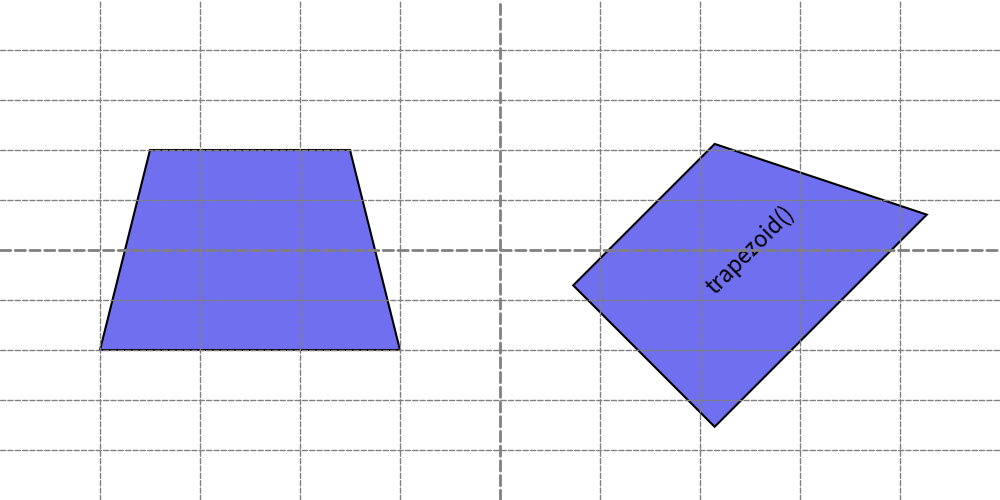
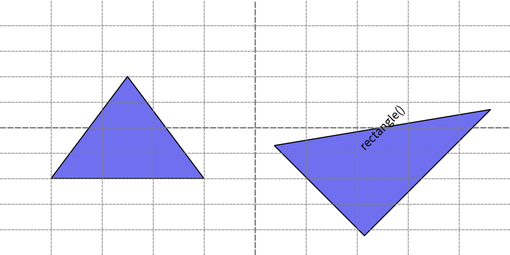

=============================
Drawing Rectangle Like Shapes
=============================

Rectangle-like Shapes
-----------------------

Functions that draw rectangle-like shapes include:

* ``arc()``
* ``chevron()``
* ``ellipse()``
* ``parallelogram()``
* ``rectangle()``
* ``rhombus()``
* ``trapezoid()``
* ``triangle``

Rectangle-like shapes in Drawlib are defined using X, Y coordinates along with width and height parameters. 
These shapes, such as ``arc()`` and ``ellipse()``, resemble rectangles in their parameterization despite their curved appearances, hence they are categorized as rectangle-like shapes.

arc()
-------

The ``arc()`` function is used to draw arcs.

An arc resembles a line but is drawn as a shape, thus arrow styles cannot be specified. 
However, you can define the line style using attributes of ``ShapeStyle``.

This function requires the following arguments:

- xy: X, Y coordinates
- width: Width of the underlying ellipse
- height: Height of the underlying ellipse
- from_angle: Starting angle of the arc
- to_angle: Ending angle of the arc
- angle: Rotation angle of the arc
- style: Style of the arc
- text: Centered text
- textsize: Font size of the text
- textstyle: Style of the centered text

Let's explore two examples.

.. literalinclude:: image_arc1.py
   :language: python
   :linenos:
   :caption: image_arc1.py

Handling angles is similar to functions like ``donuts()``. 
Please refer to its explanation for more details. 
Here's an example output:

    arc()

chevron()
-------------

The ``chevron()`` function draws a chevron shape. 
In addition to specifying width and height, it allows you to define the angle of the bottom-left corner using corner_angle. 
The shape of the chevron varies based on this parameter.

This function takes the following arguments:

- xy: X, Y coordinates
- width: Width of the chevron
- height: Height of the chevron
- corner_angle: Angle of the bottom-left corner
- mirror: Optionally reverses the chevron horizontally (default is False)
- angle: Rotation angle of the chevron
- style: Style of the chevron
- text: Centered text
- textsize: Font size of the text
- textstyle: Style of the centered text

Let's explore two examples:

.. literalinclude:: image_chevron1.py
   :language: python
   :linenos:
   :caption: image_chevron1.py

The shape of the chevron is influenced by ``corner_angle``. 
When ``mirror`` is set to True, the chevron is horizontally reversed. 
Here is an example output:

    chevron()

ellipse()
-----------

The ``ellipse()`` function draws an ellipse. 
If the width and height are identical, it behaves similarly to the ``circle()`` function.

This function accepts the following arguments:

- xy: X, Y coordinates
- width: Width of the ellipse
- height: Height of the ellipse
- angle: Rotation angle of the ellipse
- style: Style of the ellipse
- text: Centered text
- textsize: Font size of the text
- textstyle: Style of the centered text

Let's explore two examples:

.. literalinclude:: image_ellipse1.py
   :language: python
   :linenos:
   :caption: image_ellipse1.py

Here is an example output:

    ellipse()

parallelogram()
------------------

The ``parallelogram()`` function draws a parallelogram shape. 
It allows you to specify the angle of the bottom-left corner using ``corner_angle``. 
Additionally, you can mirror the shape horizontally by setting the ``mirror`` parameter to True.

This function accepts the following arguments:

- xy: X, Y coordinates
- width: Width of the parallelogram
- height: Height of the parallelogram
- corner_angle: Angle of the bottom-left corner
- mirror: Optionally reverses the parallelogram horizontally (default is False)
- angle: Rotation angle of the parallelogram
- style: Style of the parallelogram
- text: Centered text
- textsize: Font size of the text
- textstyle: Style of the centered text

Let's explore two examples.

.. literalinclude:: image_parallelogram1.py
   :language: python
   :linenos:
   :caption: image_parallelogram1.py

Here is an example output:

    parallelogram()

rectangle()
-------------

The ``rectangle()`` function draws a rectangle shape. 
It allows you to specify the radius of the rounded corners using the ``r`` parameter.

This function accepts the following arguments:

- xy: X, Y coordinates
- width: Width of the rectangle
- height: Height of the rectangle
- r: Radius of the rounded corners (default is 0, resulting in sharp corners)
- angle: Rotation angle of the rectangle
- style: Style of the rectangle
- text: Centered text
- textsize: Font size of the text
- textstyle: Style of the centered text

Let's explore two examples:

.. literalinclude:: image_rectangle1.py
   :language: python
   :linenos:
   :caption: image_rectangle1.py

Here is an example output:

    rectangle()

rhombus()
-----------

The ``rhombus()`` function draws a rhombus shape, which is a diamond-like figure with equal sides.

This function accepts the following arguments:

- xy: X, Y coordinates
- width: Width of the rhombus
- height: Height of the rhombus
- angle: Rotation angle of the rhombus
- style: Style of the rhombus
- text: Centered text
- textsize: Font size of the text
- textstyle: Style of the centered text

Let's explore two examples:

.. literalinclude:: image_rhombus1.py
   :language: python
   :linenos:
   :caption: image_rhombus1.py

Here is an example output:

    rhombus()

trapezoid()
-------------

The ``trapezoid()`` function draws a trapezoid shape, which has two different widths at its top and bottom edges. 
The positioning of the top side relative to the bottom side can be adjusted using the ``top_width``, ``bottom_width``, and optionally ``top_start`` parameters.

This function takes these arguments.

- xy: X, Y coordinates
- width: Width of the trapezoid
- height: Height of the trapezoid
- bottom_width: Width of the bottom side of the trapezoid
- top_width: Width of the top side of the trapezoid
- top_start: Optional parameter to specify where the top side starts (default places the top side centered). If set to 0, the top side starts at the same position as the bottom side.
- angle: Rotation angle of the trapezoid
- style: Style of the trapezoid
- text: Centered text
- textsize: Font size of the text
- textstyle: Style of the centered text

Let's explore two examples:

.. literalinclude:: image_trapezoid1.py
   :language: python
   :linenos:
   :caption: image_trapezoid1.py

Here is an example output:

    trapezoid()

triangle()
------------

The ``triangle()`` function draws a triangle shape. 
It has an optional parameter ``topvertex_xpos`` to specify where the top vertex is positioned horizontally.
If not specified, the triangle is drawn as an isosceles triangle with the top vertex aligned at the center of its width.

This function accepts the following arguments:

- xy: X, Y coordinates
- width: Width of the triangle
- height: Height of the triangle
- topvertex_xpos: Optional parameter to specify the horizontal position where the top vertex is pointed
- angle: Rotation angle of the triangle
- style: Style of the triangle
- text: Centered text
- textsize: Font size of the text
- textstyle: Style of the centered text

Let's explore two examples:

.. literalinclude:: image_triangle1.py
   :language: python
   :linenos:
   :caption: image_triangle1.py

Here is an example output:

    triangle()

In this example, inner text is drawn at the center of the right triangle shape. 
However, the text extends beyond the shape's boundaries. 
In such situations, you can adjust the position where the text is drawn by specifying the ``xy_shift`` attribute of ``ShapeTextStyle``. 
For further details, refer to the shape style documentation.
