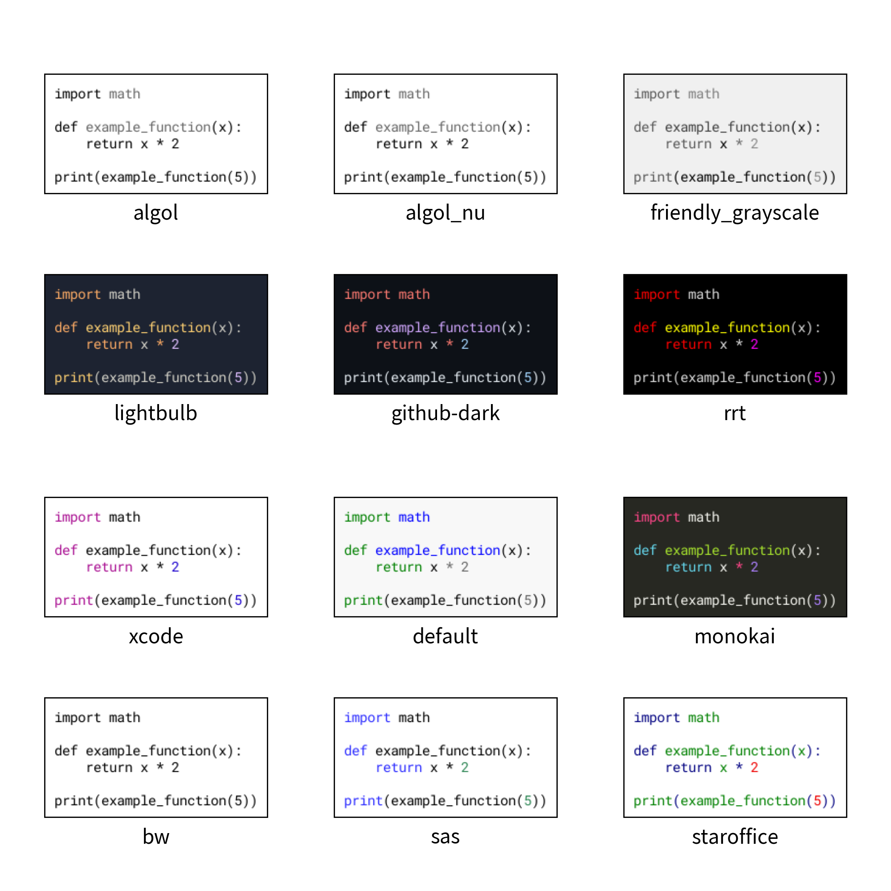

========================
SourceCode
========================

Drawing source code with Drawlib can be done simply using the ``text()`` function with ``halign="left"`` and a monospace font. 
For more sophisticated source code visuals, including syntax highlighting, Drawlib provides the SourceCode Smart Art feature. 
This feature leverages pygments to generate visually enhanced source code images.

Here is an example of code:

.. literalinclude:: image1.py
   :language: python
   :linenos:
   :caption: image1.py

In the example above, the ``dsart.SourceCode`` instance is configured with options such as:

- language: Specifies the programming language (automatically detected if not provided).
- style: Defines the syntax highlighting style (e.g., monokai).
- font: Source code font
- show_linenum: Determines whether to display line numbers.
- linenum_textcolor and linenum_bgcolor: Customize the colors of line numbers.

After creating instance, you will draw code with ``draw()`` method.
This method's arg is same to ``image()``.
But it takes ``code`` argument instead of ``image`` argument.

Here is a list of ``draw()`` arguments:

- xy: Coordinates to place the source code image.
- width: Width of the source code image.
- code: The source code string.
- style: ImageStyle for source code image

Executing the code will generate below output:

    image1.png

Source Code Styles
=====================

Drawlib supports a variety of styles from Pygment's recommended list, as well as additional black and white styles. 
Here are list of supported styles:

- bw
- sas
- staroffice
- xcode
- default
- monokai
- lightbulb
- github-dark
- rrt
- algol
- algol_nu
- friendly_grayscale

Here are output of Source Code styles.

    image2.png

get_text()
============

To retrieve the text content directly from a code file, you can use the ``dsart.SourceCode.get_text()`` method provided by SourceCode. 
This function allows you to specify a file path relative to the code file's location.